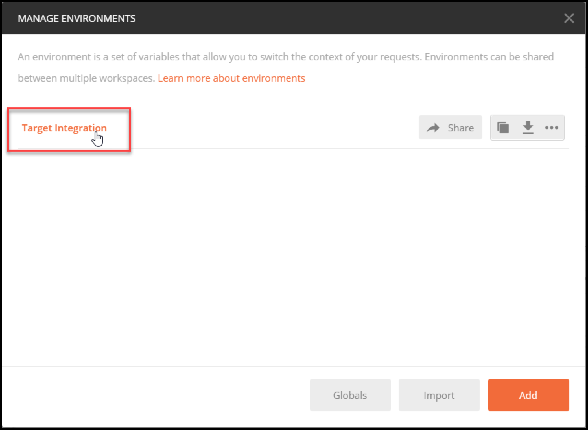
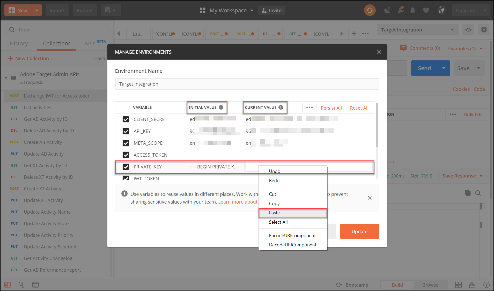

# Configurar la autenticación para las API de [!DNL Adobe Target]

Las API de administrador de [!DNL Adobe Target], incluidas las API de [!DNL Recommendations Admin], están protegidas con autenticación para garantizar que solo los usuarios autorizados las usen para acceder a [!DNL Adobe Target]. Use [Adobe Developer Console](https://developer.adobe.com/console/home) para administrar esta autenticación en todos los [!DNL Adobe Experience Cloud solutions], incluido [!DNL Adobe Target].

>[!IMPORTANT]
>
>Las credenciales de la cuenta de servicio (JWT) descritas en este artículo quedarán obsoletas en favor de las nuevas credenciales de servidor a servidor de OAuth.
>
>Las credenciales de la cuenta de servicio (JWT) seguirán funcionando hasta el 1 de enero de 2025. Debe migrar la aplicación o integración para utilizar la nueva credencial de servidor a servidor OAuth antes del 1 de enero de 2025.
>
>Para obtener más información e instrucciones paso a paso para migrar su integración, consulte [Migración de la credencial de la cuenta de servicio (JWT) a la credencial de servidor a servidor OAuth](https://developer.adobe.com/developer-console/docs/guides/authentication/ServerToServerAuthentication/migration/){target=_blank} en la documentación de *Developer Console*.
>
>Para obtener información sobre cómo configurar nuevas credenciales de OAuth, consulte [Implementación de credenciales de servidor a servidor de OAuth](https://developer.adobe.com/developer-console/docs/guides/authentication/ServerToServerAuthentication/implementation/){target=_blank} en la documentación de *Developer Console*.

Estos son los pasos preliminares necesarios para generar los tokens de autenticación JWT heredados necesarios para interactuar correctamente con las API [!DNL Adobe Target]:

1. Cree un proyecto (anteriormente denominado integración) en [!DNL Adobe Developer Console].
1. Exporte los detalles del proyecto a Postman.
1. Genere un token de acceso de portador.
1. Pruebe el token de acceso al portador.

## Requisitos previos

| Recurso | Detalles |
| --- | --- |
| Postman | Para completar estos pasos correctamente, obtiene la [aplicación de Postman](https://www.postman.com/downloads/) para tu sistema operativo. Postman basic es gratuito con la creación de cuentas. Aunque no es necesario para usar las API [!DNL Adobe Target] en general, Postman facilita los flujos de trabajo de las API y [!DNL Adobe Target] proporciona varias colecciones de Postman para ayudar a ejecutar sus API y conocer su funcionamiento. El resto de esta guía supone conocimientos prácticos de Postman. Para obtener ayuda, consulte la [documentación de Postman](https://learning.getpostman.com/). |
| Referencias | En el resto de esta guía se da por hecho que está familiarizado con los siguientes recursos:<ul><li>[Adobe I/O Github](https://github.com/adobeio)</li><li>[Documentación de la API de perfil y administrador de Target](../administer/admin-api/admin-api-overview-new.md)</li><li>[Documentación de la API de Recommendations](https://developer.adobe.com/target/administer/recommendations-api/)</li></ul> |

## Creación de un proyecto de Adobe I/O

En esta sección, tendrá acceso a [!DNL Adobe Developer Console] y creará un proyecto para [!DNL Adobe Target]. Para obtener más información, consulte la [documentación sobre proyectos](https://developer.adobe.com/developer-console/docs/guides/projects/).

&lt;!—(1) Genere su clave privada y certificado público, según la [documentación sobre autenticación](https://developer.adobe.com/developer-console/docs/guides/authentication/). //[/]: # (como se describe en el **Paso 1** de [Cómo configurar la E/S de Adobe: autenticación - Paso a paso](https://helpx.adobe.com/marketing-cloud-core/kb/adobe-io-authentication-step-by-step.html). Después de completar el paso 1, vuelva a esta guía y reanude el paso 2 que aparece a continuación. // El resultado de este paso debe ser la creación de un archivo `private.key` y un archivo `certificate_pub.crt`. Vuelva a esta guía una vez que haya generado estos dos archivos.)—>

1. En [Adobe Admin Console](https://adminconsole.adobe.com/), asegúrese de que su cuenta de usuario [!DNL Adobe] tenga acceso de nivel [Administrador de productos](https://helpx.adobe.com/es/enterprise/using/admin-roles.html) y [Desarrollador](https://helpx.adobe.com/es/enterprise/using/manage-developers.html) a [!DNL Target].

1. En [Adobe Developer Console](https://developer.adobe.com/console/home), seleccione el [!UICONTROL Experience Cloud Organization] para el que desea crear esta integración. (Tenga en cuenta que es probable que solo tenga acceso a un(a) [!UICONTROL Experience Cloud Organization].)

   

1. Haga clic en **[!UICONTROL Create new project]**.

   

1. Haga clic en **[!UICONTROL Add API]** para agregar una API de REST a su proyecto y poder acceder a los servicios y productos de [!DNL Adobe].

   

1. Seleccione **[!DNL Adobe Target]** como el servicio [!DNL Adobe] con el que desea integrar. Haga clic en el botón **[!UICONTROL Next]** que aparece.

   

1. Seleccione una opción para asociar claves públicas y privadas con la integración de cuenta de servicio que está creando para [!DNL Target]. Para este ejemplo, seleccione **[!UICONTROL Option 1: Generate a key pair]** y haga clic en **[!UICONTROL Generate keypair]**.

   

1. Según las instrucciones, anote el archivo de configuración descargado automáticamente (`config`), que contiene su clave privada. Haga clic en **[!UICONTROL Next]**.

   

1. En su sistema de archivos, compruebe la ubicación de `config`, que es el archivo de configuración comprimido creado en el paso anterior. De nuevo, este archivo de `config` contiene su clave privada, que necesitará más adelante. La ubicación exacta dentro del sistema de archivos puede diferir de la que se muestra aquí.

   

1. De nuevo en Adobe Developer Console, seleccione los [perfiles de producto](https://helpx.adobe.com/es/enterprise/using/manage-products-and-profiles.html) correspondientes a las propiedades en las que está usando Adobe Recommendations. (Si no utiliza las propiedades, seleccione la opción Workspace predeterminado.) Haga clic en **[!UICONTROL Save configured API]**.

   

1. Haga clic en **[!UICONTROL Create Integration]**. Debería recibir un mensaje temporal que indique que su API se ha configurado correctamente.
1. Finalmente, cambie el nombre del proyecto a un nombre más significativo que el original `Project 1`. Para ello, navegue hasta el proyecto utilizando la ruta de navegación como se muestra, haga clic en **[!UICONTROL Edit project]** para acceder al modal **[!UICONTROL Edit Project]** y cambie el nombre del proyecto.

   

>[!NOTE]
>
>En este ejemplo, asignamos a nuestro proyecto el nombre &quot;[!DNL Target] Integration&quot;. Si prevé utilizar el proyecto para más de [!DNL Adobe Target], es posible que desee ponerle el nombre correspondiente. Por ejemplo, puede elegir llamarlo &quot;API de Adobe&quot; o &quot;API de Experience Cloud&quot;, ya que puede utilizarse con otras soluciones en Adobe Experience Cloud.

## Exportar detalles del proyecto

Ahora que tiene un proyecto de Adobe que puede usar para acceder a [!DNL Target], debe asegurarse de enviar los detalles de ese proyecto junto con sus solicitudes de API de Adobe. Estos detalles son necesarios para interactuar con varias API de Adobe, incluidas varias API de [!DNL Target]. Por ejemplo, los detalles de la integración incluyen la información de autorización y autenticación requerida por las API de administrador de [!DNL Target]. Por lo tanto, para utilizar las API con Postman, debe introducir esos detalles en Postman.

Existen muchas formas de especificar los detalles del proyecto en Postman, pero en esta sección, aprovechamos algunas funciones y colecciones creadas previamente. En primer lugar (en esta sección), exportará los detalles de su integración a un entorno de Postman. A continuación (en la siguiente sección), se genera un token de acceso al portador para concederle acceso a los recursos de Adobe necesarios.

>[!NOTE]
>
>Para ver las instrucciones de vídeo aplicables a cualquier solución de Experience Cloud, incluida [!DNL Target], consulte [Usar Postman con las API de Experience Platform](https://experienceleague.adobe.com/docs/platform-learn/tutorials/platform-api-authentication.html?lang=es). Las siguientes secciones son relevantes para las API [!DNL Target]: 1. Cree y exporte la API de Experience Platform a Postman 2. Genere un token de acceso con Postman. Estos pasos también se proporcionan a continuación.

1. Aún en [Adobe Developer Console](https://developer.adobe.com/console/home), vaya a ver las credenciales de **[!UICONTROL Service Account (JWT)]** de su nuevo proyecto. Utilice la navegación izquierda o la sección **[!UICONTROL Credentials]** como se muestra.

   

   En **[!UICONTROL Credential details]**, tenga en cuenta que puede ver su **[!UICONTROL Public key(s)]**, **[!UICONTROL Client ID]** y otra información relacionada con su cuenta de servicio.

   

1. Haga clic para ir a la información sobre la API **[!DNL Adobe Target]**. Utilice la sección de navegación izquierda o la sección **Productos y servicios conectados** como se muestra a continuación.

   

1. Haga clic en **[!UICONTROL Download for Postman]** > **[!UICONTROL Service Account (JWT)]** para crear un archivo JSON que capture la información de autenticación para un entorno de Postman.

   

   Anote el archivo JSON en su sistema de archivos.

   

1. En Postman, haga clic en el icono de engranaje para administrar los entornos y, a continuación, haga clic en **[!UICONTROL Import]** para importar el archivo JSON (entorno).

   

1. Elija su archivo y haga clic en **[!UICONTROL Open]**.

   

1. En el modal Postman **Administrar entornos**, haga clic en el nombre del entorno recién importado para inspeccionarlo. (El nombre de su entorno puede ser diferente del que se muestra aquí. Edite el nombre como desee. No tiene que coincidir necesariamente con el nombre del proyecto [!DNL Adobe]).

   

1. Nota `CLIENT_SECRET` y `API_KEY` (junto con otras variables) tienen sus valores rellenados previamente, tomados de la integración tal como se define en Adobe Developer Console. (La variable de Postman `CLIENT_SECRET` debe coincidir con la credencial de Adobe `CLIENT SECRET` tal como se muestra en Developer Console, y `API_KEY` en Postman debe coincidir del mismo modo con `CLIENT ID` en Developer Console). Por el contrario, las notas `PRIVATE_KEY`, `JWT_TOKEN` y `ACCESS_TOKEN` están en blanco. Empecemos por proporcionar el valor `PRIVATE_KEY`.

   

1. En el sistema de archivos, abra el archivo de `config` y abra el archivo de clave `private`.

   

1. Seleccione y copie todo el contenido del archivo de clave `private`.

   

1. En Postman, pegue el valor de clave privada en los campos **[!UICONTROL INITIAL VALUE]** y **[!UICONTROL CURRENT VALUE]**.

   

1. Haga clic en **[!UICONTROL Update]** y cierre el modal Entornos.

## Generar el token de acceso al portador

En esta sección, genera su token de acceso al portador, que es necesario para autenticar su interacción con las API de [!DNL Adobe Target]. Para generar el token de acceso al portador, debe enviar los detalles de su integración (que se describen en las secciones anteriores) al [Servicio Identity Management de Adobe (IMS)](https://www.adobe.io/authentication/auth-methods.html#!AdobeDocs/adobeio-auth/master/AuthenticationOverview/AuthenticationGuide.md). Hay varias formas de hacerlo, pero en esta guía aprovechamos una colección de Postman que contiene una llamada de IMS prediseñada que hace que el proceso sea directo y fácil. Una vez importada la colección, puede volver a utilizarla siempre que sea necesario para generar nuevos tokens no solo para [!DNL Adobe Target], sino también para otras API de Adobe.

1. Vaya a [Llamadas de ejemplo a la API del servicio Identity Management de Adobe](https://github.com/adobe/experience-platform-postman-samples/tree/master/apis/ims).

   

1. Haga clic en **[!UICONTROL Adobe I/O Access Token Generation Postman collection]**.

   

1. Obtenga el JSON sin procesar de esta colección haciendo clic en **[!UICONTROL Raw]** y copiando el JSON resultante en el portapapeles. (Como alternativa, puede guardar el JSON sin procesar como archivo .json).

   

1. En Postman, importe la colección pegando y enviando el JSON sin procesar desde el portapapeles. (Como alternativa, puede cargar el archivo .json que ha guardado). Haga clic en **[!UICONTROL Continue]**.

   

1. Seleccione la solicitud **[!UICONTROL IMS: JWT Generate + Auth via User Token]** en la colección Postman de generación de tokens de acceso a Adobe I/O, asegúrese de que su entorno esté seleccionado y haga clic en **[!UICONTROL Send]** para generar el token.

   

   >[!NOTE]
   >
   >Este token de acceso al portador será válido durante 24 horas. Vuelva a enviar la solicitud siempre que necesite generar un nuevo token.

1. Abra de nuevo el modal Administrar entornos y seleccione su entorno.

   

1. Tenga en cuenta que los valores `ACCESS_TOKEN` y `JWT_TOKEN` se han rellenado.

   

Pregunta: ¿Tengo que usar la colección Postman de generación de tokens de acceso a Adobe I/O para generar el token web JSON (JWT) y el token de acceso al portador?

Respuesta: No. La colección de Postman de generación de tokens de acceso a Adobe I/O está disponible para facilitar la generación del token de acceso al portador y JWT en Postman. Como alternativa, puede utilizar las funcionalidades de Adobe Developer Console para generar manualmente el token de acceso al portador.

## Prueba del token de acceso al portador

En este ejercicio, utilizará el nuevo token de acceso al portador enviando una solicitud de API que recupera una lista de actividades de su cuenta de [!DNL Target]. Una respuesta correcta indica que el proyecto [!DNL Adobe] y la autenticación funcionan según lo esperado para utilizar la API.

1. Importe la [[!DNL Adobe Target] colección Postman de API de administrador](https://developers.adobetarget.com/api/#admin-postman-collection). Siga todas las indicaciones hasta que la colección se importe en Postman.

   

1. Expanda la colección y anote la solicitud **[!UICONTROL List activities]**.

   

1. Tenga en cuenta que variables como `{{access_token}}` no se han resuelto inicialmente. Puede resolver esto de varias formas (por ejemplo, puede definir una nueva variable de colección llamada `{{access_token}}`), pero en esta guía, cambiará la solicitud de API para aprovechar el entorno de Postman que estaba utilizando anteriormente. Esto permitirá que el entorno siga funcionando como una única consolidación coherente de todas las variables comunes en las API de Adobe.

   

1. Escriba para reemplazar `{{access_token}}` con `{{ACCESS_TOKEN}}`.

   

1. Escriba para reemplazar `{{api_key}}` con `{{API_KEY}}`.

   

1. Escriba para reemplazar `{{tenant}}` con `{{TENANT_ID}}`. La nota `{{TENANT_ID}}` aún no se reconoce.

   

1. Abra el modal Administrar entornos y seleccione su entorno.

   

1. Escriba para agregar una nueva variable de entorno `{{TENANT_ID}}`. Copie y pegue su valor de ID de inquilino en los campos **[!UICONTROL INITIAL VALUE]** y **[!UICONTROL CURRENT VALUE]** para la nueva variable de entorno `TENANT_ID`.

   

   >[!NOTE]
   >
   >La ID de inquilino es diferente de su [!DNL Target] `clientcode`. El identificador de inquilino existe en la dirección URL cuando inició sesión en [!DNL Target]. Para obtener su ID de inquilino, inicie sesión en Adobe Experience Cloud, abra [!DNL Target] y haga clic en la tarjeta de Target. Utilice el valor ID de inquilino como se indica en el subdominio URL. Por ejemplo, si la dirección URL cuando inició sesión en [!DNL Adobe Target] es `<https://mycompany.experiencecloud.adobe.com/...>`, el identificador de inquilino es &quot;mycompany&quot;.

1. Envíe la solicitud, después de asegurarse de que ha seleccionado el entorno correcto. Debe recibir una respuesta que contenga su lista de actividades.

   

Ahora que ha comprobado la autenticación de Adobe, puede utilizarla para interactuar con las API de [!DNL Adobe Target] (así como con otras API de Adobe). Por ejemplo, puede [usar las API de Recommendations](recs-api/overview.md) para crear o administrar recomendaciones, o puede usarlas con la [API de envío de Target](/help/dev/implement/delivery-api/overview.md).
