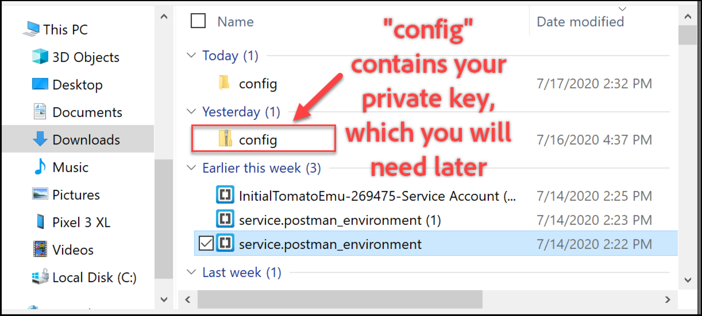
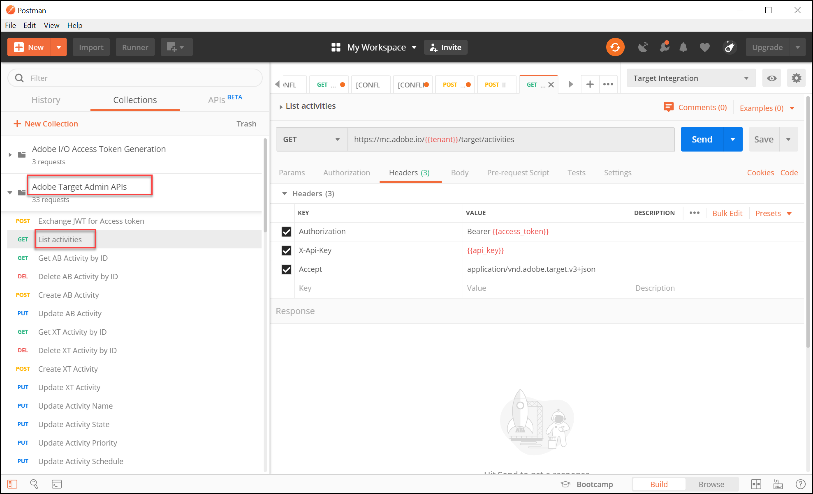

# Configuración de la autenticación para [!DNL Adobe Target] API

El [!DNL Adobe Target] Las API de administrador, que incluyen [!DNL Recommendations Admin] Las API de están protegidas con autenticación para garantizar que solo los usuarios autorizados las utilicen para acceder a [!DNL Adobe Target]. Utilice el [Consola de Adobe Developer](https://developer.adobe.com/console/home) para administrar esta autenticación para todos [!DNL Adobe Experience Cloud solutions], incluido [!DNL Adobe Target].

>[!IMPORTANT]
>
>Las credenciales de la cuenta de servicio (JWT) descritas en este artículo quedarán obsoletas en favor de las nuevas credenciales de servidor a servidor de OAuth.
>
>Las credenciales de la cuenta de servicio (JWT) seguirán funcionando hasta el 1 de enero de 2025. Debe migrar la aplicación o integración para utilizar la nueva credencial de servidor a servidor OAuth antes del 1 de enero de 2025.
>
>Para obtener más información e instrucciones paso a paso para migrar su integración, consulte [Migración de la credencial de cuenta de servicio (JWT) a la credencial de servidor a servidor OAuth](https://developer.adobe.com/developer-console/docs/guides/authentication/ServerToServerAuthentication/migration/){target=_blank} en el *Developer Console* documentación.
>
>Para obtener información sobre cómo configurar nuevas credenciales de OAuth, consulte [Implementación de credenciales de servidor a servidor OAuth](https://developer.adobe.com/developer-console/docs/guides/authentication/ServerToServerAuthentication/implementation/){target=_blank} en el *Developer Console* documentación.

Estos son los pasos preliminares necesarios para generar los tokens de autenticación JWT heredados necesarios para interactuar correctamente con [!DNL Adobe Target] API:

1. Cree un proyecto (anteriormente denominado integración) en [!DNL Adobe Developer Console].
1. Exporte los detalles del proyecto a Postman.
1. Genere un token de acceso de portador.
1. Pruebe el token de acceso al portador.

## Requisitos previos

| Recurso | Detalles |
| --- | --- |
| Postman | Para completar estos pasos correctamente, obtenga el [aplicación de Postman](https://www.postman.com/downloads/) para su sistema operativo. Postman basic es gratuito con la creación de cuentas. Aunque no es necesario para utilizar [!DNL Adobe Target] API en general, Postman facilita los flujos de trabajo de las API y [!DNL Adobe Target] proporciona varias colecciones Postman para ayudarle a ejecutar sus API y aprender cómo funcionan. El resto de esta guía supone conocimientos prácticos de Postman. Si necesita ayuda, consulte la [Documentación de Postman](https://learning.getpostman.com/). |
| Referencias | En el resto de esta guía se da por hecho que está familiarizado con los siguientes recursos:<ul><li>[Adobe I/O Github](https://github.com/adobeio)</li><li>[Documentación de la API de perfil y administración de Target](../administer/admin-api/admin-api-overview-new.md)</li><li>[Documentación de API de Recommendations](https://developers.adobetarget.com/api/recommendations/)</li></ul> |

## Creación de un proyecto de Adobe I/O

En esta sección, accederá a las [!DNL Adobe Developer Console] y cree un proyecto para [!DNL Adobe Target]. Para obtener más información, consulte [documentación sobre proyectos](https://developer.adobe.com/developer-console/docs/guides/projects/).

&lt;!---(1. Genere su clave privada y certificado público, según el [documentación sobre autenticación](https://developer.adobe.com/developer-console/docs/guides/authentication/). // [//]: # (como se describe en **Paso 1** de [Cómo configurar la E/S de Adobe: autenticación: paso a paso](https://helpx.adobe.com/marketing-cloud-core/kb/adobe-io-authentication-step-by-step.html). Después de completar el paso 1, vuelva a esta guía y reanude el paso 2 que aparece a continuación. // El resultado de esta etapa debe ser la creación de un `private.key` archivo y a `certificate_pub.crt` archivo. Vuelva a esta guía una vez que haya generado estos dos archivos.)—>

1. En el [Adobe Admin Console](https://adminconsole.adobe.com/), asegúrese de que [!DNL Adobe] La cuenta de usuario de se ha concedido tanto [Administrador de productos](https://helpx.adobe.com/enterprise/using/admin-roles.html) y [Desarrollador](https://helpx.adobe.com/enterprise/using/manage-developers.html) acceso de nivel a [!DNL Target].

1. En el [Consola de Adobe Developer](https://developer.adobe.com/console/home), seleccione la [!UICONTROL Organización Experience Cloud] para el que desea crear esta integración. (Tenga en cuenta que es probable que solo tenga acceso a un único [!UICONTROL Organización Experience Cloud].)

   

1. Clic **[!UICONTROL Crear nuevo proyecto]**.

   

1. Clic **[!UICONTROL Añadir API]** para agregar una API de REST al proyecto para acceder a [!DNL Adobe] servicios y productos.

   

1. Seleccionar **[!DNL Adobe Target]** como el [!DNL Adobe] servicio con el que desea integrar. Haga clic en **[!UICONTROL Siguiente]** botón que aparece.

   

1. Seleccione una opción para asociar claves públicas y privadas con la integración de cuentas de servicio que está creando para [!DNL Target]. Para este ejemplo, seleccione **[!UICONTROL Opción 1: generar un par de claves]** y haga clic en **[!UICONTROL Generar par de claves]**.

   

1. Según las instrucciones, tome nota del archivo de configuración descargado automáticamente (`config`), que contiene su clave privada. Haga clic en **[!UICONTROL Siguiente]**.

   

1. En el sistema de archivos, compruebe la ubicación de `config`, que es el archivo de configuración comprimido creado en el paso anterior. De nuevo, esto `config` contiene su clave privada, que necesitará más adelante. La ubicación exacta dentro del sistema de archivos puede diferir de la que se muestra aquí.

   

1. Vuelva a la consola de Adobe Developer y seleccione. [perfil(es) de producto](https://helpx.adobe.com/es/enterprise/using/manage-products-and-profiles.html) correspondiente a las propiedades en las que utiliza Adobe Recommendations. (Si no utiliza las propiedades, seleccione la opción Espacio de trabajo predeterminado.) Clic **[!UICONTROL Guardar API configurada]**.

   

1. Clic **[!UICONTROL Crear integración]**. Debería recibir un mensaje temporal que indique que su API se ha configurado correctamente.
1. Finalmente, cambie el nombre del proyecto por uno más significativo que el original `Project 1`. Para ello, vaya al proyecto utilizando la ruta de navegación como se muestra y haga clic en **[!UICONTROL Editar proyecto]** para acceder a **[!UICONTROL Editar proyecto]** modal y cambie el nombre del proyecto.

   

>[!NOTE]
>
>En este ejemplo, damos el nombre a nuestro proyecto &quot;[!DNL Target] Integración&quot;. Si prevé utilizar el proyecto para algo más que [!DNL Adobe Target], tal vez desee ponerle el nombre correspondiente. Por ejemplo, puede elegir llamarlo &quot;API de Adobe&quot; o &quot;API de Experience Cloud&quot;, ya que puede utilizarse con otras soluciones en Adobe Experience Cloud.

## Exportar detalles del proyecto

Ahora que tiene un proyecto de Adobe que puede utilizar para acceder a [!DNL Target], debe asegurarse de enviar los detalles de ese proyecto junto con sus solicitudes de API de Adobe. Estos detalles son necesarios para interactuar con varias API de Adobe, incluidas varias [!DNL Target] API. Por ejemplo, los detalles de la integración incluyen la información de autorización y autenticación requerida por el [!DNL Target] API de administrador. Por lo tanto, para utilizar las API con Postman, debe introducir esos detalles en Postman.

Existen muchas formas de especificar los detalles del proyecto en Postman, pero en esta sección, aprovechamos algunas funciones y colecciones creadas previamente. En primer lugar (en esta sección), exportará los detalles de su integración a un entorno de Postman. A continuación (en la siguiente sección), se genera un token de acceso al portador para concederle acceso a los recursos de Adobe necesarios.

>[!NOTE]
>
>Para instrucciones de vídeo aplicables a cualquier solución de Experience Cloud, incluyendo [!DNL Target], consulte [Uso de Postman con API de Experience Platform](https://experienceleague.adobe.com/docs/platform-learn/tutorials/platform-api-authentication.html). Las siguientes secciones son relevantes para la [!DNL Target] API: 1. Cree y exporte la API de Experience Platform a Postman 2. Genere un token de acceso con Postman. Estos pasos también se proporcionan a continuación.

1. Todavía en el [Consola de Adobe Developer](https://developer.adobe.com/console/home), navegue hasta ver el de su nuevo proyecto **[!UICONTROL Cuenta de servicio (JWT)]** credenciales. Utilice la navegación izquierda o la **[!UICONTROL Credenciales]** como se muestra.

   

   Entrada **[!UICONTROL Detalles de credenciales]**, tenga en cuenta que puede ver su **[!UICONTROL Clave(s) pública(es)]**, **[!UICONTROL ID de cliente]** y otra información relacionada con su cuenta de servicio.

   

1. Haga clic aquí para desplazarse a la información acerca de **[!DNL Adobe Target]** API. Utilice la navegación izquierda o la **Productos y servicios conectados** como se muestra.

   

1. Clic **[!UICONTROL Descargar para Postman]** > **[!UICONTROL Cuenta de servicio (JWT)]** para crear un archivo JSON que capture la información de autenticación para un entorno de Postman.

   

   Anote el archivo JSON en su sistema de archivos.

   

1. En Postman, haga clic en el icono de engranaje para administrar los entornos y, a continuación, haga clic en **[!UICONTROL Importar]** para importar el archivo JSON (entorno).

   

1. Seleccione el archivo y haga clic en **[!UICONTROL Abrir]**.

   

1. En Postman **Administrar entornos** modal, haga clic en el nombre del entorno recién importado para inspeccionarlo. (El nombre de su entorno puede ser diferente del que se muestra aquí. Edite el nombre como desee. No necesariamente tiene que coincidir con el nombre del [!DNL Adobe] proyecto.)

   

1. Nota `CLIENT_SECRET` y `API_KEY` (junto con otras variables) tienen sus valores rellenados previamente, tomados de la integración tal como se define en la consola de Adobe Developer. (El Postman `CLIENT_SECRET` debe coincidir con el valor de `CLIENT SECRET` credenciales de Adobe tal como se muestran en Developer Console, y `API_KEY` en Postman debe coincidir del mismo modo `CLIENT ID` en Developer Console). Por el contrario, anote `PRIVATE_KEY`, `JWT_TOKEN`, y `ACCESS_TOKEN` están en blanco. Empecemos por proporcionar lo siguiente `PRIVATE_KEY` valor.

   

1. En el sistema de archivos, abra `config` y abra el archivo. `private` archivo de clave.

   

1. Seleccione y copie todo el contenido del `private` archivo de clave.

   

1. En Postman, pegue el valor de clave privada en **[!UICONTROL VALOR INICIAL]** y **[!UICONTROL VALOR ACTUAL]** campos.

   

1. Clic **[!UICONTROL Actualizar]** y cierre el modal Environments.

## Generar el token de acceso al portador

En esta sección, se genera el token de acceso al portador, que es necesario para autenticar la interacción con [!DNL Adobe Target] API. Para generar el token de acceso de portador, debe enviar los detalles de la integración (establecidos en las secciones anteriores) a [Adobe Servicio de Identity Management (IMS)](https://www.adobe.io/authentication/auth-methods.html#!AdobeDocs/adobeio-auth/master/AuthenticationOverview/AuthenticationGuide.md). Hay varias formas de hacerlo, pero en esta guía aprovechamos una colección de Postman que contiene una llamada de IMS prediseñada que hace que el proceso sea directo y fácil. Una vez importada la colección, puede volver a utilizarla cuando sea necesario para generar nuevos tokens, no solo para [!DNL Adobe Target], pero también otras API de Adobe.

1. Vaya a [Llamadas de muestra de API del servicio Identity Management de Adobe](https://github.com/adobe/experience-platform-postman-samples/tree/master/apis/ims).

   

1. Haga clic en **[!UICONTROL Adobe I/O Acceso Generación de tokens Colección Postman]**.

   

1. Obtenga el JSON sin procesar de esta colección haciendo clic en **[!UICONTROL Raw]** y, a continuación, copie el JSON resultante en el portapapeles. (Como alternativa, puede guardar el JSON sin procesar como archivo .json).

   

1. En Postman, importe la colección pegando y enviando el JSON sin procesar desde el portapapeles. (Como alternativa, puede cargar el archivo .json que ha guardado). Haga clic en **[!UICONTROL Continuar]**.

   

1. Seleccione el **[!UICONTROL IMS: JWT Generate + Auth mediante token de usuario]** en la colección Postman de generación de tokens de acceso a Adobe I/O, asegúrese de que su entorno esté seleccionado y haga clic en **[!UICONTROL Enviar]** para generar el token.

   

   >[!NOTE]
   >
   >Este token de acceso al portador será válido durante 24 horas. Vuelva a enviar la solicitud siempre que necesite generar un nuevo token.

1. Abra de nuevo el modal Administrar entornos y seleccione su entorno.

   

1. Tenga en cuenta `ACCESS_TOKEN` y `JWT_TOKEN` Los valores de ahora se rellenan.

   

Pregunta: ¿Tengo que usar la colección Postman de generación de tokens de acceso a Adobe I/O para generar el token web JSON (JWT) y el token de acceso al portador?

Respuesta: No. La colección de Postman de generación de tokens de acceso a Adobe I/O está disponible para facilitar la generación del token de acceso al portador y JWT en Postman. También puede utilizar las funcionalidades de la consola de Adobe Developer para generar manualmente el token de acceso del portador.

## Prueba del token de acceso al portador

En este ejercicio, utilizará el nuevo token de acceso al portador enviando una solicitud de API que recupera una lista de actividades de su [!DNL Target] cuenta. Una respuesta correcta indica su [!DNL Adobe] El proyecto y la autenticación funcionan según lo esperado para utilizar la API.

1. Importe el [[!DNL Adobe Target] Recopilación de Postman de API de administrador](https://developers.adobetarget.com/api/#admin-postman-collection). Siga todas las indicaciones hasta que la colección se importe en Postman.

   

1. Expanda la colección y observe la **[!UICONTROL Enumerar actividades]** solicitud.

   

1. Tenga en cuenta que las variables como `{{access_token}}` no se han resuelto inicialmente. Esto se puede resolver de varias formas diferentes; por ejemplo, se puede definir una nueva variable de colección llamada `{{access_token}}`—pero en esta guía, cambiará la solicitud de API para aprovechar el entorno de Postman que estaba utilizando anteriormente. Esto permitirá que el entorno siga funcionando como una única consolidación coherente de todas las variables comunes en las API de Adobe.

   

1. Escriba para reemplazar `{{access_token}}` con `{{ACCESS_TOKEN}}`.

   

1. Escriba para reemplazar `{{api_key}}` con `{{API_KEY}}`.

   

1. Escriba para reemplazar `{{tenant}}` con `{{TENANT_ID}}`. Nota `{{TENANT_ID}}` aún no se reconoce.

   

1. Abra el modal Administrar entornos y seleccione su entorno.

   

1. Escriba para añadir una nueva `{{TENANT_ID}}` variable de entorno. Copie y pegue su valor de ID de inquilino en **[!UICONTROL VALOR INICIAL]** y **[!UICONTROL VALOR ACTUAL]** campos para el nuevo `TENANT_ID` variable de entorno.

   

   >[!NOTE]
   >
   >El ID de inquilino es diferente al de [!DNL Target] `clientcode`. El ID de inquilino existe en la dirección URL cuando inicia sesión en [!DNL Target]. Para obtener su ID de inquilino, inicie sesión en Adobe Experience Cloud y abra [!DNL Target]y haga clic en la tarjeta Target. Utilice el valor ID de inquilino como se indica en el subdominio URL. Por ejemplo, si su dirección URL al iniciar sesión en [!DNL Adobe Target] es `<https://mycompany.experiencecloud.adobe.com/...>` a continuación, su ID de inquilino es &quot;mycompany&quot;.

1. Envíe la solicitud, después de asegurarse de que ha seleccionado el entorno correcto. Debe recibir una respuesta que contenga su lista de actividades.

   

Ahora que ha comprobado la autenticación de Adobe, puede utilizarla para interactuar con [!DNL Adobe Target] API (así como otras API de Adobe). Por ejemplo, puede [Uso de API de Recommendations](recs-api/overview.md) para crear o administrar recomendaciones, o puede utilizarlo con el [API de envío de Target](/help/dev/implement/delivery-api/overview.md).
