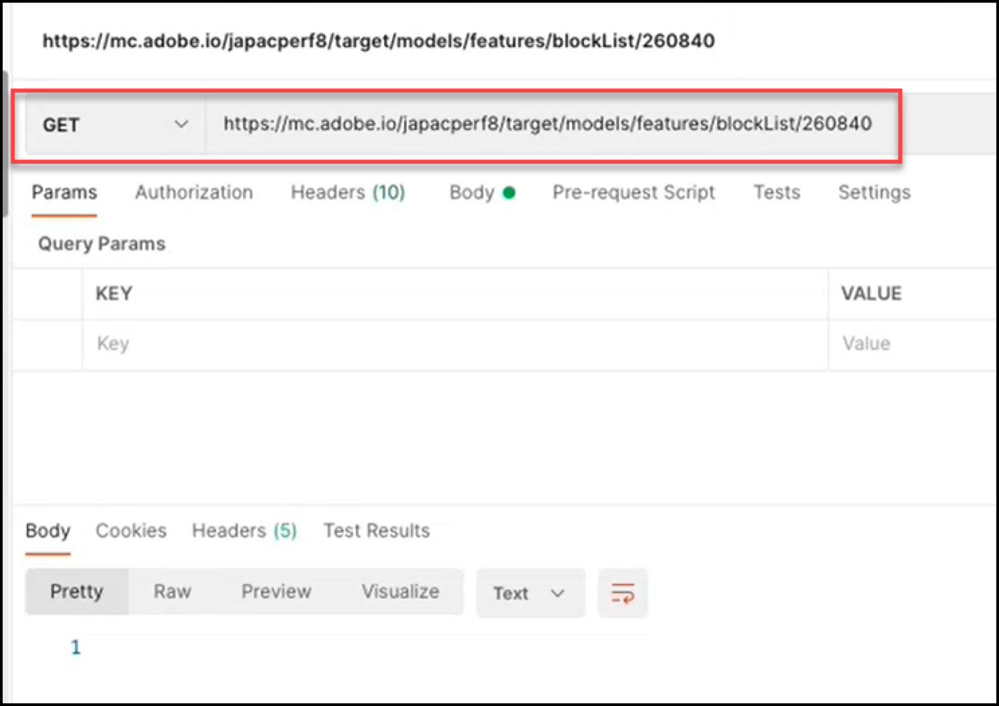

# Información general de API de modelos

La API de modelos, también denominada API de Lista de bloqueados, permite a los usuarios ver y administrar la lista de características utilizadas en los modelos de aprendizaje automático para las actividades [!UICONTROL Automated Personalization] (AP) y [!DNL Auto-Target] (AT). Si un usuario desea excluir una función de la utilización por parte de los modelos para actividades AP o AT, puede utilizar la API de modelos para añadir esa función a la &quot;lista de bloqueados&quot;.

Un(a) **[!UICONTROL blocklist]** define el conjunto de características que [!DNL Adobe Target] excluirá de sus modelos de aprendizaje automático. Para obtener más información sobre las características, consulte [Datos utilizados por [!DNL Target] algoritmos de aprendizaje automático](https://experienceleague.adobe.com/docs/target/using/activities/automated-personalization/ap-data.html).

Las listas de bloqueados se pueden definir por actividad (nivel de actividad) o para todas las actividades de una cuenta de [!DNL Target] (nivel global).

<!-- To get started with the Models API in order to create and manage your blocklist, download the Postman Collection [here](https://git.corp.adobe.com/target/ml-configuration-management-service/tree/nextRelease/rest_api_library). Note this is an Adobe internal link. Need to publish this publicly if want to share with customers. -->

## Especificación de API de modelos

Vea la especificación de API de modelos [aquí](../administer/models-api/models-api-overview.md).

## Requisitos previos  

Para usar la API de modelos, debe configurar la autenticación mediante [Adobe Developer Console](https://developer.adobe.com/console/home), tal como lo haría con [Target Admin API](../administer/admin-api/admin-api-overview-new.md). Para obtener más información, consulte [Cómo configurar la autenticación](../before-administer/configure-authentication.md).

## Directrices de uso de API de modelos

Administración de listas de bloqueados

[**Paso 1:**](#step1) Ver la lista de características de una actividad

[**Paso 2:**](#step2) Compruebe la lista de bloqueados de la actividad

[**Paso 3:**](#step3) Agregar características a la lista de bloqueados de la actividad

[**Paso 4:**](#step4) (Opcional) Desbloquear

[**Paso 5:**](#step5) (opcional) Administrar la lista de bloqueados global


## Paso 1: Ver la lista de funciones de una actividad {#step1}

Antes de realizar la inclusión en la lista de bloqueados de una función, consulte la lista de funciones que se están incluyendo actualmente en los modelos de para esa actividad.

>[!BEGINTABS]

>[!TAB Solicitud]

```json {line-numbers="true"}
GET https://mc.adobe.io/<tenant>/target/models/features/<campaignId>
```

>[!TAB Respuesta]

```json {line-numbers="true"}
{
    "features": [
        {
            "externalName": "Visitor Profile - Total Visits to Activity",
            "internalName": "SES_PREVIOUS_VISIT_COUNT",
            "type": "CONTINUOUS"
        },
        {
            "externalName": "Visitor Profile - Total Visits",
            "internalName": "SES_TOTAL_SESSIONS",
            "type": "CONTINUOUS"
        },
        {
            "externalName": "Visitor Profile - Pages Seen Before Activity",
            "internalName": "SES_PREVIOUS_VISIT_COUNT",
            "type": "CONTINUOUS"
        },
        {
            "externalName": "Visitor Profile - Activity Lifetime Time on Site",
            "internalName": "SES_TOTAL_TIME",
            "type": "CONTINUOUS"
        }
    ],
    "reportParameters": {
        "clientCode": <tenant>,
        "campaignId": <campaignId>
    }
}
```

>[!ENDTABS]

<!-- JUDY: Update codeblock above once you have the complete Response. -->

En el ejemplo que se muestra a continuación, el usuario comprueba la lista de funciones que se utilizan en el modelo para la actividad cuyo ID de actividad es 260840.


>[!NOTE]
>
>Para encontrar el ID de actividad de su actividad, vaya a la lista de actividades en la interfaz de usuario de [!DNL Target]. Haga clic en la actividad que le interese. El ID de actividad se muestra en el cuerpo de la página de Información general de las actividades resultantes, así como al final de la dirección URL de esa página.

**[!UICONTROL externalName]** es un nombre descriptivo para una característica. Lo crea [!DNL Target] y es posible que este valor cambie con el tiempo. Los usuarios pueden ver estos nombres descriptivos en el [informe de perspectivas de Personalization](https://experienceleague.adobe.com/docs/target/using/reports/insights/personalization-insights-reports.html).

**[!UICONTROL internalName]** es el identificador real de la característica. También lo creó [!DNL Target], pero no se puede cambiar. Este es el valor al que deberá hacer referencia para identificar las funciones a las que desea hacer lista de bloqueados.

Tenga en cuenta que para que la lista de funciones se rellene con valores (es decir, para que no sea nula), una actividad de:

1. Debe tener el estado = Activo o debe haberse activado anteriormente
1. Debe haber estado ejecutándose el tiempo suficiente para que haya actividad de campaña, de modo que el modelo haya tenido datos con los que ejecutar.

## Paso 2: Compruebe la lista de bloqueados de la actividad {#step2}

A continuación, vea la lista de bloqueados. En otras palabras, compruebe qué funciones, si las hay, se están bloqueando actualmente para que no se incluyan en los modelos de esta actividad.

>[!ERROR]
>
>Tenga en cuenta que `/blockList/` distingue entre mayúsculas y minúsculas en la solicitud.

>[!BEGINTABS]

>[!TAB Solicitud]

```json {line-numbers="true"}
GET https://mc.adobe.io/<tenant>/target/models/features/blockList/<campaignId>
```

>[!TAB Respuesta]

```json {line-numbers="true"}

```

>[!ENDTABS]

En el ejemplo que se muestra a continuación, el usuario está comprobando la lista de funciones bloqueadas de la actividad cuyo ID de actividad está 260840. Los resultados están vacíos, lo que significa que esta actividad no tiene actualmente ninguna función incluida en la lista de bloqueados.



>[!NOTE]
>
>Puede ver resultados vacíos como este, la primera vez que comprueba la lista de bloqueados completa, antes de agregarle funciones. Sin embargo, una vez que haya añadido (y eliminado posteriormente) funciones de una lista de bloqueados, puede ver resultados ligeramente diferentes, en los que se devuelve una matriz de funciones incluidas en la lista de bloqueados vacía. Siga leyendo para ver un ejemplo de esto en [Paso 4](#step4).

## Paso 3: Añadir funciones a la lista de bloqueados de la actividad {#step3}

Para agregar características a la lista de bloqueados, cambie la solicitud de GET a PUT y modifique el cuerpo de la solicitud para especificar `blockedFeatureSources` o `blockedFeatures` como desee.

* El cuerpo de la solicitud requiere `blockedFeatures` o `blockedFeatureSources`. Ambos pueden estar incluidos.
* Rellene `blockedFeatures` con valores identificados a partir de `internalName`. Consulte [Paso 1](#step1).
* Rellene `blockedFeatureSources` con valores de la tabla siguiente.

Tenga en cuenta que `blockedFeatureSources` indica de dónde proviene una característica. A efectos de inclusión en la lista de bloqueados, sirven como grupos o categorías de funciones, que permiten a los usuarios bloquear conjuntos completos de funciones a la vez. Los valores de `blockedFeatureSources` coinciden con los primeros caracteres del identificador de una característica (`blockedFeatures` o `internalName` valores); por lo tanto, también pueden considerarse &quot;prefijos de característica&quot;.

### Tabla de `blockedFeatureSources` valores {#table}

| Prefijo | Descripción |
| --- | --- |
| CAJA | Parámetro de mbox |
| Dirección URL | Personalizado: parámetro de URL |
| ENV | Entorno |
| SES | Perfil del visitante |
| GEO | Ubicación geográfica |
| PRO | Personalizado: perfil |
| SEG | Personalizado: segmento de informes |
| AAM | Personalizado: Segmento de Experience Cloud |
| MAFIA | Móvil |
| CRS | Personalizado: Atributos del cliente |
| UPA | Personalizado: atributo de perfil RT-CDP |
| IAC | Áreas de interés del visitante |  |

>[!BEGINTABS]

>[!TAB Solicitud]

```json {line-numbers="true"}
PUT https://mc.adobe.io/<tenant>/target/models/features/blockList/<campaignId>

{
    "blockedFeatureSources": ["AAM"],
    "blockedFeatures": ["SES_PREVIOUS_VISIT_COUNT", "SES_TOTAL_SESSIONS"]
}
```

>[!TAB Respuesta]

```json {line-numbers="true"}
{
    "blockedFeatures": [
            "SES_PREVIOUS_VISIT_COUNT",
            "SES_TOTAL_SESSIONS"
        ],
    "blockedFeatureSources": [
            "AAM"
        ]
}
```

>[!ENDTABS]

En el ejemplo que se muestra aquí, el usuario está bloqueando dos características, `SES_PREVIOUS_VISIT_COUNT` y `SES_TOTAL_SESSIONS`, que identificó previamente consultando la lista completa de características de la actividad cuyo ID de actividad es 260480, tal como se describe en [Paso 1](#step1). También están bloqueando todas las características que provienen de los segmentos del Experience Cloud AAM, lo cual se logra bloqueando características con el prefijo &quot;&quot;, tal como se describe en la [tabla](#table) anterior.


Tenga en cuenta que después de la inclusión en la lista de bloqueados de una característica, se recomienda que compruebe la lista de bloqueados actualizada realizando de nuevo el [Paso 2](#step2) (GET de la lista de bloqueados). Compruebe que los resultados aparecen según lo esperado (compruebe que los resultados incluyen las funciones agregadas desde la última solicitud de PUT).

## Paso 4: (Opcional) Desbloquear {#step4}

Para desbloquear todas las características incluidas en la lista de bloqueados, borre los valores de `blockedFeatureSources` o `blockedFeatures`.

>[!BEGINTABS]

>[!TAB Solicitud]

```json {line-numbers="true"}
PUT https://mc.adobe.io/<tenant>/target/models/features/blockList/<campaignId>

{
    "blockedFeatureSources": [],
    "blockedFeatures": []
}
```

>[!TAB Respuesta]

```json {line-numbers="true"}
{
    "blockedFeatures": [],
    "blockedFeatureSources": []
}
```

>[!ENDTABS]

En el ejemplo que se muestra a continuación, el usuario está borrando su lista de bloqueados de la actividad cuyo ID de actividad está 260840. Tenga en cuenta que la respuesta confirma matrices vacías para las características bloqueadas y sus orígenes: `blockedFeatureSources` y `blockedFeatures`, respectivamente.


Como siempre, después de modificar la lista de bloqueados, se recomienda que vuelva a realizar el [Paso 2](#step2) (la GET lista de bloqueados para comprobar que la lista incluye las características esperadas). En el ejemplo que se muestra aquí, el usuario comprueba que su lista de bloqueados está vacía.


Pregunta: ¿Cómo puedo eliminar algunas listas de bloqueados, pero no todas?

Respuesta: Para quitar un subconjunto discreto de características incluidas en la lista de bloqueados de una lista de bloqueados de varias características, los usuarios simplemente pueden enviar la lista actualizada de características que desean bloquear en [la solicitud de lista de bloqueados](#step3), en lugar de borrar toda la lista de bloqueados y volver a agregar las características deseadas. En otras palabras, envíe la lista de características actualizada (como se muestra en el [Paso 3](#step3)), asegurándose de excluir las características que desee &quot;eliminar&quot; de la lista de bloqueados.

## Paso 5: (Opcional) Administrar la lista de bloqueados global {#step5}

Los ejemplos anteriores se encontraban en el contexto de una sola actividad. También puede bloquear funciones para todas las actividades en un cliente determinado (inquilino), en lugar de tener que especificar la lista de bloqueados de cada actividad individualmente. Para realizar una lista de bloqueados global, use la llamada de `/blockList/global` en lugar de `blockList/<campaignId>`.

>[!BEGINTABS]

>[!TAB Solicitud]

```json {line-numbers="true"}
PUT https://mc.adobe.io/<tenant>/target/models/features/blockList/global

{
    "blockedFeatureSources": ["AAM", "PRO", "ENV"],
    "blockedFeatures": ["AAM_FEATURE_1", "AAM_FEATURE_2"]
}
```

>[!TAB Respuesta]

```json {line-numbers="true"}
{
    "blockedFeatures": [
        "AAM_FEATURE_1",
        "AAM_FEATURE_2"
    ],
    "blockedFeatureSources": [
        "AAM",
        "PRO",
        "ENV"
    ]
}
```

>[!ENDTABS]

AAM AAM En la solicitud de ejemplo que se muestra arriba, el usuario está bloqueando dos características, &quot;_FEATURE_1&quot; y &quot;_FEATURE_2&quot;, para todas las actividades de su cuenta de [!DNL Target]. AAM AAM Esto significa que, independientemente de la actividad, &quot;_FEATURE_1&quot; y &quot;_FEATURE_2&quot; no se incluirán en los modelos de aprendizaje automático de esta cuenta. AAM Además, el usuario también está bloqueando globalmente todas las funciones cuyo prefijo sea &quot;&quot;, &quot;PRO&quot; o &quot;ENV&quot;.

Pregunta: ¿No es redundante el ejemplo de código anterior?

Respuesta: Sí. AAM AAM Es redundante bloquear funciones con valores que comienzan por &quot;&quot;, a la vez que bloquea todas las funciones cuyo origen sea &quot;&quot;. AAM El siguiente resultado es que todas las funciones originadas en los segmentos de Experience Cloud (segmentos de) se bloquearán. Por lo tanto, si el objetivo es bloquear todas las funciones de los segmentos de Experience Cloud AAM, no es necesario especificar individualmente determinadas funciones que comienzan con &quot;&quot;, como en el ejemplo anterior.

Paso final: Ya sea a nivel de actividad o a nivel global, se recomienda comprobar la lista de bloqueados después de modificarla para asegurarse de que contiene los valores esperados. Para ello, cambie `PUT` por `GET`.

AAM La respuesta de ejemplo que se muestra a continuación indica que [!DNL Target] está bloqueando dos características individuales, además de todas las características originadas en &quot;&quot;, &quot;PRO&quot; y &quot;ENV&quot;.


