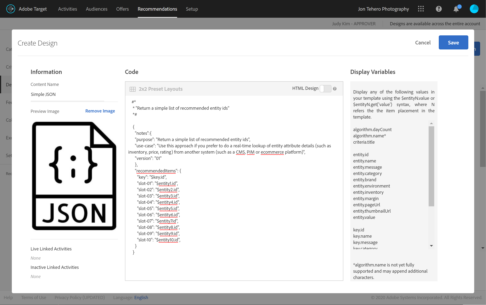
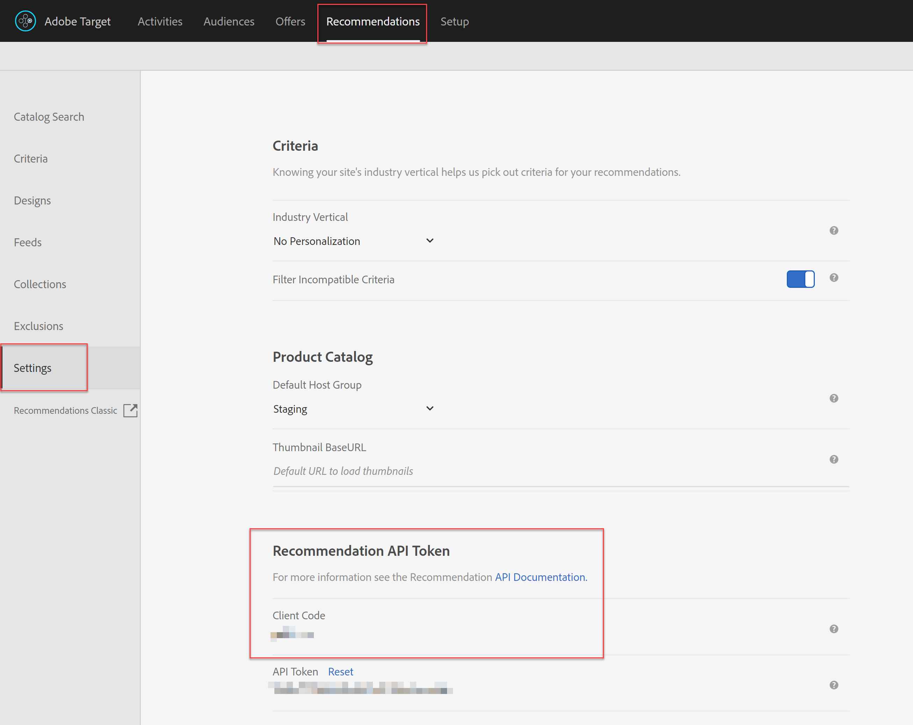
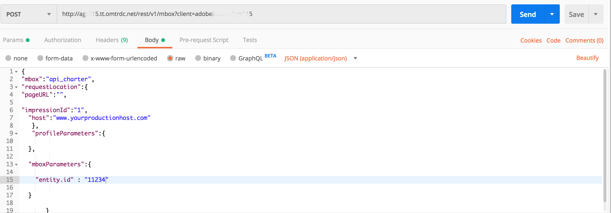
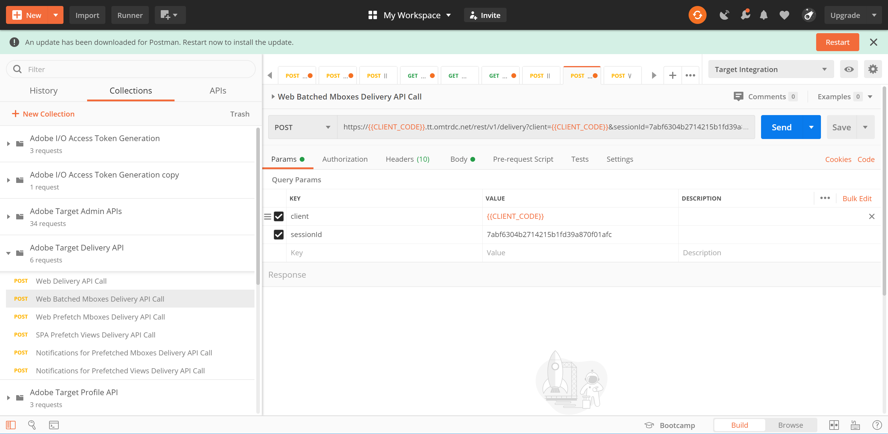

# Obtención de Recommendations con la API de entrega

Las API Adobe Target y Adobe Target Recommendations se pueden utilizar para enviar respuestas a páginas web, pero también se pueden utilizar en experiencias no basadas en HTML, como aplicaciones, pantallas, consolas, correos electrónicos, quioscos y otros dispositivos de visualización. En otras palabras, cuando no se pueden usar las bibliotecas de Target y JavaScript, la [API de envío de Target](/help/dev/implement/delivery-api/overview.md) sigue habilitando el acceso a toda la gama de funcionalidades de Target para ofrecer experiencias personalizadas.

>[!NOTE]
>
>Al solicitar contenido que contenga recomendaciones reales (productos o artículos recomendados), utilice la API de envío de Target.

Para recuperar recomendaciones, envíe una llamada al POST de la API de entrega de Adobe Target con la información contextual adecuada, que puede incluir un ID de usuario (para su uso con recomendaciones específicas de perfil, como los elementos visualizados recientemente del usuario), el nombre mbox relevante, parámetros mbox, parámetros de perfil u otros atributos. La respuesta incluirá entity.ids recomendados (y puede incluir otros datos de entidad) en formato JSON o HTML, que luego se pueden mostrar en el dispositivo.

La [API de entrega](/help/dev/implement/delivery-api/overview.md) para Adobe Target muestra todas las características existentes que proporciona una solicitud de destino estándar.

La API de entrega:

* Te permite recuperar experiencias u ofertas para una ubicación y una audiencia de una manera completa.
* No requiere autenticación.
* Sólo POST.
* No procesa cookies ni redirige llamadas.
* No requiere ni reconoce &quot;roles de usuario&quot;. Simplemente captura contenido o informa eventos en servidores perimetrales de destino.

Para utilizar la API de entrega para ofrecer las experiencias de destino, incluidas las recomendaciones, siga estos pasos:

1. Cree una actividad de Target (A/B, XT, AP o Recommendations) empleando el Compositor basado en formularios (no el Compositor de experiencias visuales).
1. Utilice la API de envío para obtener una respuesta a las solicitudes generadas por la actividad de Target que acaba de crear.

&lt;!— Q: ¿Por qué son necesarios AMBOS pasos para esto? Si tiene una recomendación basada en formularios definida para un mbox, ¿cuál es el punto o la ventaja de tener también el paso de la API de entrega para recuperar los resultados? ¿Por qué no puede hacer que el Rec basado en formularios entregue los resultados en el dispositivo de destino...? R: Vea el caso de uso a continuación... es cuando quiere &quot;interceptar&quot; los resultados pendientes para hacer más cosas antes de mostrar los resultados. Cosas como las comparaciones en tiempo real con los niveles de inventario. —>

## Crear una recomendación mediante el editor de experiencia basado en formularios

Para crear recomendaciones que se puedan usar con la API de entrega, use [Compositor basado en formularios](https://experienceleague.adobe.com/docs/target/using/experiences/form-experience-composer.html?lang=es).

1. En primer lugar, cree y guarde un diseño basado en JSON para utilizarlo en su recomendación. Para obtener el archivo JSON de muestra, además de información básica sobre cómo se pueden devolver las respuestas JSON al configurar una actividad basada en formularios, consulte la documentación de [Creación de diseños de recomendación](https://experienceleague.adobe.com/docs/target/using/recommendations/recommendations-design/create-design.html?lang=es). En este ejemplo, el diseño se denomina *JSON simple.*
   

1. En Target, vaya a **[!UICONTROL Activities]** > **[!UICONTROL Create Activity]** > **[!UICONTROL Recommendations]** y, a continuación, seleccione **[!UICONTROL Form]**.

   

1. Seleccione una propiedad y haga clic en **[!UICONTROL Next]**.
1. Defina la ubicación en la que desea que los usuarios reciban la respuesta de la recomendación. El ejemplo siguiente utiliza una ubicación denominada *api_charter*. Seleccione su diseño basado en JSON, creado anteriormente, con el nombre *Simple JSON.*
   
1. Guarde y active la recomendación. Generará resultados. [Una vez que los resultados estén listos](https://experienceleague.adobe.com/docs/target/using/recommendations/recommendations-activity/previewing-and-launching-your-recommendations-activity.html?lang=es), puede usar la API de envío para recuperarlos.

## Uso de la API de entrega

La sintaxis de la [API de envío](/help/dev/implement/delivery-api/overview.md) es:

`POST https://{{CLIENT_CODE}}.tt.omtrdc.net/rest/v1/delivery`

1. Tenga en cuenta que el código de cliente es obligatorio. Como recordatorio, el código de cliente se puede encontrar en Adobe Target navegando a **[!UICONTROL Recommendations]** > **[!UICONTROL Settings]**. Observe el valor **Código de cliente** en la sección **Token de API de recomendación**.
   
1. Una vez que tenga el código de cliente de, cree la llamada de API de envío. El ejemplo siguiente comienza con **[!UICONTROL Web Batched Mboxes Delivery API Call]** proporcionado en la [colección Postman de la API de entrega](../../implement/delivery-api/overview.md#section/Getting-Started/Postman-Collection), y realiza las modificaciones pertinentes. Por ejemplo:
   * los objetos **browser** y **address** se quitaron de **Body**, ya que no son necesarios para los casos de uso que no son de HTML
   * *api_charter* aparece como el nombre de la ubicación en este ejemplo
   * se especifica entity.id, ya que esta recomendación se basa en la Similitud de contenido, que requiere que se pase a Target una clave de elemento actual.
     
Recuerde configurar los parámetros de consulta correctamente. Por ejemplo, asegúrese de especificar `{{CLIENT_CODE}}` según sea necesario. <!-- Q: In the updated call syntax, entity.id is listed as a profileParameter instead of an mboxParameter as in older versions. Q: Old image  Old accompanying text: "Note this recommendation is based on Content Similar products based on the entity.id sent via mboxParameters." -->
     
1. Envíe la solicitud. Esto se ejecuta en la ubicación *api_charter*, que tiene una recomendación activa en ejecución, definida con su diseño JSON que generará una lista de entidades recomendadas.
1. Reciba una respuesta basada en el diseño JSON.
   
La respuesta incluye el ID de clave, así como los ID de entidad de las entidades recomendadas.

El uso de la API de envío con Recommendations de esta manera le permite realizar pasos adicionales antes de mostrar recomendaciones al visitante en un dispositivo que no sea de HTML. Por ejemplo, puede tomar la respuesta de la API de envío para realizar una búsqueda adicional en tiempo real de los detalles de atributos de entidad (inventario, precio, calificación, etc.) de otro sistema (como una plataforma de CMS, PIM o de comercio electrónico) antes de mostrar los resultados finales.

Con el enfoque descrito en esta guía, puede hacer que cualquier aplicación aproveche la respuesta de Target para ofrecer recomendaciones personalizadas.

## Ejemplos de implementaciones

Los siguientes recursos proporcionan ejemplos de varias implementaciones no centradas en HTML. Tenga en cuenta que cada implementación será única, debido al sistema y los dispositivos implicados.

| Recurso | Detalles |
| --- | --- |
| [Configuración de la extensión de Target en Experience Platform Launch e Implementación de las API de Target](https://developer.adobe.com/client-sdks/documentation/adobe-target/) | Pasos para configurar la extensión de Target en Experience Platform Launch, añadir la extensión de Target a la aplicación e implementar las API de Target para solicitar actividades, recuperar previamente ofertas e introducir el modo de vista previa. |
| [Cliente de nodo de Adobe Target](https://www.npmjs.com/package/@adobe/target-nodejs-sdk) | SDK v1.0 de Target Node.js de código abierto |
| [Introducción al servidor](../../implement/server-side/server-side-overview.md) | Información sobre las API de Adobe Target Server Side Delivery, las API de Server Side Batch Delivery, el SDK de Node.js y las API de Adobe Target Recommendations. |
| [Recommendations de contenido de Adobe Campaign en el correo electrónico](https://medium.com/adobetech/adobe-campaign-content-recommendations-in-email-b51ced771d7f) | Blog que describe cómo aprovechar las recomendaciones de contenido en el correo electrónico mediante Adobe Target y Adobe I/O Runtime en Adobe Campaign. |

## Administración de la configuración de Recommendations con API

La mayoría de las veces, las recomendaciones se configuran en la interfaz de usuario de Adobe Target y, a continuación, se utilizan o se accede a ellas a través de las API de Target, por motivos como los que se indican en las secciones anteriores. Esta coordinación UI-API es común. Sin embargo, a veces los usuarios pueden querer realizar todas las acciones a través de las API, tanto la configuración como el uso de los resultados. Aunque es mucho menos común, los usuarios pueden configurar, ejecutar, *y* de forma absoluta aprovechar los resultados de las recomendaciones completamente mediante las API.

En una [sección anterior](manage-catalog.md), aprendimos a administrar entidades de Adobe Target Recommendations y a distribuirlas en el lado del servidor. Del mismo modo, la [Adobe Developer Console](https://developer.adobe.com/console/home) te permite administrar criterios, promociones, colecciones y plantillas de diseño sin tener que iniciar sesión en Adobe Target. Puede encontrar una lista completa de todas las API de Recommendations [aquí](https://developer.adobe.com/target/administer/recommendations-api/), pero aquí hay un resumen para su referencia.

| Recurso | Detalles |
| --- | --- |
| [Colecciones](https://developer.adobe.com/target/administer/recommendations-api/#tag/Collections) | Listar, crear, obtener, editar y eliminar colecciones. |
| [Criterios](https://developer.adobe.com/target/administer/recommendations-api/#tag/Criteria) | Enumerar y obtener criterios. |
| [Diseños](https://developer.adobe.com/target/administer/recommendations-api/#tag/Designs) | Enumera, crea, obtiene, edita, elimina y valida diseños. |
| [Entidades](https://developer.adobe.com/target/administer/recommendations-api/#tag/Entities) | Guarde, elimine y obtenga entidades. |
| [Promociones](https://developer.adobe.com/target/administer/recommendations-api/#tag/Promotions) | Enumere, cree, obtenga, edite y elimine promociones. |
| [Criterios de categoría](https://developer.adobe.com/target/administer/recommendations-api/#tag/Category-Criteria) | Enumerar, crear, obtener, editar y eliminar criterios de categoría. |
| [Criterios personalizados](https://developer.adobe.com/target/administer/recommendations-api/#tag/Custom-Criteria) | Enumerar, crear, obtener, editar y eliminar criterios personalizados. |
| [Criterios de elemento](https://developer.adobe.com/target/administer/recommendations-api/#tag/Item-Criteria) | Mostrar, crear, obtener, editar y eliminar criterios de elementos. |
| [Criterios de popularidad](https://developer.adobe.com/target/administer/recommendations-api/#tag/Popularity-Criteria) | Mostrar, crear, obtener, editar y eliminar criterios de popularidad. |
| [Criterios de atributo de perfil](https://developer.adobe.com/target/administer/recommendations-api/#tag/Profile-Attribute-Criteria) | Mostrar, crear, obtener, editar y eliminar criterios de atributo de perfil. |
| [Criterios Recientes](https://developer.adobe.com/target/administer/recommendations-api/#tag/Recent-Criteria) | Enumere, cree, obtenga, edite y elimine criterios recientes. |
| [Criterios de secuencia](https://developer.adobe.com/target/administer/recommendations-api/#tag/Sequence-Criteria) | Enumerar, crear, obtener, editar y eliminar criterios de secuencia. |

## Documentación de referencia

* [documentación de la API de entrega de destino de Adobe](/help/dev/implement/delivery-api/overview.md)
* [Integrar Recommendations con el correo electrónico](https://experienceleague.adobe.com/docs/target/using/recommendations/recommendations-faq/integrating-recs-email.html?lang=es)

## Resumen y revisión

¡Felicidades! Al completar esta guía, ha aprendido cómo:
* [Administrar el catálogo mediante la API de Recommendations](manage-catalog.md)
* [Administrar criterios personalizados mediante la API de Recommendations](manage-custom-criteria.md)
* [Uso de la API de envío con Recommendations](fetch-recs-server-side-delivery-api.md)
