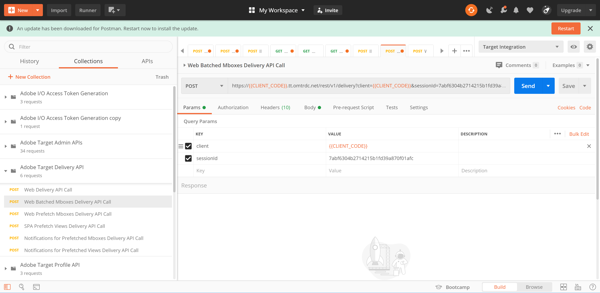

# Recuperación de Recommendations con la API de entrega

Las API de Recommendations de Adobe Target y Adobe Target se pueden utilizar para enviar respuestas a páginas web, pero también se pueden utilizar en experiencias no basadas en HTML, como aplicaciones, pantallas, consolas, correos electrónicos, quioscos y otros dispositivos de visualización. En otras palabras, cuando no se pueden utilizar las bibliotecas de Target y JavaScript, la variable [API de envío de Target](/help/dev/implement/delivery-api/overview.md) sigue habilitando el acceso a toda la gama de funcionalidades de Target para ofrecer experiencias personalizadas.

>[!NOTE]
>
>Al solicitar contenido que contenga recomendaciones reales (productos o artículos recomendados), utilice la API de envío de Target.

Para recuperar recomendaciones, envíe una llamada al POST de la API de envío de Adobe Target con la información contextual adecuada, que puede incluir un ID de usuario (para su uso con recomendaciones específicas del perfil, como los artículos vistos recientemente por el usuario), un nombre de mbox relevante, parámetros de mbox, parámetros de perfil y otros atributos. La respuesta incluirá entity.ids recomendados (y pueden incluir otros datos de entidad) en formato JSON o de HTML, que luego se pueden mostrar en el dispositivo.

El [API de envío](/help/dev/implement/delivery-api/overview.md) para Adobe Target expone todas las funciones existentes que proporciona una solicitud de Target estándar.

La API de envío:

* Permite recuperar experiencias u ofertas para una ubicación y una audiencia de forma RESTful.
* No requiere autenticación.
* Solo POST.
* No procesa cookies ni llamadas de redirección.
* No requiere ni reconoce &quot;funciones de usuario&quot;. Simplemente obtiene contenido o informa de eventos a los servidores Edge de Target.

Para utilizar la API de envío para ofrecer experiencias de Target, incluidas recomendaciones, siga estos pasos:

1. Cree una actividad de Target (A/B, XT, AP o Recommendations) empleando el Compositor basado en formularios (no el Compositor de experiencias visuales).
1. Utilice la API de envío para obtener una respuesta a las solicitudes generadas por la actividad de Target que acaba de crear.

&lt;!P: ¿Por qué son necesarios ambos pasos para esto? Si tiene una recomendación basada en formularios definida para un mbox, ¿cuál es el punto o la ventaja de tener también el paso de la API de entrega para recuperar los resultados? ¿Por qué no puede hacer que la grabación basada en formularios envíe los resultados en el dispositivo de destino...?? R: Consulte el caso de uso siguiente... es cuando desea &quot;interceptar&quot; los resultados pendientes para hacer más cosas antes de mostrar los resultados. Cosas como comparaciones en tiempo real con niveles de inventario. --->

## Crear una recomendación con el Compositor de experiencias basadas en formularios

Para crear recomendaciones que se puedan usar con la API de envío, use [Compositor basado en formularios](https://experienceleague.adobe.com/docs/target/using/experiences/form-experience-composer.html).

1. En primer lugar, cree y guarde un diseño basado en JSON para utilizarlo en su recomendación. Para obtener información general sobre el JSON de muestra y sobre cómo se pueden devolver las respuestas JSON al configurar una actividad basada en formularios, consulte la documentación sobre [Creación de diseños de recomendación](https://experienceleague.adobe.com/docs/target/using/recommendations/recommendations-design/create-design.html). En este ejemplo, el diseño se denomina *JSON simple.*
   

1. En Target, navegue hasta **[!UICONTROL Actividades]** > **[!UICONTROL Crear actividad]** > **[!UICONTROL Recommendations]**, luego seleccione **[!UICONTROL Form]**.

   

1. Seleccione una propiedad y haga clic en **[!UICONTROL Siguiente]**.
1. Defina la ubicación en la que desea que los usuarios reciban la respuesta de la recomendación. El ejemplo siguiente utiliza una ubicación denominada *api_charter*. Seleccione el diseño basado en JSON, creado anteriormente, denominado *JSON simple.*
   
1. Guarde y active la recomendación. Generará resultados. [Una vez que los resultados estén listos](https://experienceleague.adobe.com/docs/target/using/recommendations/recommendations-activity/previewing-and-launching-your-recommendations-activity.html), puede utilizar la API de envío para recuperarlos.

## Uso de la API de entrega

La sintaxis de la variable [API de envío](/help/dev/implement/delivery-api/overview.md) es:

`POST https://{{CLIENT_CODE}}.tt.omtrdc.net/rest/v1/delivery`

1. Tenga en cuenta que el código de cliente es obligatorio. Como recordatorio, el código de cliente se puede encontrar en Adobe Target navegando a **[!UICONTROL Recommendations]** > **[!UICONTROL Configuración]**. Tenga en cuenta **Código de cliente** valor en **Token de API de recomendación** sección.
   
1. Una vez que tenga el código de cliente de, cree la llamada de API de envío. El ejemplo siguiente comienza con **[!UICONTROL Llamada de API de entrega de mboxes web por lotes]** se proporciona en la [Colección Postman de API de envío](../../implement/delivery-api/overview.md/#section/Getting-Started/Postman-Collection), haciendo las modificaciones pertinentes. Por ejemplo:
   * el **explorador** y **dirección** objetos se han eliminado del **Cuerpo**, ya que no son necesarios para casos de uso que no son de HTML
   * *api_charter* aparece como el nombre de la ubicación en este ejemplo
   * se especifica entity.id, ya que esta recomendación se basa en la Similitud de contenido, que requiere que se pase a Target una clave de elemento actual.
     
Recuerde configurar los parámetros de consulta correctamente. Por ejemplo, asegúrese de especificar `{{CLIENT_CODE}}` según sea necesario. &lt;!— P: En la sintaxis de llamada actualizada, entity.id se muestra como profileParameter en lugar de mboxParameter, como en versiones anteriores. ---> &lt;!— P: Imagen antigua  Texto adjunto antiguo: &quot;Tenga en cuenta que esta recomendación se basa en productos similares al contenido, basados en el entity.id enviado a través de mboxParameters.&quot; —>
     
1. Envíe la solicitud. Esto se ejecuta en contra de *api_charter* ubicación, que tiene una recomendación activa en ejecución, definida con su diseño JSON que mostrará una lista de entidades recomendadas.
1. Reciba una respuesta basada en el diseño JSON.
   
La respuesta incluye el ID de clave, así como los ID de entidad de las entidades recomendadas.

El uso de la API de envío con Recommendations de esta manera le permite realizar pasos adicionales antes de mostrar recomendaciones al visitante en un dispositivo que no sea de HTML. Por ejemplo, puede tomar la respuesta de la API de envío para realizar una búsqueda adicional en tiempo real de los detalles de atributos de entidad (inventario, precio, calificación, etc.) de otro sistema (como un CMS, PIM o una plataforma de comercio electrónico) antes de mostrar los resultados finales.

Con el enfoque descrito en esta guía, puede hacer que cualquier aplicación aproveche la respuesta de Target para ofrecer recomendaciones personalizadas.

## Ejemplos de implementaciones

Los siguientes recursos proporcionan ejemplos de varias implementaciones centradas en no HTML. Tenga en cuenta que cada implementación será única, debido al sistema y los dispositivos implicados.

| Recurso | Detalles |
| --- | --- |
| [Adobe Target en todas partes: implementación del lado del servidor o en IoT](https://expleague.azureedge.net/labs/L733/index.html) | Adobe Summit 2019 Lab ofrece una experiencia práctica para una aplicación de React que aprovecha las API del lado del servidor de Adobe Target. |
| [Adobe Target en una aplicación móvil sin el SDK de Adobe](https://community.tealiumiq.com/t5/Universal-Data-Hub/Adobe-Target-in-a-Mobile-App-Without-the-Adobe-SDK/ta-p/26753) | Esta guía muestra cómo configurar Adobe Target en la aplicación móvil sin instalar el SDK de Adobe. Esta solución utiliza la vista web del SDK de Tealium y el módulo de comandos remotos para enviar y recibir solicitudes a la API de visitante de Adobe (Experience Cloud) y a la API de Adobe Target. |
| [Cómo funciona Adobe Target en aplicaciones móviles](../../implement/mobile/how-target-works-mobile-apps.md) | Cómo funciona Target con el SDK móvil |
| [Configuración de la extensión de Target en Experience Platform Launch e Implementación de las API de Target](https://developer.adobe.com/client-sdks/documentation/adobe-target/) | Pasos para configurar la extensión de Target en Experience Platform Launch, añadir la extensión de Target a la aplicación e implementar las API de Target para solicitar actividades, recuperar previamente ofertas e introducir el modo de vista previa. |
| [Cliente del nodo de Adobe Target](https://www.npmjs.com/package/@adobe/target-nodejs-sdk) | SDK v1.0 de Node.js de Target de código abierto |
| [Información general del servidor](../../implement/server-side/server-side-overview.md) | Información sobre las API de envío del servidor de Adobe Target, las API de envío por lotes del servidor, el SDK de Node.js y las API de Adobe Target Recommendations. |
| [Adobe Campaign Content Recommendations en correo electrónico](https://medium.com/adobetech/adobe-campaign-content-recommendations-in-email-b51ced771d7f) | Blog que describe cómo aprovechar las recomendaciones de contenido en el correo electrónico mediante Adobe Target y Adobe I/O Runtime en Adobe Campaign. |

## Administración de la configuración de Recommendations con API

La mayoría de las veces, las recomendaciones se configuran en la interfaz de usuario de Adobe Target y, a continuación, se utilizan o se accede a ellas a través de las API de Target, por motivos como los mencionados en las secciones anteriores. Esta coordinación IU-API es común. Sin embargo, a veces los usuarios pueden querer realizar todas las acciones a través de las API, tanto la configuración como el uso de los resultados. Aunque es mucho menos común, los usuarios pueden configurar, ejecutar, *y* aproveche los resultados de las recomendaciones completamente mediante las API.

Aprendimos en un [sección anterior](manage-catalog.md) Obtenga información sobre cómo administrar entidades de Recommendations de Adobe Target y entregarlas en el servidor. Del mismo modo, la variable [Consola de Adobe Developer](https://developer.adobe.com/console/home) permite administrar criterios, promociones, colecciones y plantillas de diseño sin tener que iniciar sesión en Adobe Target. Se puede encontrar una lista completa de todas las API de Recommendations [aquí](http://developers.adobetarget.com/api/recommendations/), pero aquí tiene un resumen como referencia.

| Recurso | Detalles |
| --- | --- |
| [Colecciones](http://developers.adobetarget.com/api/recommendations/#tag/Collections) | Enumere, cree, obtenga, edite y elimine colecciones. |
| [Criterios](http://developers.adobetarget.com/api/recommendations/#tag/Criteria) | Enumerar y obtener criterios. |
| [Diseños](http://developers.adobetarget.com/api/recommendations/#tag/Designs) | Muestre una lista, cree, obtenga, edite, elimine y valide diseños. |
| [Entidades](http://developers.adobetarget.com/api/recommendations/#tag/Entities) | Guarde, elimine y obtenga entidades. |
| [Promociones](http://developers.adobetarget.com/api/recommendations/#tag/Promotions) | Enumere, cree, obtenga, edite y elimine promociones. |
| [Criterios de categoría](http://developers.adobetarget.com/api/recommendations/#tag/Category-Criteria) | Enumerar, crear, obtener, editar y eliminar criterios de categoría. |
| [Criterios personalizados](http://developers.adobetarget.com/api/recommendations/#tag/Custom-Criteria) | Enumerar, crear, obtener, editar y eliminar criterios personalizados. |
| [Criterios de elemento](http://developers.adobetarget.com/api/recommendations/#tag/Item-Criteria) | Enumerar, crear, obtener, editar y eliminar criterios de elementos. |
| [Criterios de popularidad](http://developers.adobetarget.com/api/recommendations/#tag/Popularity-Criteria) | Enumere, cree, obtenga, edite y elimine criterios de popularidad. |
| [Criterios de atributo de perfil](http://developers.adobetarget.com/api/recommendations/#tag/Profile-Attribute-Criteria) | Enumerar, crear, obtener, editar y eliminar criterios de atributos de perfil. |
| [Criterios recientes](http://developers.adobetarget.com/api/recommendations/#tag/Recent-Criteria) | Enumere, cree, obtenga, edite y elimine criterios recientes. |
| [Criterios de secuencia](http://developers.adobetarget.com/api/recommendations/#tag/Sequence-Criteria) | Enumerar, crear, obtener, editar y eliminar criterios de secuencia. |

## Documentación de referencia

* [Documentación de la API de envío de Adobe Target](/help/dev/implement/delivery-api/overview.md)
* [Integrar Recommendations con el correo electrónico](https://experienceleague.adobe.com/docs/target/using/recommendations/recommendations-faq/integrating-recs-email.html)

## Resumen y revisión

¡Felicidades! Al completar esta guía, ha aprendido cómo:
* [Administrar el catálogo mediante la API de Recommendations](manage-catalog.md)
* [Administrar criterios personalizados mediante la API de Recommendations](manage-custom-criteria.md)
* [Uso de la API de envío con Recommendations](fetch-recs-server-side-delivery-api.md)
