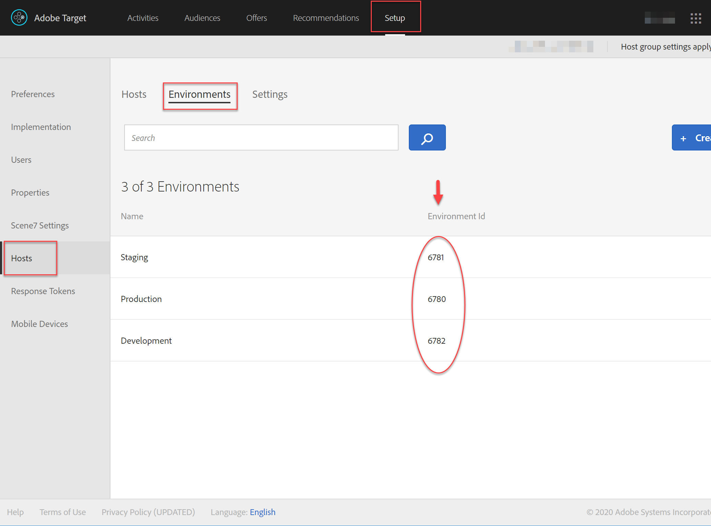
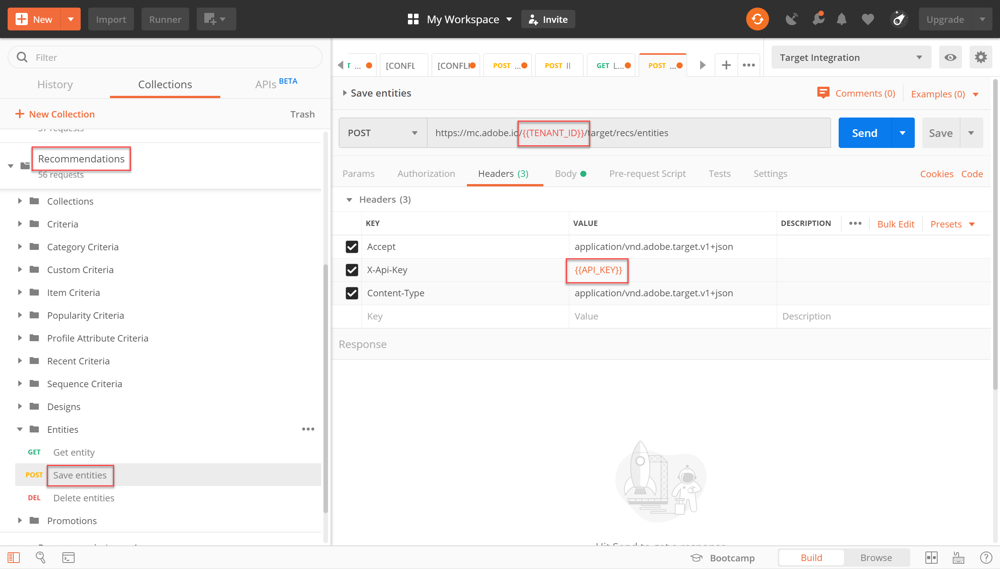
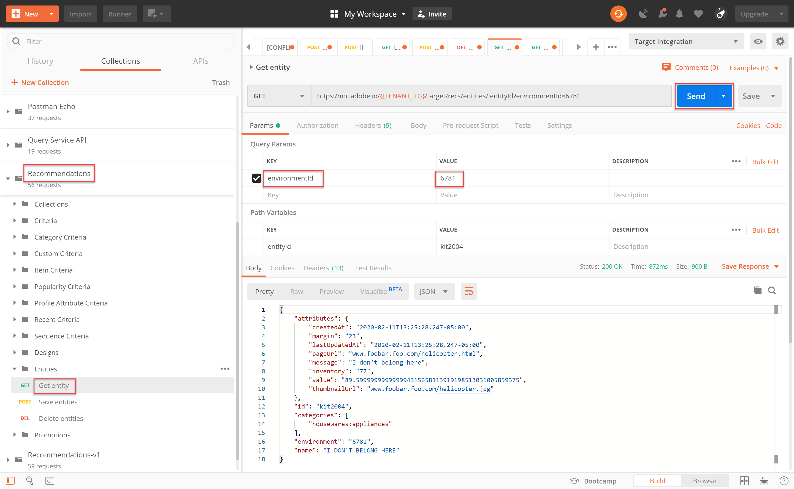

# Administrar el catálogo Recommendations mediante API

A la vez que se asegura de que cumple con los [requisitos para usar la API de Recommendations](/help/dev/before-administer/recs-api/overview.md#prerequisites), aprendió a [generar un token de acceso](/help/dev/before-administer/configure-authentication.md) mediante el flujo de autenticación JWT para usar las API de administración de [!DNL Adobe Target] en [Adobe Developer Console](https://developer.adobe.com/console/home).

Ahora puede usar las [API de Recommendations](https://developer.adobe.com/target/administer/recommendations-api/) para agregar, actualizar o eliminar elementos en su catálogo de Recommendations. Al igual que con el resto de las API de administración de Adobe Target, las API de Recommendations requieren autenticación.

>[!NOTE]
>
>Envíe la solicitud **[!UICONTROL IMS: JWT Generate + Auth via User Token]** siempre que necesite actualizar el token de acceso para la autenticación, ya que caduca pasadas 24 horas. Consulte [Configuración de la autenticación de la API de Adobe](../configure-authentication.md) para obtener instrucciones.


Antes de continuar, obtén la [colección Postman de Recommendations](https://developer.adobe.com/target/administer/recommendations-api/#section/Postman).

## Creación y actualización de elementos con la API Guardar entidades

Para rellenar la base de datos de productos de Recommendations con la API en lugar de con una fuente de productos CSV o para que Target active solicitudes en páginas de productos, use [Guardar la API de entidades](https://developer.adobe.com/target/administer/recommendations-api/#operation/saveEntities). Esta solicitud agrega o actualiza un elemento en un solo entorno de Target. La sintaxis es:

```
POST https://mc.adobe.io/{{TENANT_ID}}/target/recs/entities
```

Por ejemplo, las entidades guardadas pueden utilizarse para actualizar artículos siempre que se cumplan determinados umbrales (como umbrales de inventario o precio) con el fin de marcar dichos artículos y evitar que se recomienden.

1. Vaya a **[!UICONTROL Target]** > **[!UICONTROL Setup]** > **[!UICONTROL Hosts]** > **[!UICONTROL CONTROL Environments]** para obtener el identificador del entorno de destino en el que desea agregar o actualizar un elemento.

   

1. Compruebe que `TENANT_ID` y `API_KEY` hacen referencia a las variables de entorno de Postman establecidas anteriormente. Utilice la siguiente imagen para compararla. Si es necesario, modifique los encabezados y la ruta en su solicitud de API para que coincidan con los de la imagen siguiente.

   

1. Escriba su JSON como código **raw** en **Cuerpo**. No olvide especificar su ID de entorno con la variable `environment`. (En el ejemplo siguiente, el ID de entorno es 6781).

   

   A continuación se muestra un ejemplo de JSON que agrega entity.id kit2001 con valores de entidad asociados para un producto Toaster Oven al entorno 6781.

   ```
       {
       "entities": [{
               "name": "Toaster Oven",
               "id": "kit2001",
               "environment": 6781,
               "categories": [
                   "housewares:appliances"
               ],
               "attributes": {
                   "inventory": 77,
                   "margin": 23,
                   "message": "crashing helicopter",
                   "pageUrl": "www.foobar.foo.com/helicopter.html",
                   "thumbnailUrl": "www.foobar.foo.com/helicopter.jpg",
                  "value": 19.2
               }
           }]
       }
   ```

1. Haga clic en **[!UICONTROL Send]**. Debe recibir la siguiente respuesta.

   

   El objeto JSON se puede escalar para enviar varios productos. Por ejemplo, este JSON especifica dos entidades.

   ```
       {
           "entities": [{
                   "name": "Toaster Oven",
                   "id": "kit2001",
                   "environment": 6781,
                   "categories": [
                       "housewares:appliances"
                   ],
                   "attributes": {
                       "inventory": 89,
                       "margin": 11,
                       "message": "Toaster Oven",
                       "pageUrl": "www.foobar.foo.com/helicopter.html",
                       "thumbnailUrl": "www.foobar.foo.com/helicopter.jpg",
                       "value": 102.5
                   }
               },
               {
                   "name": "Blender",
                   "id": "kit2002",
                   "environment": 6781,
                   "categories": [
                       "housewares:appliances"
                   ],
                   "attributes": {
                       "inventory": 36,
                       "margin": 5,
                       "message": "Blender",
                       "pageUrl": "www.foobar.foo.com/helicopter.html",
                       "thumbnailUrl": "www.foobar.foo.com/helicopter.jpg",
                       "value": 54.5
                   }
               }
           ]
       }
   ```

1. ¡Ahora es tu turno! Utilice la API **[!UICONTROL Save Entities]** para agregar los siguientes elementos al catálogo. Utilice el JSON de muestra anterior como punto de partida. (Deberá ampliar el JSON para incluir entidades adicionales).

   

Parece que los dos últimos elementos no pertenecen. Vamos a inspeccionarlos usando la API **[!UICONTROL Get Entity]** y, si es necesario, eliminarlos usando la API **[!UICONTROL Delete Entities]**.

## Obtención de detalles del elemento con la API de obtención de entidad

Para recuperar los detalles de un elemento existente, use [Obtener API de entidad](https://developer.adobe.com/target/administer/recommendations-api/#operation/getEntity). La sintaxis es:

```
GET https://mc.adobe.io/{{TENANT_ID}}/target/recs/entities/[entity.id]
```

Los detalles de entidad solo se pueden recuperar para una sola entidad a la vez. Puede utilizar Obtener entidad para confirmar que las actualizaciones se realizaron en el catálogo según lo esperado o para auditar de otro modo el contenido del catálogo.

1. En la solicitud de API, especifique el ID de entidad con la variable `entityId`. El siguiente ejemplo devuelve los detalles de la entidad cuyo entityId=kit2004.

   

1. Compruebe que `TENANT_ID` y `API_KEY` hacen referencia a las variables de entorno de Postman establecidas anteriormente. Utilice la siguiente imagen para compararla. Si es necesario, modifique los encabezados y la ruta en su solicitud de API para que coincidan con los de la imagen siguiente.

   

1. Envíe la solicitud.

   
Si recibe un error que indica que no se encontró la entidad, como se muestra en el ejemplo anterior, compruebe que está enviando la solicitud al entorno de Target correcto.


   >[!NOTE]
   >
   >Si no se especifica ningún entorno explícitamente, Get Entity intenta obtener la entidad solo de [entorno predeterminado](https://experienceleague.adobe.com/docs/target/using/administer/environments.html?lang=es). Si desea extraer de cualquier entorno que no sea el predeterminado, debe especificar el ID del entorno.

1. Si es necesario, agregue el parámetro `environmentId` y vuelva a enviar la solicitud.

   

1. Envíe otra solicitud **[!UICONTROL Get Entity]**, esta vez para inspeccionar la entidad cuyo entityId=kit2005.

   

Supongamos que decide que estas entidades deben eliminarse del catálogo. Vamos a usar la API **[!UICONTROL Delete Entities]**.

## Eliminación de elementos con la API de eliminación de entidades

Para quitar elementos del catálogo, usa la [API Eliminar entidades](https://developer.adobe.com/target/administer/recommendations-api/#operation/deleteEntities). La sintaxis es:

```
DELETE https://mc.adobe.io/{{TENANT_ID}}/target/recs/entities?ids=[comma-delimited-entity-ids]&environment=[environmentId]
```

>[!WARNING]
>
>La API Eliminar entidades elimina las entidades a las que hacen referencia los ID especificados. Si no se proporciona ningún ID de entidad, se eliminan todas las entidades del entorno determinado. Si no se proporciona ningún ID de entorno, las entidades se eliminarán de todos los entornos. ¡Utilícelo con precaución!

1. Vaya a **[!UICONTROL Target]** > **[!UICONTROL Setup]** > **[!UICONTROL Hosts]** > **[!UICONTROL Environments]** para obtener el identificador del entorno de destino del que desea eliminar los elementos.

   

1. En la solicitud de API, especifique los identificadores de entidad de las entidades que desea eliminar mediante la sintaxis `&ids=[comma-delimited-entity-ids]` (un parámetro de consulta). Cuando elimine más de una entidad, separe los ID con comas.

   

1. Especifique el ID de entorno con la sintaxis `&environment=[environmentId]`; de lo contrario, se eliminarán las entidades de todos los entornos.

   

1. Compruebe que `TENANT_ID` y `API_KEY` hacen referencia a las variables de entorno de Postman establecidas anteriormente. Utilice la siguiente imagen para compararla. Si es necesario, modifique los encabezados y la ruta en su solicitud de API para que coincidan con los de la imagen siguiente.

   

1. Envíe la solicitud.

   

1. Compruebe sus resultados usando **[!UICONTROL Get Entity]**, que ahora debería indicar que no se encuentran las entidades eliminadas.

   

   

¡Felicidades! Ahora puede utilizar las API de Recommendations para crear, actualizar, eliminar y obtener detalles sobre las entidades del catálogo. En la siguiente sección, aprenderá a administrar criterios personalizados.

&lt;!— [Siguiente: &quot;Administrar criterios personalizados&quot; >](manage-custom-criteria.md) —>
