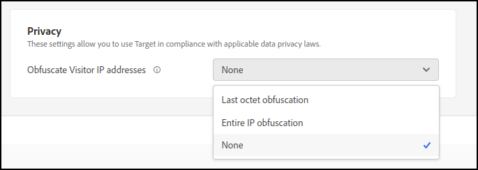

# Privacidad

[!DNL Adobe Target] ha habilitado procesos y configuraciones que permiten [!DNL Target] utilizar en cumplimiento con las leyes aplicables sobre privacidad de datos.

## Recopilación de direcciones IP e información de identificación personal (PII)

La dirección IP de un visitante del sitio web se transmite a un centro de procesamiento de datos (DPC) de Adobe. Según la configuración de red del visitante, la dirección IP no representa necesariamente la dirección IP del equipo del visitante. Por ejemplo, la dirección IP puede ser una dirección IP externa de un cortafuegos de traducción de direcciones de red (NAT), un proxy HTTP o una puerta de enlace de Internet.

>[!IMPORTANT]
>
>[!DNL Target] no almacena ninguna dirección IP del usuario ni ninguna información de identificación personal (PII). Solo [!DNL Target] usa las direcciones IP durante la sesión (en memoria, nunca persistieron).

## Sustitución del último octeto de direcciones IP

Adobe ha desarrollado una configuración de &quot;privacidad por diseño&quot; que los usuarios pueden habilitar para Adobe [!DNL Target]. Cuando está habilitada, Adobe [!DNL Target] oculta inmediatamente el último octeto (la última parte) de la dirección IP en el momento en que se recopila la dirección IP. Esta anonimización se realiza antes de cualquier procesamiento de la dirección IP, incluso antes de una consulta geográfica opcional de la dirección IP.

Cuando se habilita esta función, la dirección IP se convierte en lo suficientemente anónima para que ya no pueda identificarse como información personal. Como resultado, [!DNL Target] se puede usar de conformidad con las leyes de privacidad de datos en países que no permiten la recopilación de información personal. Es muy probable que la obtención de información por nivel de ciudad vea significativamente afectada por la confusión de la dirección IP. La obtención de información por nivel de región y país solo debería verse ligeramente afectada.

La siguiente configuración está disponible en la interfaz de usuario de [!DNL Target] navegando a **[!UICONTROL Administración]** > **[!UICONTROL Implementación]**:

* [!UICONTROL Ofuscación del último octeto]: [!DNL Target] oculta el último octeto de la dirección IP.
* [!UICONTROL Ofuscación de IP completa]: [!DNL Target] oculta la dirección IP completa.
* [!UICONTROL Ninguno]: [!DNL Target] no oculta ninguna parte de la dirección IP.

  

[!DNL Target] recibe la dirección IP completa y la oculta (si se establece en Último octeto o IP completa) según lo especificado. [!DNL Target] guarda entonces la dirección IP ocultada en la memoria solamente durante la sesión actual.

### Ofuscación de IP de nivel de flujo de datos al usar [!DNL Adobe Experience Platform Web SDK] {#aep}

Al usar [!DNL Platform Web SDK] (versión 23.4 o posterior), la configuración de confusión de IP en el nivel de secuencia de datos tiene prioridad sobre cualquier opción de confusión de IP establecida en [!DNL Target]. Por ejemplo, si la opción de ofuscación de IP de nivel de secuencia de datos está establecida en [!UICONTROL Completa] y la opción de ofuscación de IP de [!DNL Target] está establecida en [!UICONTROL Última ofuscación de octeto], [!DNL Target] recibe una IP totalmente ofuscada.

Para obtener más información, consulte [!UICONTROL Confusión de IP] en [Configurar un conjunto de datos](https://experienceleague.adobe.com/docs/experience-platform/datastreams/configure.html?lang=es){target=_blank} en la Guía de flujos de datos de *[!DNL Adobe Experience Platfrom]*.

## Segmentación geográfica

Si habilita el reemplazo del último octeto de la dirección IP, los valores restantes de la dirección IP se pueden analizar mediante los informes de [!DNL Target]. Si no se ha ocultado el último octeto de la dirección IP, se puede analizar la dirección IP completa en [!DNL Target]. Puede usar la característica Segmentación geográfica para determinar la ubicación del visitante por zona geográfica. Los datos de segmentación geográfica se detallan solamente hasta el nivel de ciudad o de código postal, y no a nivel individual.

Si las direcciones IP se ocultan por completo, la segmentación geográfica y el direccionamiento geográfico no estarán disponibles.

## Vínculo de no participación

Puede añadir un vínculo de no participación a sus sitios para permitir que los visitantes renuncien a los recuentos y la publicación de contenido.

1. Añada el vínculo siguiente a su sitio:

   `<a href="https://clientcode.tt.omtrdc.net/optout"> Your Opt Out Language Here</a>`

1. (Condicional) Si utiliza CNAME, el vínculo debe contener el parámetro &quot;client=`clientcode`&quot;, por ejemplo:
   `https://my.cname.domain/optout?client=clientcode`.

1. Reemplace `clientcode` por su código de cliente de y añada el texto o la imagen que se vinculará a la dirección URL de no participación.

Los visitantes que hagan clic en este vínculo no se incluirán en ninguna petición de mbox llamada desde sus sesiones de navegación hasta que eliminen sus cookies o hasta pasados dos años, lo que ocurra primero. Esto funciona estableciendo una cookie para el visitante llamada `disableClient` en el dominio `clientcode.tt.omtrdc.net`.

Aunque utilice una implementación de cookies de origen, la posibilidad de exclusión proporcionada se establece mediante una cookie de terceros. Si el cliente solo usa una cookie de origen, [!DNL Target] comprueba si se ha establecido una cookie de exclusión.

## Reglamentos de protección de datos y privacidad

Consulte [Reglamentos de protección de datos y privacidad](/help/dev/before-implement/privacy/cmp-privacy-and-general-data-protection-regulation.md) para obtener información sobre el Reglamento General de Protección de Datos (RGPD) de la Unión Europea, la Ley de Privacidad del Consumidor de California (CCPA) y otros requisitos de privacidad internacionales, y cómo estos reglamentos afectan a su organización y a [!DNL Target].

## Recopilación de datos sobre el uso de las funciones

Los datos de uso de características individuales se recopilan con fines internos de Adobe para identificar si las características de [!DNL Target] funcionan según lo previsto o para identificar las características que se están infrautilizando. Se recopilan varias mediciones de latencia para ayudar a resolver los problemas de rendimiento. Los datos personales no se recopilan.

Puede excluirse de los datos de uso de informes en nuestros SDK configurando `telemetryEnabled` como false en las opciones de inicialización del cliente. Para obtener más información, consulte [telemetryEnabled en targetGlobalSettings](/help/dev/implement/client-side/atjs/atjs-functions/targetglobalsettings.md#telemetryenabled).
