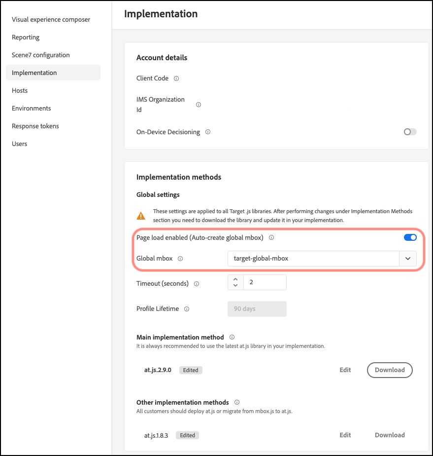

# Personalización de un mbox global

Información para personalizar un mbox global de [!DNL Adobe Target] para at.js.

1. Haga clic en **[!UICONTROL Administration]** > **[!UICONTROL Implementation]**.

1. Deshabilite **[!UICONTROL Page load enabled (Auto create global mbox)]** y luego agregue el nombre del mbox global personalizado que desea usar para publicar actividades de [!DNL Target].

>[!WARNING]
>
>El cambio se guarda automáticamente al seleccionar un mbox global diferente.

Este mbox global personalizado también se usa para el rastreo de clics.

1. Implemente la biblioteca at.js en su sitio.

   Consulte [Cómo implementar at.js](/help/dev/implement/client-side/atjs/how-to-deployatjs/how-to-deployatjs.md) para obtener más información.

1. Programe la transición según su versión.

   Cuando esté listo para que [!DNL Target] empiece a usar el mbox global en todas las actividades futuras, proceda con este paso.

   Actualice el nombre del mbox global personalizado para que coincida con el nombre usado en el paso 2 anterior.

>[!WARNING]
>
>Todas las actividades de su cuenta se sincronizan con este mbox. Asegúrese de que el mbox global esté presente en el sitio para que las actividades de sigan funcionando. Asegúrese de editar y volver a guardar las actividades afectadas que se crearon con el [!UICONTROL Visual Experience Composer] (VEC) que se sincronizan con este mbox. No es necesario volver a guardar las actividades creadas en [!UICONTROL Form-Based Experience Composer] o mediante API.
