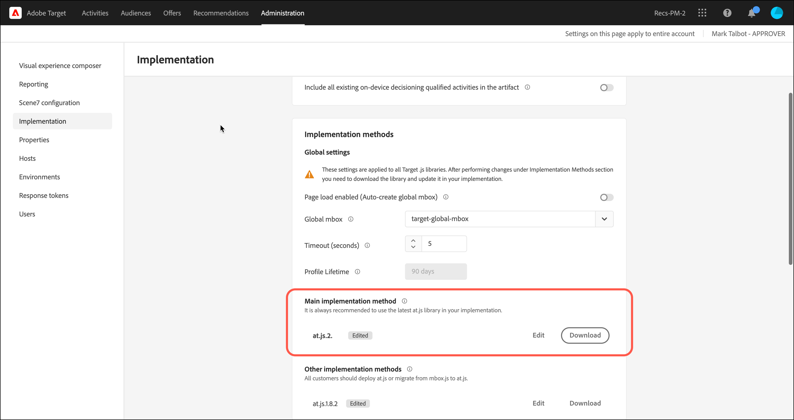

# [!UICONTROL On-device decisioning] para at.js

Desde la versión 2.5.0, at.js ofrece [!UICONTROL on-device decisioning]. [!UICONTROL On-device decisioning] le permite almacenar en caché sus actividades [Prueba A/B](https://experienceleague.adobe.com/docs/target/using/activities/abtest/test-ab.html) y [Segmentación de experiencias](https://experienceleague.adobe.com/docs/target/using/activities/experience-targeting/experience-target.html) (XT) en el explorador para realizar la toma de decisiones en memoria sin una solicitud de bloqueo de red al Edge Network [!DNL Adobe Target].

>[!NOTE]
>
>[!UICONTROL On-device decisioning] está disponible tanto para implementaciones del lado del cliente como del lado del servidor. Este artículo describe [!UICONTROL on-device decisioning] para el cliente. Para obtener información acerca de [!UICONTROL on-device decisioning] para el lado del servidor, consulte la documentación de implementación del lado del servidor [aquí](../../../server-side/sdk-guides/on-device-decisioning/overview.md).

[!DNL Target] también ofrece la flexibilidad de ofrecer la experiencia más relevante y actualizada a partir de sus actividades de experimentación y personalización impulsadas por el aprendizaje automático (impulsadas por ML) a través de una llamada al servidor en directo. En otras palabras, cuando el rendimiento es más importante, puede elegir usar [!UICONTROL on-device decisioning]. Sin embargo, cuando se necesita la experiencia más relevante, actualizada y basada en ML, se puede realizar una llamada al servidor en su lugar.

## ¿Cuáles son los beneficios de [!UICONTROL on-device decisioning]?

Los beneficios de [!UICONTROL on-device decisioning] incluyen:

* **Ofrezca decisiones y experiencias increíblemente rápidas.**: la agrupación y la toma de decisiones se realizan en memoria y en el explorador para evitar el bloqueo de solicitudes de red.
* **Mejorar el rendimiento de la aplicación.** Ejecute experimentos y proporcione personalización a sus clientes y usuarios sin poner en riesgo las experiencias de los usuarios finales.
* **Mejorar la puntuación de calidad del sitio de Google.**: cuando las decisiones se toman en memoria, mejore la puntuación de calidad del sitio de Google de su negocio en línea para que los consumidores puedan descubrirlo mejor.
* **Aprenda de los análisis en tiempo real.** Obtenga información en tiempo real de su rendimiento de actividad mediante la creación de informes en [Analytics for Target](https://experienceleague.adobe.com/docs/target/using/integrate/a4t/a4t.html) (A4T). A4T le permite pivotar su estrategia en momentos críticos.

## Funciones compatibles

[!DNL Adobe Target] JS SDK ofrece a los clientes la flexibilidad de elegir entre el rendimiento y la actualización de los datos para tomar decisiones. En otras palabras, si la entrega del contenido personalizado más relevante y atractivo a través del aprendizaje automático es lo más importante para usted, se debe realizar una llamada al servidor en directo. Sin embargo, cuando el rendimiento es más crítico, se debe tomar una decisión en el dispositivo y en la memoria. Para que [!UICONTROL on-device decisioning] funcione, consulte la lista de características compatibles:

* Tipos de actividades. 
* Segmentación de audiencia
* Método de asignación

Para obtener más información, vea [Características compatibles con [!UICONTROL on-device decisioning]](/help/dev/implement/client-side/atjs/on-device-decisioning/supported-features.md).

## ¿Cómo funciona [!UICONTROL on-device decisioning]?

Al implementar e inicializar at.js con [!UICONTROL on-device decisioning] habilitado, se descarga un [artefacto de regla](/help/dev/implement/client-side/atjs/on-device-decisioning/rule-artifact.md) que incluye a [!UICONTROL on-device decisioning] para actividades, audiencias y recursos A/B y XT desde la red de distribución de contenido (CDN) de Akamai más cercana a su visitante y se almacena en caché localmente en el explorador del visitante. Cuando se realiza una solicitud desde at.js para recuperar una experiencia, la decisión con respecto a la experiencia que se va a devolver se realiza en memoria, en función de los metadatos codificados en el artefacto de regla en caché.

## Método de toma de decisiones

Con [!UICONTROL on-device decisioning], [!DNL Target] introduce una nueva configuración denominada Método de toma de decisiones. La configuración Método de toma de decisiones dicta cómo at.js envía sus experiencias. El método de toma de decisiones tiene tres valores:

* Solo del lado del servidor
* Solo en el dispositivo
* Híbrido

### Solo del lado del servidor

Solo del lado del servidor es el método de toma de decisiones predeterminado que se establece por defecto cuando at.js 2.5.0+ se implementa y despliega en las propiedades web.

Usar solo del lado del servidor como configuración predeterminada significa que todas las decisiones se toman en la red perimetral [!DNL Target], lo que implica una llamada al servidor de bloqueo. Este método puede introducir la latencia incremental, pero también proporciona beneficios importantes, como la posibilidad de aplicar las capacidades de aprendizaje automático de [!DNL Target], que incluyen las actividades [Recommendations](https://experienceleague.adobe.com/docs/target/using/recommendations/recommendations.html), [Automated Personalization](https://experienceleague.adobe.com/docs/target/using/activities/automated-personalization/automated-personalization.html) (AP) y [Segmentación automática](https://experienceleague.adobe.com/docs/target/using/activities/auto-target/auto-target-to-optimize.html).

Además, la mejora de sus experiencias personalizadas mediante el uso del perfil de usuario de [!DNL Target], que se mantiene en todas las sesiones y canales, puede proporcionar potentes resultados para su empresa.

Por último, solo del lado del servidor permite utilizar Adobe Experience Cloud y ajustar las audiencias a las que se puede dirigir mediante segmentos de Audience Manager y Adobe Analytics.

El diagrama siguiente ilustra la interacción entre el visitante, el explorador, at.js 2.5.0+ y la red de Edge [!DNL Adobe Target]. Este diagrama de flujo captura los nuevos visitantes y los visitantes que regresan.

(Haga clic en la imagen para ampliarla a ancho completo).

{zoomable="yes"}

La siguiente lista corresponde a los números del diagrama:

| Paso   | Descripción |
| --- | --- |
| 1 | El ID de visitante de Experience Cloud se ha recuperado del [servicio de identidad de Adobe Experience Cloud](https://experienceleague.adobe.com/docs/id-service/using/home.html?). |
| 2 | La biblioteca de at.js carga de forma sincronizada y oculta el cuerpo del documento.<br />   La biblioteca at.js también se puede cargar de forma asíncrona con un fragmento de ocultamiento previo opcional implementado en la página. |
| 3 | La biblioteca at.js oculta el cuerpo para evitar parpadeos. |
| 4 | Se realiza una solicitud de carga de página que incluye todos los parámetros configurados, como (ECID, ID de cliente, parámetros personalizados, perfil de usuario, etc.) |
| 5 | Se ejecutan los scripts de perfil y se incluyen en el Almacenamiento de perfiles.<br />El Almacenamiento de perfiles solicita audiencias de la Biblioteca de audiencias que cumplan los requisitos (por ejemplo, audiencias compartidas de Adobe Analytics, Adobe Audience Manager, etc.).<br />Se envían los atributos del cliente al Almacenamiento de perfiles en un procesamiento de lotes. |
| 6 | El Almacenamiento de perfiles se utiliza para la calificación de audiencias y el agrupamiento para filtrar actividades. |
| 7 | El contenido resultante se selecciona después de que la experiencia se determine a partir de actividades activas [!DNL Target]. |
| 8 | La biblioteca at.js oculta los elementos correspondientes de la página que están asociados con la experiencia que se debe procesar. |
| 9 | La biblioteca at.js muestra el cuerpo para que el resto de la página se pueda cargar para que la vea el visitante. |
| 10 | La biblioteca at.js manipula el DOM para procesar la experiencia desde el Edge Network [!DNL Target]. |
| 11 | La experiencia se procesa para el visitante. |
| 12 | Se carga toda la página web. |
| 13 | Se envían los datos de Analytics a los servidores de recopilación de datos. |
| 14 | Se comparan los datos de Target con los datos de Analytics mediante el SDID y se procesan en el almacén de informes de Analytics. Por lo tanto, los datos de Analytics se pueden ver tanto en Analytics como en [!DNL Target] mediante los informes de [!UICONTROL Analytics for Target] (A4T). |

### Solo en el dispositivo

Solo en el dispositivo es el método de toma de decisiones que debe configurarse en at.js 2.5.0+ cuando [!UICONTROL on-device decisioning] solo debe usarse en sus páginas web.

[!UICONTROL On-device decisioning] puede entregar sus experiencias y actividades de personalización a una velocidad asombrosa, ya que las decisiones se toman a partir de un artefacto de reglas en caché que contiene todas las actividades que cumplen los requisitos para [!UICONTROL on-device decisioning].

Para obtener más información acerca de las actividades que cumplen los requisitos para [!UICONTROL on-device decisioning], vea [Características compatibles en [!UICONTROL on-device decisioning]](/help/dev/implement/client-side/atjs/on-device-decisioning/supported-features.md).

Este método de toma de decisiones solo debe usarse si el rendimiento es muy crítico en todas las páginas que requieren decisiones de Target. Además, recuerde que cuando se selecciona este método de toma de decisiones, las actividades de [!DNL Target] que no cumplen los requisitos para [!UICONTROL on-device decisioning] no se entregarán ni ejecutarán. La biblioteca at.js 2.5.0+ está configurada para buscar únicamente el artefacto de reglas en caché para tomar decisiones.

El diagrama siguiente ilustra la interacción entre su visitante, el explorador, at.js 2.5.0+ y la CDN de Akamai. La CDN de Akamai almacena en caché el artefacto de reglas para la primera visita del visitante. Para la primera visita a la página de un visitante nuevo, el artefacto de reglas JSON debe descargarse de la CDN de Akamai para almacenarse en la caché local en el explorador del visitante. Una vez descargado el artefacto de reglas JSON, la decisión se toma inmediatamente sin una llamada de red de bloqueo. El siguiente diagrama de flujo captura los nuevos visitantes.

(Haga clic en la imagen para ampliarla a ancho completo).

{zoomable="yes"}

La siguiente lista corresponde a los números del diagrama:

>[!NOTE]
>
>[!DNL Adobe Target] Servidores de administración califican todas sus actividades que cumplen los requisitos para [!UICONTROL on-device decisioning], generan el artefacto de reglas JSON y lo propagan a la CDN de Akamai. Sus actividades se monitorizan continuamente en busca de actualizaciones para generar un nuevo artefacto de reglas JSON que se propagará a la CDN de Akamai.

| Paso   | Descripción |
| --- | --- |
| 1 | El ID de visitante de Experience Cloud se ha recuperado del [servicio de identidad de Adobe Experience Cloud](https://experienceleague.adobe.com/docs/id-service/using/home.html). |
| 2 | La biblioteca de at.js carga de forma sincronizada y oculta el cuerpo del documento.<br />La biblioteca at.js también se puede cargar de forma asíncrona con un fragmento de ocultamiento previo opcional implementado en la página. |
| 3 | La biblioteca at.js oculta el cuerpo para evitar parpadeos. |
| 4 | La biblioteca at.js realiza una solicitud para recuperar el artefacto de regla JSON de la CDN de Akamai más cercana al visitante. |
| 5 | La CDN de Akamai responde con el artefacto de regla JSON. |
| 6 | El artefacto de regla JSON se almacena localmente en caché en el explorador del visitante. |
| 7 | La biblioteca at.js interpreta el artefacto de regla JSON y ejecuta la decisión de recuperar la experiencia y oculta los elementos probados. |
| 8 | La biblioteca at.js muestra el cuerpo para que el resto de la página se pueda cargar para que la vea el visitante. |
| 9 | La biblioteca at.js manipula el DOM para procesar la experiencia desde el artefacto de regla JSON en caché. |
| 10 | La experiencia se procesa para el visitante. |
| 11 | Se carga toda la página web. |
| 12 | Los datos de Analytics se envían a los servidores de recopilación de datos. Se comparan los datos de Target con los datos de Analytics mediante el SDID y se procesan en el almacén de informes de Analytics. Por lo tanto, los datos de Analytics se pueden ver tanto en Analytics como en [!DNL Target] mediante los informes de [!UICONTROL Analytics for Target] (A4T). |

El diagrama siguiente ilustra la interacción entre el visitante, el explorador, at.js 2.5.0+ y el artefacto de reglas JSON en caché para la visita individual a la página o la visita recurrente posterior del visitante. Dado que el artefacto de reglas JSON ya se almacena en caché y está disponible en el explorador, la decisión se toma inmediatamente sin una llamada de red de bloqueo. Este diagrama de flujo captura la navegación posterior por la página o los visitantes que regresan.

(Haga clic en la imagen para ampliarla a ancho completo).

{zoomable="yes"}

La siguiente lista corresponde a los números del diagrama:

>[!NOTE]
>
>[!DNL Adobe Target] Servidores de administración califican todas sus actividades que cumplen los requisitos para [!UICONTROL on-device decisioning], generan el artefacto de reglas JSON y lo propagan a la CDN de Akamai. Sus actividades se monitorizan continuamente en busca de actualizaciones para generar un nuevo artefacto de reglas JSON que se propagará a la CDN de Akamai.

| Paso   | Descripción |
| --- | --- |
| 1 | El ID de visitante de Experience Cloud se ha recuperado del [servicio de identidad de Adobe Experience Cloud](https://experienceleague.adobe.com/docs/id-service/using/home.html). |
| 2 | La biblioteca de at.js carga de forma sincronizada y oculta el cuerpo del documento.<br />La biblioteca at.js también se puede cargar de forma asíncrona con un fragmento de ocultamiento previo opcional implementado en la página. |
| 3 | La biblioteca at.js oculta el cuerpo para evitar parpadeos. |
| 4 | La biblioteca at.js interpreta el artefacto de regla JSON y ejecuta la decisión en la memoria para recuperar la experiencia. |
| 5 | Los elementos probados están ocultos. |
| 6 | La biblioteca at.js muestra el cuerpo para que el resto de la página se pueda cargar para que la vea el visitante. |
| 7 | La biblioteca at.js manipula el DOM para procesar la experiencia desde el artefacto de regla JSON en caché. |
| 8 | La experiencia se procesa para el visitante. |
| 9 | Se carga toda la página web. |
| 10 | Los datos de Analytics se envían a los servidores de recopilación de datos. Se comparan los datos de Target con los datos de Analytics mediante el SDID y se procesan en el almacén de informes de Analytics. Por lo tanto, los datos de Analytics se pueden ver tanto en Analytics como en [!DNL Target] mediante los informes de [!UICONTROL Analytics for Target] (A4T). |

### Híbrido

Híbrido es el método de toma de decisiones que debe establecerse en at.js 2.5.0+ cuando se deben ejecutar tanto [!UICONTROL on-device decisioning] como las actividades que requieren una llamada de red a la red de Edge [!DNL Adobe Target].

Cuando administra actividades de [!UICONTROL on-device decisioning] y actividades del lado del servidor, puede resultar un poco complicado y tedioso pensar en cómo implementar y aprovisionar [!DNL Target] en sus páginas. Con el método de toma de decisiones híbrido, [!DNL Target] sabe cuándo debe realizar una llamada al servidor a la red de Edge [!DNL Adobe Target] para las actividades que requieren ejecución del lado del servidor y también cuándo ejecutar únicamente decisiones en el dispositivo.

El artefacto de reglas JSON incluye metadatos para informar a at.js de si un mbox tiene una actividad del lado del servidor en ejecución o una actividad [!UICONTROL on-device decisioning]. Este método de toma de decisiones garantiza que las actividades que desea que se entreguen rápidamente se realicen a través de [!UICONTROL on-device decisioning] y que, para las actividades que requieren una personalización basada en ML más potente, dichas actividades se realicen a través de la red de Edge [!DNL Adobe Target].

El diagrama siguiente ilustra la interacción entre su visitante, el explorador, at.js 2.5.0+, la CDN de Akamai y la Edge Network [!DNL Adobe Target] para un visitante nuevo que visita su página por primera vez. La conclusión de este diagrama es que el artefacto de reglas JSON se descarga asincrónicamente mientras las decisiones se toman a través de la red de Edge [!DNL Adobe Target].

Este enfoque garantiza que el tamaño del artefacto, que puede incluir muchas actividades, no influya negativamente en la latencia de la decisión. La descarga del artefacto de reglas JSON sincrónicamente y la toma de decisiones a partir de entonces también pueden tener efectos adversos para la latencia y pueden ser incoherentes. Por lo tanto, el método de toma de decisiones híbrido es una recomendación de práctica recomendada para realizar siempre una llamada del lado del servidor para la decisión de un nuevo visitante y, como el artefacto de reglas JSON se almacena en caché en paralelo. Para cualquier visita posterior a la página y visita de retorno, las decisiones se toman desde la caché y en memoria a través del artefacto de reglas JSON.

(Haga clic en la imagen para ampliarla a ancho completo).

{zoomable="yes"}

La siguiente lista corresponde a los números del diagrama:

>[!NOTE]
>
>[!DNL Adobe Target] Servidores de administración califican todas sus actividades que cumplen los requisitos para [!UICONTROL on-device decisioning], generan el artefacto de reglas JSON y lo propagan a la CDN de Akamai. Sus actividades se monitorizan continuamente en busca de actualizaciones para generar un nuevo artefacto de reglas JSON que se propagará a la CDN de Akamai.

| Paso   | Descripción |
| --- | --- |
| 1 | El ID de visitante de Experience Cloud se ha recuperado del [servicio de identidad de Adobe Experience Cloud](https://experienceleague.adobe.com/docs/id-service/using/home.html). |
| 2 | La biblioteca de at.js carga de forma sincronizada y oculta el cuerpo del documento.<br />La biblioteca at.js también se puede cargar de forma asíncrona con un fragmento de ocultamiento previo opcional implementado en la página. |
| 3 | La biblioteca at.js oculta el cuerpo para evitar parpadeos. |
| 4 | Se realiza una solicitud de carga de página al Edge Network [!DNL Adobe Target], incluidos todos los parámetros configurados, como (ECID, ID de cliente, parámetros personalizados, perfil de usuario, etc.) |
| 5 | Al mismo tiempo, at.js realiza una solicitud para recuperar el artefacto de regla JSON de la CDN de Akamai más cercana al visitante. |
| 6 | ([!DNL Adobe Target] Edge Network) Los scripts de perfil se ejecutan y luego se incluyen en el almacén de perfiles. El Almacenamiento de perfiles solicita audiencias de la Biblioteca de audiencias que cumplan los requisitos (por ejemplo, audiencias compartidas de Adobe Analytics, Adobe Audience Manager, etc.). |
| 7 | La CDN de Akamai responde con el artefacto de regla JSON. |
| 8 | El Almacenamiento de perfiles se utiliza para la calificación de audiencias y el agrupamiento para filtrar actividades. |
| 9 | El contenido resultante se selecciona después de que la experiencia se determine a partir de actividades activas [!DNL Target]. |
| 10 | La biblioteca at.js oculta los elementos correspondientes de la página que están asociados con la experiencia que se debe procesar. |
| 11 | La biblioteca at.js muestra el cuerpo para que el resto de la página se pueda cargar para que la vea el visitante. |
| 12 | La biblioteca at.js manipula el DOM para procesar la experiencia desde el Edge Network [!DNL Target]. |
| 13 | La experiencia se procesa para el visitante. |
| 14 | Se carga toda la página web. |
| 15 | Los datos de Analytics se envían a los servidores de recopilación de datos. Se comparan los datos de Target con los datos de Analytics mediante el SDID y se procesan en el almacén de informes de Analytics. Por lo tanto, los datos de Analytics se pueden ver tanto en Analytics como en [!DNL Target] mediante los informes de [!UICONTROL Analytics for Target] (A4T). |

El diagrama siguiente ilustra la interacción entre el visitante, el explorador, at.js 2.5.0+ y el artefacto de reglas JSON en caché para una navegación de página posterior o una visita recurrente. En este diagrama, concéntrese únicamente en el caso de uso en el que se toma una decisión en el dispositivo para la navegación de páginas o la visita de retorno subsiguientes. Tenga en cuenta que, según qué actividades estén activas para determinadas páginas, se puede realizar una llamada del lado del servidor para ejecutar decisiones del lado del servidor.

(Haga clic en la imagen para ampliarla a ancho completo).

{zoomable="yes"}

La siguiente lista corresponde a los números del diagrama:

>[!NOTE]
>
>[!DNL Adobe Target] Servidores de administración califican todas sus actividades que cumplen los requisitos para [!UICONTROL on-device decisioning], generan el artefacto de reglas JSON y lo propagan a la CDN de Akamai. Sus actividades se monitorizan continuamente en busca de actualizaciones para generar un nuevo artefacto de reglas JSON que se propagará a la CDN de Akamai.

| Paso   | Descripción |
| --- | --- |
| 1 | El ID de visitante de Experience Cloud se ha recuperado del [servicio de identidad de Adobe Experience Cloud](https://experienceleague.adobe.com/docs/id-service/using/home.html). |
| 2 | La biblioteca de at.js carga de forma sincronizada y oculta el cuerpo del documento.<br />La biblioteca at.js también se puede cargar de forma asíncrona con un fragmento de ocultamiento previo opcional implementado en la página. |
| 3 | La biblioteca at.js oculta el cuerpo para evitar parpadeos. |
| 4 | Se realiza una solicitud para recuperar una experiencia. |
| 5 | La biblioteca at.js confirma que el artefacto de regla JSON ya se ha almacenado en caché y ejecuta la decisión en la memoria para recuperar la experiencia. |
| 6 | Los elementos probados están ocultos. |
| 7 | La biblioteca at.js muestra el cuerpo para que el resto de la página se pueda cargar para que la vea el visitante. |
| 8 | La biblioteca at.js manipula el DOM para procesar la experiencia desde el artefacto de regla JSON en caché. |
| 9 | La experiencia se procesa para el visitante. |
| 10 | Se carga toda la página web. |
| 11 | Los datos de Analytics se envían a los servidores de recopilación de datos. Se comparan los datos de Target con los datos de Analytics mediante el SDID y se procesan en el almacén de informes de Analytics. Por lo tanto, los datos de Analytics se pueden ver tanto en Analytics como en [!DNL Target] mediante los informes de [!UICONTROL Analytics for Target] (A4T). |

## ¿Cómo habilito [!UICONTROL on-device decisioning]?

[!UICONTROL On-device decisioning] está disponible para todos los clientes de [!DNL Target] que utilizan At.js 2.5.0+.

Para habilitar [!UICONTROL on-device decisioning]:

>[!NOTE]
>
>Debe tener el rol de administrador o aprobador [usuario](https://experienceleague.adobe.com/docs/target/using/administer/manage-users/user-management.html) para habilitar o deshabilitar la opción de toma de decisiones en el dispositivo.

1. Haga clic en **[!UICONTROL Administration]** > **[!UICONTROL Implementation]** > **[!UICONTROL Account details]**.
1. En **[!UICONTROL Account details]**, coloque el conmutador **[!UICONTROL On-Device Decisioning]** en la posición &quot;on&quot;.

   Conmutar ![[!UICONTROL On-device decisioning]](assets/on-device-decisioning-toggle.png)

   La opción &quot;Incluir todas las actividades calificadas de [!UICONTROL on-device decisioning] existentes en el artefacto&quot; se muestra si habilita [!UICONTROL on-device decisioning].
1. (Condicional) Deslice el conmutador a la posición &quot;Activado&quot; si desea que todas sus actividades activas de [!DNL Target] que cumplen los requisitos para [!UICONTROL on-device decisioning] se incluyan automáticamente en el artefacto.

   Si deja esta opción desactivada, debe volver a crear y activar las actividades [!UICONTROL on-device decisioning] para que se incluyan en el artefacto de reglas generadas. En otras palabras, cualquier actividad en estado activo antes de activar la opción Toma de decisiones en el dispositivo no se incluye en el artefacto de reglas.

Después de habilitar la opción de toma de decisiones en el dispositivo, [!DNL Target] comienza a generar y propagar [artefactos de regla](/help/dev/implement/client-side/atjs/on-device-decisioning/rule-artifact.md) para su cliente.

>[!WARNING]
>
>Asegúrese de habilitar la opción antes de inicializar el SDK [!DNL Adobe Target] para usar [!UICONTROL on-device decisioning]. Los artefactos de regla primero deben generarse y propagarse a las CDN de Akamai para que [!UICONTROL on-device decisioning] funcione. La propagación puede tardar entre cinco y diez minutos en generarse y propagarse el primer artefacto de regla a la CDN de Akamai.

## ¿Cómo configuro at.js 2.5.0+ para que use [!UICONTROL on-device decisioning]?

1. Haga clic en **[!UICONTROL Administration]** > **[!UICONTROL Implementation]** > **[!UICONTROL Account details]**.
1. En **[!UICONTROL Implementation Methods]** > **[!UICONTROL Main Implementation Method]**, haga clic en **[!UICONTROL Edit]** junto a su versión de at.js (debe ser at.js 2.5.0 o posterior).

   

   >[!WARNING]
   >
   >Antes de cambiar esta configuración predeterminada, póngase en contacto con Atención al cliente para evitar que esto afecte a su implementación actual.

1. Seleccione el método de toma de decisiones deseado:

   * Solo del lado del servidor
   * Solo en el dispositivo
   * Híbrido

   

### Configuración global

Puede configurar un método de toma de decisiones predeterminado para todas las [!DNL Target] decisiones. Los distintos métodos de toma de decisiones son solo del lado del servidor, solo en el dispositivo e híbrido. El método de toma de decisiones seleccionado en la interfaz de usuario [!DNL Target] se configura en `window.targetGlobalSettings` en el campo `decisioningMethod`. Obtenga más información acerca de `decisioningMethod` en [targetGlobalSettings()](/help/dev/implement/client-side/atjs/atjs-functions/targetglobalsettings.md#decisioningmethod).

```javascript {line-numbers="true"}
<head> 
    <script type="text/javascript">

        window.targetGlobalSettings = { 
            clientCode: "yourClientCodeHere", 
            imsOrgId: "imsOrgId@AdobeOrg", 
            decisioningMethod: "on-device"

        }; 
    </script>

    <script type="text/javascript" src="at.js"></script> 
</head>
```

### Configuración personalizada

Si establece `decisioningMethod` en `window.targetGlobalSettings`, pero desea anular `decisioningMethod` para cada decisión [!DNL Adobe Target] según el caso de uso, puede realizar este procedimiento especificando `decisioningMethod` en la llamada [getOffers()](/help/dev/implement/client-side/atjs/atjs-functions/adobe-target-getoffers-atjs-2.md) de at.js2.5.0+.

```javascript {line-numbers="true"}
adobe.target.getOffers({ 

  decisioningMethod:"on-device", 
  request: { 
    execute: { 
      mboxes: [ 
        { 
          index: 0, 
          name: "homepage" 
        } 
      ] 
    } 
 } 
});
```

>[!NOTE]
>
>Para usar &quot;en el dispositivo&quot; o &quot;híbrido&quot; como método de toma de decisiones en la llamada a getOffers(), asegúrese de que la configuración global tenga `decisioningMethod` como &quot;en el dispositivo&quot; o &quot;híbrido&quot;. La biblioteca at.js 2.5.0 o posterior debe saber si desea descargar y almacenar en caché el artefacto de reglas JSON inmediatamente después de cargarse en la página. Si el método de toma de decisiones para la configuración global se establece en &quot;lado del servidor&quot; y el método de toma de decisiones &quot;en el dispositivo&quot; o &quot;híbrido&quot; se pasa a la llamada getOffers(), at.js 2.5.0+ no tendría el artefacto de regla JSON en la caché para ejecutar sus decisiones en el dispositivo.

### TTL de caché de artefactos

Target representa las actividades que cumplen los requisitos de [!UICONTROL on-device decisioning] como un artefacto que consta de metadatos, reglas y condiciones. Este artefacto se almacena en caché en la CDN de Akamai. Durante la primera visita del usuario, el explorador del usuario descarga y almacena en caché el artefacto que representa sus actividades [!UICONTROL on-device decisioning].

En las visitas posteriores al sitio, el explorador comprueba automáticamente si debe descargar una versión más reciente del artefacto. Esta comprobación añade latencia. El TTL Caché de artefactos define el número de minutos que no desea que el explorador compruebe si hay un artefacto actualizado desde la última descarga correcta. Cuanto más largo sea el lapso de tiempo, mejor será el rendimiento. Cuanto más corto sea el lapso de tiempo, mejor será la actualización de los datos, pero al coste de la latencia añadida.

## ¿Cómo sé que una actividad es elegible para [!UICONTROL on-device decisioning]?

Después de crear una actividad que cumple los requisitos de [!UICONTROL on-device decisioning], se puede ver una etiqueta que indique Apto para la toma de decisiones en el dispositivo en la página Información general de la actividad.


Esta etiqueta no significa que la actividad siempre se enviará a través de [!UICONTROL on-device decisioning]. Solo cuando at.js 2.5.0+ esté configurado para usar [!UICONTROL on-device decisioning], esta actividad se ejecutará en el dispositivo. Si at.js 2.5.0+ no está configurado para utilizar en el dispositivo, esta actividad se entregará a través de una llamada al servidor realizada desde at.js.

Puede filtrar todas las actividades que cumplen los requisitos de [!UICONTROL on-device decisioning] en la página Actividades mediante el filtro Apto para la toma de decisiones en el dispositivo.


>[!NOTE]
>
>Después de crear y activar una actividad que cumpla los requisitos de [!UICONTROL on-device decisioning], pueden pasar de cinco a diez minutos antes de que se incluya en el artefacto de reglas que se genera y propaga al punto de presencias de la CDN de Akamai.

## Resumen de los pasos para garantizar que mis actividades [!UICONTROL on-device decisioning] se entreguen a través de At.js 2.5.0+?

1. Acceda a la interfaz de usuario de [!DNL Adobe Target] y vaya a **[!UICONTROL Administration]** > **[!UICONTROL Implementation]** > **[!UICONTROL Account Details]** para habilitar la opción **[!UICONTROL On-Device Decisioning]**.
1. Habilite la opción **[!UICONTROL "Include all existing [!UICONTROL on-device decisioning] qualified activities in the artifact"]**.

   La primera generación de artefactos de reglas JSON puede tardar hasta 10 minutos.

1. Cree y active un tipo de actividad [&#x200B; compatible con [!UICONTROL on-device decisioning]](/help/dev/implement/client-side/atjs/on-device-decisioning/supported-features.md) y verifique que cumpla los requisitos de [!UICONTROL on-device decisioning].
1. Establezca **[!UICONTROL Decisioning Method]** en **[!UICONTROL "Hybrid"]** o **[!UICONTROL "On-device only"]** a través de la interfaz de usuario de la configuración de at.js.
1. Descargue e implemente at.js 2.5.0+ en sus páginas.
