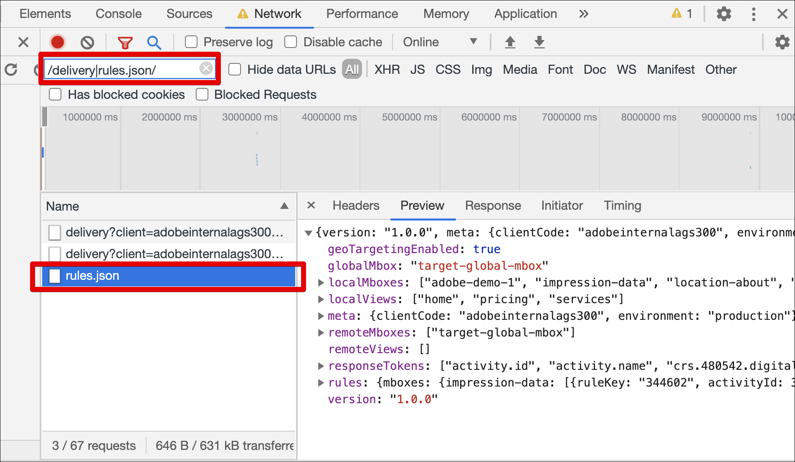

# Solucionar problemas de [!UICONTROL toma de decisiones en el dispositivo] para at.js

Complete los siguientes pasos para solucionar problemas de la [!UICONTROL toma de decisiones en el dispositivo] en [!UICONTROL Adobe Target] con la biblioteca JavaScript at.js:

## Paso 1: Habilitar el registro de consola para at.js

Anexar el parámetro de URL `mboxDebug=1` permite que at.js imprima mensajes en la consola del explorador.

Todos los mensajes contienen el prefijo &quot;AT:&quot; para obtener una descripción general más práctica. Para asegurarse de que un artefacto se haya cargado correctamente, el registro de la consola debe contener mensajes similares a los siguientes:

```
AT: LD.ArtifactProvider fetching artifact - https://assets.adobetarget.com/your-client-cide/production/v1/rules.json
AT: LD.ArtifactProvider artifact received - status=200
```

La siguiente ilustración muestra estos mensajes en el registro de la consola:

(Haga clic en la imagen para ampliarla a ancho completo).

{zoomable="yes"}

## Paso 2: Compruebe la descarga del artefacto de regla en la pestaña Red del explorador

Abra la pestaña Red del explorador.

Por ejemplo, para abrir DevTools en Google Chrome:

1. Presione Control+Mayús+J (Windows) o Comando+Opción+J (Mac).
1. Vaya a la pestaña Red.
1. Filtre las llamadas por la palabra clave &quot;rules.json&quot; para asegurarse de que solo se muestre el archivo de reglas de artefactos.

   Además, puede filtrar por &quot;/delivery|rules.json/&quot; para mostrar todas las llamadas de Target y el artefacto rules.json.

   

## Paso 3: Verificar la descarga de artefactos de regla mediante eventos personalizados de at.js

La biblioteca at.js distribuye dos nuevos eventos personalizados para admitir [!UICONTROL la toma de decisiones en el dispositivo].

* `adobe.target.event.ARTIFACT_DOWNLOAD_SUCCEEDED`
* `adobe.target.event.ARTIFACT_DOWNLOAD_FAILED`

Puede suscribirse para escuchar estos eventos personalizados en su aplicación y actuar cuando la descarga del archivo de reglas de artefactos se realice correctamente o no.

El siguiente ejemplo muestra un ejemplo de código que escucha eventos de éxito y error de descarga de artefactos:

```javascript {line-numbers="true"}
document.addEventListener(adobe.target.event.ARTIFACT_DOWNLOAD_SUCCEEDED, function(e) { 
  console.log("Artifact successfully downloaded", e.detail);
}, false);

document.addEventListener(adobe.target.event.ARTIFACT_DOWNLOAD_FAILED, function(e) { 
  console.log("Artifact failed to download", e.detail);
}, false);
```


