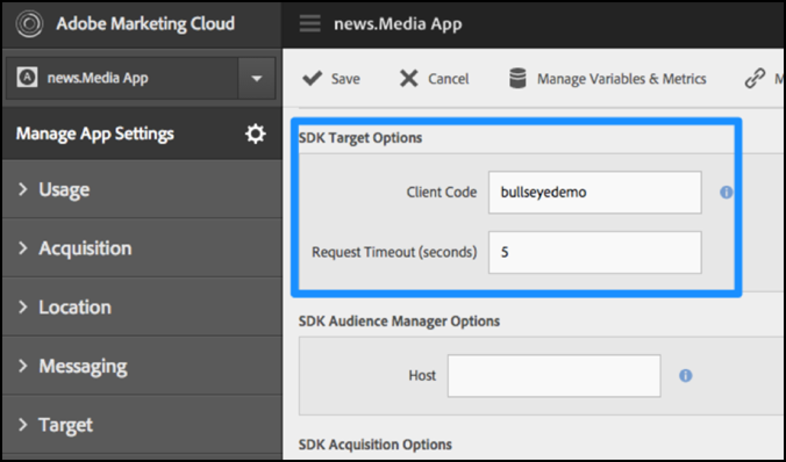

# Habilitar [!DNL Target] en SDK

Agregue [!UICONTROL Adobe Mobile Services SDK] a su aplicación.

>[!IMPORTANT]
>
>La compatibilidad con los SDK de [!DNL Adobe Mobile] versión 4.*x* finalizó el 31 de agosto de 2021 y ya no se recomienda para [!DNL Adobe Target] usuarios móviles.
>
>[Adobe Experience Platform SDK para aplicaciones móviles](https://developer.adobe.com/client-sdks/documentation/){target=_blank} es la solución recomendada para impulsar [!DNL Adobe Experience Cloud] soluciones y servicios en sus aplicaciones móviles.

1. Si no ha instalado Adobe Mobile Services SDK en su aplicación, use las credenciales de Analytics o Experience Cloud y descargue SDK desde el sitio web de [Adobe Mobile Services](https://mobilemarketing.adobe.com/).

1. Agregue [!DNL Adobe Mobile Services SDK] a su aplicación.

   Encontrará las instrucciones en [Implementación básica y ciclo de vida](https://experienceleague.adobe.com/docs/mobile-services/ios/getting-started-ios/dev-qs.html?lang=es).

1. Añada código de cliente, tiempo de espera y habilite SSL.

   En Experience Cloud, abra Mobile Services y vaya a **[!UICONTROL Administrar configuración de aplicación]** > **[!UICONTROL Opciones de Target de SDK]**.

   Agregue su código de cliente [!DNL Target] y tiempo de espera. El código de cliente es exclusivo de la cuenta o compañía. El tiempo de espera es el tiempo en número de segundos hasta el cual [!DNL Target] esperará una respuesta antes de mostrar el contenido predeterminado. Compruebe que la opción **[!UICONTROL Utilizar HTTPS]** esté marcada en la página Administrar configuración de aplicación de Adobe Mobile Services. Si HTTPS no está habilitado, todas las llamadas que se hagan en iOS9 y versiones posteriores se bloquearán a menos que realice una lista de permitidos del servidor [!DNL Target].

   

1. Cuando haya creado o encontrado la aplicación, busque la configuración de la aplicación y descargue el SDK que desee.

   

>[!WARNING]
>
> Si no tiene acceso a la interfaz de marketing móvil, puede hacer los cambios directamente en el archivo de configuración en el código de la aplicación, pero no se sincronizarán con la página de configuración de la interfaz de usuario.
