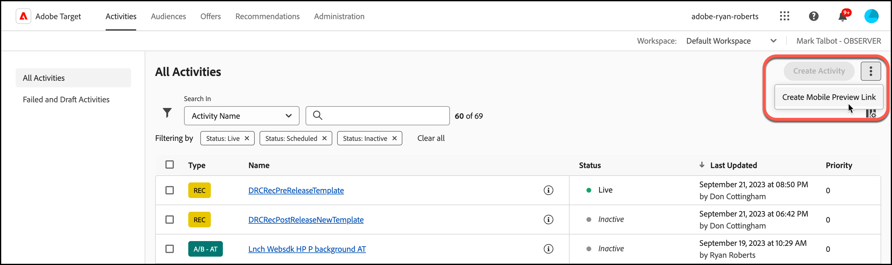
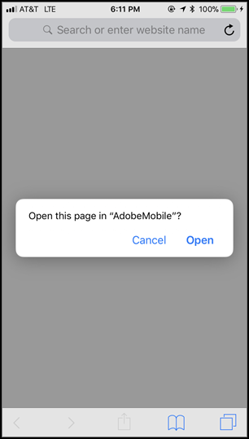
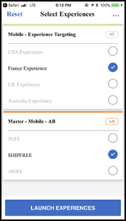
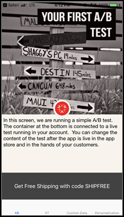
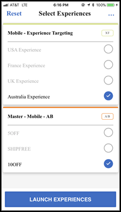
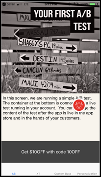

# [!DNL Target] vista previa para móviles

Use los vínculos de vista previa en móviles para realizar fácilmente un control de calidad exhaustivo de las actividades de aplicaciones móviles y registrarse en diferentes experiencias con el dispositivo sin tener que usar ningún dispositivo de prueba especial.

La funcionalidad de vista previa para móviles le permite probar completamente sus actividades de aplicación móvil antes del lanzamiento.

## Requisitos previos

1. **Use una versión compatible de SDK:** La característica de vista previa para móviles requiere que descargue e instale la versión adecuada de [!DNL Adobe Mobile SDK] en sus aplicaciones correspondientes.

   Para obtener instrucciones para descargar el SDK apropiado, consulte [Versiones actuales de SDK](https://developer.adobe.com/client-sdks/documentation/current-sdk-versions/){target=_blank} en la documentación de *[!DNL Adobe Experience Platform Mobile SDK]*.

1. **Configure un esquema de direcciones URL:** el vínculo de vista previa utiliza un esquema de direcciones URL para abrir la aplicación. Especifique un esquema URL único para la vista previa.

   Para obtener más información, consulte [Vista previa](https://developer.adobe.com/client-sdks/documentation/adobe-target/#visual-preview){target=_blank} en *Configurar la extensión de Target en la interfaz de usuario de la conexión de datos* en la documentación de *[!DNL Mobile SDK]*.

   Los siguientes vínculos contienen más información:

   * **iOS**: Para obtener más información sobre cómo configurar esquemas de URL para iOS, consulte [Definición de un esquema de URL personalizado para su aplicación](https://developer.apple.com/documentation/xcode/defining-a-custom-url-scheme-for-your-app){target=_blank} en el sitio web de *Apple Developer*.
   * **Android**: Para obtener más información sobre cómo configurar esquemas de URL para Android, consulte [Crear vínculos profundos al contenido de la aplicación](https://developer.android.com/training/app-links/deep-linking){target=_blank} en el sitio web de *Desarrolladores de Android*.

1. **Configurar la API `collectLaunchInfo` (solo i0S)**

   Para obtener más información, consulte [Vista previa](https://developer.adobe.com/client-sdks/documentation/adobe-target/#visual-preview){target=_blank} en *Configurar la extensión de Target en la interfaz de usuario de la conexión de datos* en la documentación de *[!DNL Mobile SDK]*.

## Generación de un vínculo de vista previa

1. En la interfaz de usuario [!DNL Target], haga clic en el icono **[!UICONTROL More Options]** (los puntos suspensivos verticales) y, a continuación, seleccione **[!UICONTROL Create Mobile Preview Link]**.

   

1. Seleccione las actividades que desea previsualizar y luego haga clic en **[!UICONTROL Generate Mobile Preview Link]**.

   >[!NOTE]
   >
   >Solo puede seleccionar actividades [!UICONTROL A/B Test] y [!UICONTROL Experience Targeting] (XT) basadas en formularios.

   

1. Especifique el esquema de URL de su aplicación.

   El esquema de URL debe ser el mismo que el que está presente en la aplicación de iOS o Android. Repita este proceso por separado para iOS y Android, si es necesario.

   

1. Haga clic en **[!UICONTROL Generate Mobile Preview Link]** y copie el vínculo.

   

## Vista previa en su dispositivo

Abra el vínculo en un navegador móvil en un dispositivo en el que tenga instalada la aplicación. Esta aplicación puede ser la aplicación de producción que descargó del [!DNL Apple App Store] o del [!DNL Google Play Store]. No es necesario que la aplicación sea una compilación especial. Si tiene un vínculo de vista previa activo, puede ver las experiencias en el dispositivo.

1. Abra el vínculo en su navegador móvil.

   Comparta el vínculo que copió en la sección anterior de la interfaz de usuario de [!DNL Target] en su dispositivo móvil de una manera conveniente, por ejemplo, mediante texto, correo electrónico o [!DNL Slack].

   |||

   Su aplicación se abre e inicia [!DNL Target] [!UICONTROL Mobile Preview Mode].

1. Seleccione la combinación de experiencias que desee ver y haga clic en **[!UICONTROL Launch Experiences]**.

   ||||
||||

## Limitaciones

* Debe volver a cargarse la vista para que el nuevo contenido se muestre después de hacer clic en el botón **[!UICONTROL Launch Experiences]**. El modo más sencillo es cambiar a una pantalla diferente y regresar a aquella en la que espera que se produzca el cambio.
* La vista previa para móviles no es compatible con las versiones de Android anteriores a API-19 (KitKat).
