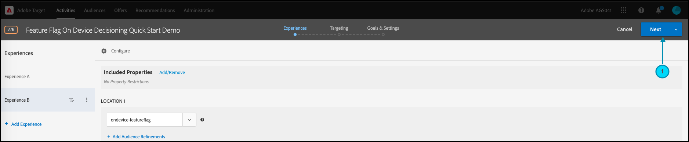
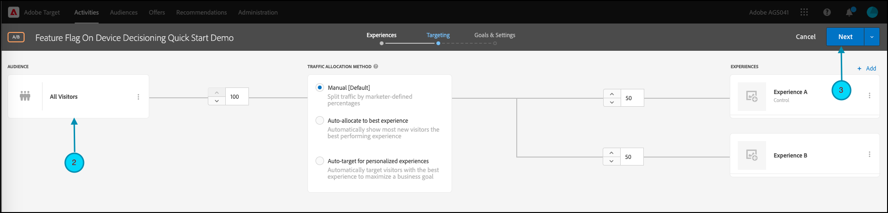

# Introducción a los SDK de [!DNL Target]

Para ponerte en marcha, te recomendamos que crees tu primera actividad de indicador de funciones de [toma de decisiones en el dispositivo](../on-device-decisioning/overview.md) en el idioma que elijas:

* Node.js
* Java
* .NET
* Python

## Resumen de los pasos

1. Habilitar la toma de decisiones en el dispositivo para su organización
1. Instalación de SDK
1. Inicialización de SDK
1. Configurar los indicadores de características en una actividad [!DNL Adobe Target] [!UICONTROL Prueba A/B]
1. Implementar y procesar la función en la aplicación
1. Implementar el seguimiento de eventos en la aplicación
1. Activa tu actividad [!UICONTROL Prueba A/B]

## &#x200B;1. Habilitar la toma de decisiones en el dispositivo para su organización

Al habilitar la toma de decisiones en el dispositivo, se garantiza que la actividad [!UICONTROL Prueba A/B] se ejecute con una latencia cercana a cero. Para habilitar esta función, vaya a **[!UICONTROL Administración]** > **[!UICONTROL Implementación]** > **[!UICONTROL Detalles de la cuenta]** y habilite la opción **[!UICONTROL Toma de decisiones en el dispositivo]**.


>[!NOTE]
>
>Debe tener el **[!UICONTROL Administrador]** o **[!UICONTROL Aprobador]** [rol de usuario](https://experienceleague.adobe.com/docs/target/using/administer/manage-users/user-management.html) para habilitar o deshabilitar la opción **[!UICONTROL Toma de decisiones en el dispositivo]**.

Después de habilitar la opción **[!UICONTROL Toma de decisiones en el dispositivo]**, [!DNL Adobe Target] comienza a generar [artefactos de regla](../on-device-decisioning/rule-artifact-overview.md) para su cliente.

## &#x200B;2. Instalación de SDK

Para Node.js, Java y Python, ejecute el siguiente comando en el directorio del proyecto en el terminal. Para .NET, agréguela como una dependencia mediante [la instalación desde NuGet](https://www.nuget.org/packages/Adobe.Target.Client).

>[!BEGINTABS]

>[!TAB Nodo.js (NPM)]

```js {line-numbers="true"}
npm i @adobe/target-nodejs-sdk -P
```

>[!TAB Java (Maven)]

```javascript {line-numbers="true"}
<dependency>
   <groupId>com.adobe.target</groupId>
   <artifactId>java-sdk</artifactId>
   <version>2.0</version>
</dependency>
```

>[!TAB .NET (Bash)]

```bash {line-numbers="true"}
dotnet add package Adobe.Target.Client
```

>[!TAB Python (pip)]

```python {line-numbers="true"}
pip install target-python-sdk
```

>[!ENDTABS]

## &#x200B;3. Inicialización de SDK

El artefacto de regla se descarga durante el paso de inicialización de SDK. Puede personalizar el paso de inicialización para determinar cómo se descarga y utiliza el artefacto.

>[!BEGINTABS]

>[!TAB Nodo.js]

```js {line-numbers="true"}
const TargetClient = require("@adobe/target-nodejs-sdk");

const CONFIG = {
   client: "<your target client code>",
   organizationId: "your EC org id",
   decisioningMethod: "on-device",
   events: {
      clientReady: targetClientReady
      }
};

const tClient = TargetClient.create(CONFIG);

function targetClientReady() {
   //Adobe Target SDK has now downloaded the JSON artifact locally, which contains the activity details.
   //We will see how to use the artifact here very soon.
}
```

>[!TAB Java (Maven)]

```javascript {line-numbers="true"}
ClientConfig config = ClientConfig.builder()
   .client("testClient")
   .organizationId("ABCDEF012345677890ABCDEF0@AdobeOrg")
   .build();
TargetClient targetClient = TargetClient.create(config);
```

>[!TAB .NET (C#)]

```csharp {line-numbers="true"}
var targetClientConfig = new TargetClientConfig.Builder("testClient", "ABCDEF012345677890ABCDEF0@AdobeOrg")
   .Build();
this.targetClient.Initialize(targetClientConfig);
```

>[!TAB Python]

```python {line-numbers="true"}
from target_python_sdk import TargetClient

def target_client_ready():
   # Adobe Target SDK has now downloaded the JSON artifact locally, which contains the activity details.
   # We will see how to use the artifact here very soon.

CONFIG = {
   "client": "<your target client code>",
   "organization_id": "your EC org id",
   "decisioning_method": "on-device",
   "events": {
      "client_ready": target_client_ready
   }
}

target_client = TargetClient.create(CONFIG)
```

>[!ENDTABS]

## &#x200B;4. Configurar los indicadores de características en una actividad [!DNL Adobe Target] [!UICONTROL Prueba A/B]

1. En [!DNL Target], vaya a la página **[!UICONTROL Actividades]** y, a continuación, seleccione **[!UICONTROL Crear actividad]** > **[!UICONTROL Prueba A/B]**.

   

1. En el modal **[!UICONTROL Crear actividad de prueba A/B]**, deje seleccionada la opción web predeterminada (1), seleccione **[!UICONTROL Formulario]** como compositor de experiencias (2), seleccione **[!UICONTROL Workspace predeterminado]** con **[!UICONTROL Sin restricciones de propiedad]**(3) y, a continuación, haga clic en **[!UICONTROL Siguiente]** (4).

   

1. En el paso de creación de la actividad **[!UICONTROL Experiencias]**, indique un nombre para su actividad (1) y agregue una segunda experiencia, Experiencia B, haciendo clic en **[!UICONTROL Agregar experiencia]** (2). Introduzca el nombre de la ubicación que elija (3). Por ejemplo, `ondevice-featureflag` o `homepage-addtocart-featureflag` son nombres de ubicación que indican los destinos de las pruebas de indicadores de características.  En el ejemplo que se muestra a continuación, `ondevice-featureflag` es la ubicación definida para la Experiencia B. Opcionalmente, puede agregar Refinamientos de audiencia (4) para restringir la calificación a la actividad.

   

1. En la sección **[!UICONTROL CONTENIDO]** de la misma página, seleccione **[!UICONTROL Crear oferta JSON]** en la lista desplegable (1) como se muestra.

   

1. En el cuadro de texto **[!UICONTROL Datos JSON]** que aparece, escriba las variables de marcador de característica para cada experiencia (1), utilizando un objeto JSON válido (2).

   Introduzca las variables de indicador de funcionalidad para la Experiencia A.

   

   **(Ejemplo de JSON para la Experiencia A anterior)**

   ```json {line-numbers="true"}
   {
      "enabled" : true,
      "flag" : "expA"
   }
   ```

   Introduzca las variables de indicador de funciones para la Experiencia B.

   

   **(Ejemplo de JSON para la Experiencia B anterior)**

   ```json {line-numbers="true"}
   {
      "enabled" : true,
      "flag" : "expB"
   }
   ```

1. Haga clic en **[!UICONTROL Siguiente]** (1) para avanzar al paso **[!UICONTROL Segmentación]** de creación de actividad.

   

1. En el ejemplo del paso **[!UICONTROL Segmentación]** que se muestra a continuación, Segmentación de audiencia (2) permanece en el conjunto predeterminado de Todos los visitantes, para simplificar. Esto significa que la actividad no está dirigida. Sin embargo, tenga en cuenta que Adobe recomienda segmentar siempre las audiencias para las actividades de producción. Haga clic en **[!UICONTROL Siguiente]** (3) para avanzar al paso **[!UICONTROL Objetivos y configuración]** de la creación de la actividad.

   

1. En el paso **[!UICONTROL Objetivos y configuración]**, establece **[!UICONTROL Reporting Source]** en **[!UICONTROL Adobe Target]** (1). Defina la **[!UICONTROL Métrica de objetivo]** como **[!UICONTROL Conversión]**, y especifique los detalles según las métricas de conversión del sitio (2). Haga clic en **[!UICONTROL Guardar y cerrar]** (3) para guardar la actividad.

   

## &#x200B;5. Implementar y procesar la función en la aplicación

Después de configurar las variables de indicador de características en [!DNL Target], modifique el código de la aplicación para usarlas. Por ejemplo, después de obtener la marca de características en la aplicación, puede utilizarla para habilitar características y procesar la experiencia para la que el visitante cumple los requisitos.

>[!BEGINTABS]

>[!TAB Nodo.js]

```js {line-numbers="true"}
//... Code removed for brevity
​
let featureFlags = {};
​
function targetClientReady() {
   tClient.getAttributes(["ondevice-featureflag"]).then(function(response) {
      const featureFlags = response.asObject("ondevice-featureflag");
      if(featureFlags.enabled && featureFlags.flag !== "expA") { //Assuming "expA" is control
         console.log("Render alternate experience" + featureFlags.flag);
      }
      else {
         console.log("Render default experience");
      }
   });
}
```

>[!TAB Java (Maven)]

```javascript {line-numbers="true"}
MboxRequest mbox = new MboxRequest().name("ondevice-featureflag").index(0);
TargetDeliveryRequest request = TargetDeliveryRequest.builder()
   .context(new Context().channel(ChannelType.WEB))
   .execute(new ExecuteRequest().mboxes(Arrays.asList(mbox)))
   .build();
Attributes attributes = targetClient.getAttributes(request, "ondevice-featureflag");
String flag = attributes.getString("ondevice-featureflag", "flag");
```

>[!TAB .NET (C#)]

```csharp {line-numbers="true"}
var mbox = new MboxRequest(index: 0, name: "ondevice-featureflag");
var deliveryRequest = new TargetDeliveryRequest.Builder()
   .SetContext(new Context(ChannelType.Web))
   .SetExecute(new ExecuteRequest(mboxes: new List<MboxRequest> { mbox }))
   .Build();
var attributes = targetClient.GetAttributes(request, "ondevice-featureflag");
var flag = attributes.GetString("ondevice-featureflag", "flag");
```

>[!TAB Python]

```python {line-numbers="true"}
# ... Code removed for brevity

feature_flags = {}

def target_client_ready():
   attribute_provider = target_client.get_attributes(["ondevice-featureflag"])
   feature_flags = attribute_provider.as_object(mbox_name="ondevice-featureflag")
   if feature_flags.get("enabled") and feature_flags.get("flag") != "expA": # Assuming "expA" is control
      print("Render alternate experience {}".format(feature_flags.get("flag")))
   else:
      print("Render default experience")
```

>[!ENDTABS]

## &#x200B;6. Implementar el seguimiento adicional de eventos en la aplicación

Opcionalmente, puede enviar eventos adicionales para rastrear conversiones mediante la función sendNotification().

>[!BEGINTABS]

>[!TAB Nodo.js]

```js {line-numbers="true"}
//... Code removed for brevity
​
//When a conversion happens
TargetClient.sendNotifications({
   targetCookie,
   "request" : {
      "notifications" : [
      {
         type: "display",
         timestamp : Date.now(),
         id: "conversion",
         mbox : {
            name : "orderConfirm"
         },
         order : {
            id: "BR9389",
            total : 98.93,
            purchasedProductIds : ["J9393", "3DJJ3"]
         }
      }
      ]
   }
})
```

>[!TAB Java (Maven)]

```javascript {line-numbers="true"}
Notification notification = new Notification();
notification.setId("conversion");
notification.setImpressionId(UUID.randomUUID().toString());
notification.setType(MetricType.DISPLAY);
notification.setTimestamp(System.currentTimeMillis());
Order order = new Order("BR9389");
order.total(98.93);
order.purchasedProductIds(["J9393", "3DJJ3"]);
notification.setOrder(order);

TargetDeliveryRequest notificationRequest =
   TargetDeliveryRequest.builder()
      .context(new Context().channel(ChannelType.WEB))
      .notifications(Collections.singletonList(notification))
      .build();

NotificationDeliveryService notificationDeliveryService = new NotificationDeliveryService();
notificationDeliveryService.sendNotification(notificationRequest);
```

>[!TAB .NET (C#)]

```csharp {line-numbers="true"}
var order = new Order
{
   Id = "BR9389",
   Total = 98.93M,
   PurchasedProductIds = new List<string> { "J9393", "3DJJ3" },
};
​
var notification = new Notification
{
   Id = "conversion",
   ImpressionId = Guid.NewGuid().ToString(),
   Type = MetricType.Display,
   Timestamp = DateTimeOffset.UtcNow.ToUnixTimeMilliseconds(),
   Order = order,
};
​
var notificationRequest = new TargetDeliveryRequest.Builder()
   .SetContext(new Context(ChannelType.Web))
   .SetNotifications(new List<Notification> {notification})
   .Build();
​
targetClient.SendNotifications(notificationRequest);
```

>[!TAB Python]

```python {line-numbers="true"}
# ... Code removed for brevity

# When a conversion happens
notification_mbox = NotificationMbox(name="orderConfirm")
order = Order(id="BR9389, total=98.93, purchased_product_ids=["J9393", "3DJJ3"])
notification = Notification(
   id="conversion",
   type=MetricType.DISPLAY,
   timestamp=1621530726000,  # Epoch time in milliseconds
   mbox=notification_mbox,
   order=order
)
notification_request = DeliveryRequest(notifications=[notification])


target_client.send_notifications({
   "target_cookie": target_cookie,
   "request" : notification_request
})
```

>[!ENDTABS]

## &#x200B;7. Activa tu actividad [!UICONTROL Prueba A/B]

1. Haga clic en **[!UICONTROL Activar]** (1) para activar su actividad [!UICONTROL Prueba A/B].

   >[!NOTE]
   >
   >Debe tener el **[!UICONTROL aprobador]** o **[!UICONTROL publicador]** [rol de usuario](https://experienceleague.adobe.com/docs/target/using/administer/manage-users/user-management.html) para realizar este paso.

   
