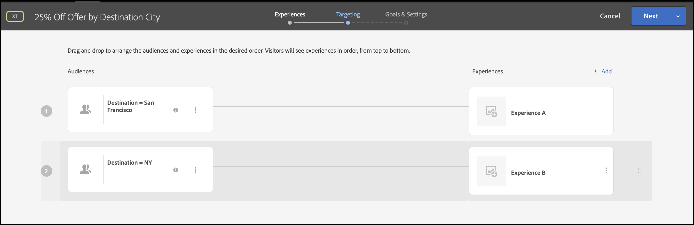
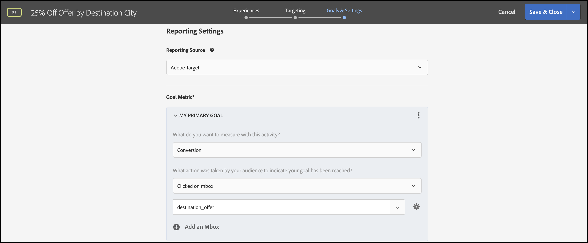

# Entrega de personalización

## Resumen de los pasos

1. Activar [!UICONTROL toma de decisiones en el dispositivo] para su organización
1. Crear un [!UICONTROL Segmentación de experiencias] Actividad (XT)
1. Definir experiencia personalizada por audiencia
1. Verificar experiencia personalizada por audiencia
1. Configuración de informes
1. Agregar métricas para KPI de seguimiento
1. Implementación de ofertas personalizadas en la aplicación
1. Implementación de código para hacer un seguimiento de eventos de conversión
1. Activar su [!UICONTROL Segmentación de experiencias] (XT) actividad de personalización

Supongamos que es una empresa de turismo. Desea ofrecer una oferta personalizada del 25% de descuento en determinados paquetes de viaje. Para que la oferta resuene entre sus usuarios, decide mostrar un punto de referencia de la ciudad de destino. También debe asegurarse de que la entrega de sus ofertas personalizadas se ejecute con una latencia cercana a cero para que no afecte negativamente a las experiencias de los usuarios y distorsione los resultados.

## 1. Habilitar [!UICONTROL toma de decisiones en el dispositivo] para su organización

1. Al habilitar la toma de decisiones en el dispositivo, se garantiza que una actividad A/B se ejecute con una latencia cercana a cero. Para habilitar esta función, vaya a **[!UICONTROL Administration]** > **[!UICONTROL Implementación]** > **[!UICONTROL Detalles de la cuenta]** in [!DNL Adobe Target]y habilite la opción **[!UICONTROL Toma de decisiones en el dispositivo]** alternar.

   

   >[!NOTE]
   >
   >Debe tener el administrador o aprobador [función de usuario](https://experienceleague.adobe.com/docs/target/using/administer/manage-users/user-management.html) para habilitar o deshabilitar [!UICONTROL Toma de decisiones en el dispositivo] alternar.

   Después de activar el **[!UICONTROL Toma de decisiones en el dispositivo]** alternar, [!DNL Adobe Target] comienza a generar *artefactos de regla* para su cliente.

## 2. Crear un [!UICONTROL Segmentación de experiencias] Actividad (XT)

1. Entrada [!DNL Adobe Target], vaya al **[!UICONTROL Actividades]** página, luego seleccione **[!UICONTROL Crear actividad]** > **[!UICONTROL Segmentación de experiencias]**.

   

1. En el **[!UICONTROL Crear actividad de segmentación de experiencias]** modal, mantenga el valor predeterminado **[!UICONTROL Web]** opción seleccionada (1), seleccionar **[!UICONTROL Form]** como compositor de experiencias (2), seleccione un espacio de trabajo y una propiedad (3) y haga clic en **[!UICONTROL Siguiente]** (4).

   

## 3. Defina una experiencia personalizada por audiencia

1. En el **[!UICONTROL Experiencias]** paso de creación de la actividad, haga clic en **[!UICONTROL Cambiar audiencia]** para crear una audiencia de aquellos visitantes que desean viajar a San Francisco, California.

   

1. En el **[!UICONTROL Crear audiencia]** modal, defina una regla personalizada donde `destinationCity = San Francisco`. Define el grupo de usuarios que desea viajar a San Francisco.

   

1. Todavía en el **[!UICONTROL Experiencias]** paso, introduzca el nombre de la ubicación (1) dentro de su aplicación donde desea presentar una oferta especial con respecto al puente Golden Gate, pero solo para aquellos que se dirigen a San Francisco. En el ejemplo que se muestra a continuación, la página principal es la ubicación seleccionada para la oferta de HTML (2), que se define en la variable **[!UICONTROL Contenido]** área.

   

1. Añada otra audiencia de objetivos haciendo clic en **[!UICONTROL Añadir segmentación de experiencias]**. Esta vez, diríjase a una audiencia que desee viajar a Nueva York definiendo una regla de audiencia en la que `destinationCity = New York`. Defina la ubicación dentro de su aplicación donde desea presentar una oferta especial con respecto al Empire State Building. En el ejemplo que se muestra a continuación, `homepage` es la ubicación seleccionada para la oferta de HTML (2), que se define en la **[!UICONTROL Contenido]** área.

   

## 4. Verificar la experiencia personalizada por audiencia

En el **[!UICONTROL Segmentación]** paso, compruebe que ha configurado la experiencia personalizada que desea por audiencia.



## 5. Configurar informes

En el **[!UICONTROL Objetivos y configuración]** paso, elija **[!UICONTROL Adobe Target]** como el **[!UICONTROL Fuente de informes]** para ver los resultados de la actividad en [!DNL Adobe Target] IU o elija **[!UICONTROL Adobe Analytics]** para verlos en la interfaz de usuario de Adobe Analytics.



## 6. Agregar métricas para el seguimiento de KPI

Elija una **[!UICONTROL Métrica de objetivo]** para medir el éxito de la actividad. En este ejemplo, una conversión correcta se basa en si el usuario hace clic en la oferta de destino personalizada.

## 7. Implementar las ofertas personalizadas en la aplicación

>[!BEGINTABS]

>[!TAB Node.js]

```js {line-numbers="true"}
const TargetClient = require("@adobe/target-nodejs-sdk");

const CONFIG = {
  client: "acmeclient",
  organizationId: "1234567890@AdobeOrg"
};

const targetClient = TargetClient.create(CONFIG);

targetClient.getOffers({
  request: {      
    execute: {
      pageLoad: {
        parameters: {
          destinationCity: "San Francisco"
        }
      }
    }       
  }
})
.then(console.log)
.catch(console.error);
```

>[!TAB Java]

```java {line-numbers="true"}
ClientConfig config = ClientConfig.builder()
  .client("acmeclient")
  .organizationId("1234567890@AdobeOrg")
  .build();
TargetClient targetClient = TargetClient.create(config);

Context context = new Context().channel(ChannelType.WEB);

ExecuteRequest executeRequest = new ExecuteRequest();

RequestDetails pageLoad = new RequestDetails();
pageLoad.setParameters(
    new HashMap<String, String>() {
      {
        put("destinationCity", "San Francisco");
      }
    });

executeRequest.setPageLoad(pageLoad);

TargetDeliveryRequest request = TargetDeliveryRequest.builder()
  .context(context)
  .execute(executeRequest)
  .build();

TargetDeliveryResponse offers = targetClient.getOffers(request);
```

>[!ENDTABS]

## 8. Implementar código para rastrear eventos de conversión

>[!BEGINTABS]

>[!TAB Node.js]

```js {line-numbers="true"}
//... Code removed for brevity

//When a conversion happens
TargetClient.sendNotifications({
    targetCookie,
    "request" : {
      "notifications" : [
        {
          type: "click",
          timestamp : Date.now(),
          id: "conversion",
          mbox : {
            name : "destinationOffer"
          }
        }
      ]
    }
})
```

>[!TAB Java]

```java {line-numbers="true"
ClientConfig config = ClientConfig.builder()
  .client("acmeclient")
  .organizationId("1234567890@AdobeOrg")
  .build();
TargetClient targetClient = TargetClient.create(config);

Context context = new Context().channel(ChannelType.WEB);

ExecuteRequest executeRequest = new ExecuteRequest();

RequestDetails pageLoad = new RequestDetails();
pageLoad.setParameters(
    new HashMap<String, String>() {
      {
        put("destinationCity", "San Francisco");
      }
    });

executeRequest.setPageLoad(pageLoad);
NotificationDeliveryService notificationDeliveryService = new NotificationDeliveryService();

Notification notification = new Notification();
notification.setId("conversion");
notification.setImpressionId(UUID.randomUUID().toString());
notification.setType(MetricType.CLICK);
notification.setTimestamp(System.currentTimeMillis());
notification.setTokens(
    Collections.singletonList(
        "IbG2Jz2xmHaqX7Ml/YRxRGqipfsIHvVzTQxHolz2IpSCnQ9Y9OaLL2gsdrWQTvE54PwSz67rmXWmSnkXpSSS2Q=="));

TargetDeliveryRequest targetDeliveryRequest =
    TargetDeliveryRequest.builder()
        .context(context)
        .execute(executeRequest)
        .notifications(Collections.singletonList(notification))
        .build();

TargetDeliveryResponse offers = targetClient.getOffers(request);
notificationDeliveryService.sendNotification(request);
```

>[!ENDTABS]

## 9. Active la actividad de segmentación de experiencias (XT)


