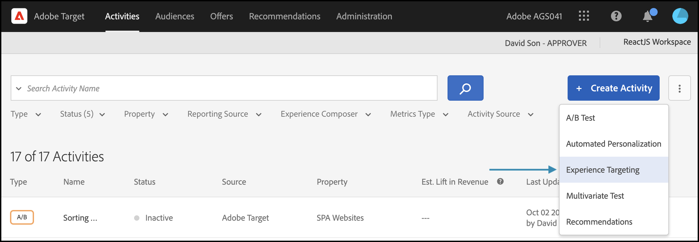
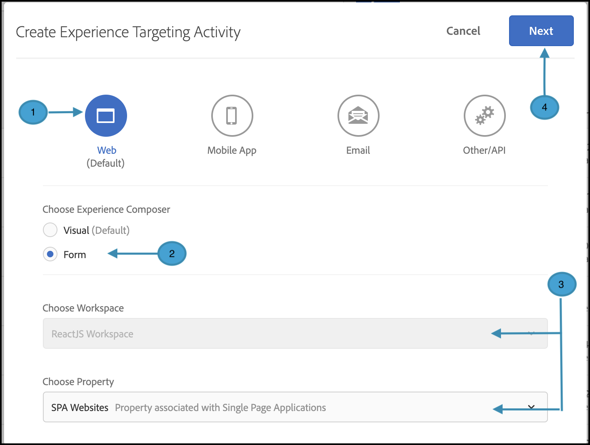
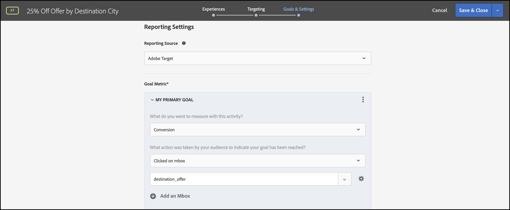

# Entrega de personalización

## Resumen de los pasos

1. Habilitar [!UICONTROL toma de decisiones en el dispositivo] para su organización
1. Crear una actividad [!UICONTROL segmentación de experiencias] (XT)
1. Definir experiencia personalizada por audiencia
1. Verificar experiencia personalizada por audiencia
1. Configuración de informes
1. Agregar métricas para KPI de seguimiento
1. Implementación de ofertas personalizadas en la aplicación
1. Implementación de código para hacer un seguimiento de eventos de conversión
1. Activa tu actividad de personalización [!UICONTROL Segmentación de experiencias] (XT)

Supongamos que es una empresa de turismo. Desea ofrecer una oferta personalizada del 25% de descuento en determinados paquetes de viaje. Para que la oferta resuene entre sus usuarios, decide mostrar un punto de referencia de la ciudad de destino. También debe asegurarse de que la entrega de sus ofertas personalizadas se ejecute con una latencia cercana a cero para que no afecte negativamente a las experiencias de los usuarios y distorsione los resultados.

## &#x200B;1. Habilitar [!UICONTROL toma de decisiones en el dispositivo] para su organización

1. Al habilitar la toma de decisiones en el dispositivo, se garantiza que una actividad A/B se ejecute con una latencia cercana a cero. Para habilitar esta característica, vaya a **[!UICONTROL Administración]** > **[!UICONTROL Implementación]** > **[!UICONTROL Detalles de la cuenta]** en [!DNL Adobe Target] y habilite la opción **[!UICONTROL Toma de decisiones en el dispositivo]**.

   

   >[!NOTE]
   >
   >Debe tener el rol de administrador o aprobador [user](https://experienceleague.adobe.com/docs/target/using/administer/manage-users/user-management.html) para habilitar o deshabilitar la opción [!UICONTROL On-Device Decisioning].

   Después de habilitar la opción **[!UICONTROL Toma de decisiones en el dispositivo]**, [!DNL Adobe Target] comienza a generar *artefactos de regla* para su cliente.

## &#x200B;2. Crear una actividad [!UICONTROL segmentación de experiencias] (XT)

1. En [!DNL Adobe Target], vaya a la página **[!UICONTROL Actividades]** y, a continuación, seleccione **[!UICONTROL Crear actividad]** > **[!UICONTROL Segmentación de experiencias]**.

   

1. En el modal **[!UICONTROL Crear actividad de segmentación de experiencias]**, deje seleccionada la opción predeterminada **[!UICONTROL Web]** (1), seleccione **[!UICONTROL Formulario]** como compositor de experiencias (2), seleccione un área de trabajo y una propiedad (3) y haga clic en **[!UICONTROL Siguiente]** (4).

   

## &#x200B;3. Definir una experiencia personalizada por audiencia

1. En el paso de creación de la actividad **[!UICONTROL Experiencias]**, haz clic en **[!UICONTROL Cambiar audiencia]** para crear una audiencia de aquellos visitantes que quieran viajar a San Francisco, California.

   

1. En el modal **[!UICONTROL Crear audiencia]**, defina una regla personalizada donde `destinationCity = San Francisco`. Define el grupo de usuarios que desea viajar a San Francisco.

   

1. Aún en el paso **[!UICONTROL Experiencias]**, escriba el nombre de la ubicación (1) dentro de su aplicación donde desea presentar una oferta especial con respecto al Bridge Golden Gate, pero solo para los que se dirigen a San Francisco. En el ejemplo que se muestra a continuación, homepage es la ubicación seleccionada para la oferta de HTML (2), que se define en el área **[!UICONTROL Contenido]**.

   

1. Agregue otra audiencia de segmentación haciendo clic en **[!UICONTROL Agregar segmentación de experiencias]**. En esta ocasión, defina una regla de audiencia donde `destinationCity = New York` sea el destino de una audiencia que desee viajar a Nueva York. Defina la ubicación dentro de su aplicación donde desea presentar una oferta especial con respecto al Empire State Building. En el ejemplo que se muestra aquí, `homepage` es la ubicación seleccionada para la oferta de HTML (2), que se define en el área **[!UICONTROL Contenido]**.

   

## &#x200B;4. Verificar experiencia personalizada por audiencia

En el paso **[!UICONTROL Segmentación]**, compruebe que ha configurado la experiencia personalizada que desea por audiencia.


## &#x200B;5. Configuración de informes

En el paso **[!UICONTROL Objetivos y configuración]**, elige **[!UICONTROL Adobe Target]** como **[!UICONTROL Source de informes]** para ver los resultados de la actividad en la interfaz de usuario de [!DNL Adobe Target], o elige **[!UICONTROL Adobe Analytics]** para verlos en la interfaz de usuario de Adobe Analytics.



## &#x200B;6. Agregar métricas para KPI de seguimiento

Elija una **[!UICONTROL Métrica de objetivo]** para medir el éxito de la actividad. En este ejemplo, una conversión correcta se basa en si el usuario hace clic en la oferta de destino personalizada.

## &#x200B;7. Implemente sus ofertas personalizadas en la aplicación

>[!BEGINTABS]

>[!TAB Nodo.js]

```js {line-numbers="true"}
const TargetClient = require("@adobe/target-nodejs-sdk");

const CONFIG = {
  client: "acmeclient",
  organizationId: "1234567890@AdobeOrg"
};

const targetClient = TargetClient.create(CONFIG);

targetClient.getOffers({
  request: {      
    execute: {
      pageLoad: {
        parameters: {
          destinationCity: "San Francisco"
        }
      }
    }       
  }
})
.then(console.log)
.catch(console.error);
```

>[!TAB Java]

```java {line-numbers="true"}
ClientConfig config = ClientConfig.builder()
  .client("acmeclient")
  .organizationId("1234567890@AdobeOrg")
  .build();
TargetClient targetClient = TargetClient.create(config);

Context context = new Context().channel(ChannelType.WEB);

ExecuteRequest executeRequest = new ExecuteRequest();

RequestDetails pageLoad = new RequestDetails();
pageLoad.setParameters(
    new HashMap<String, String>() {
      {
        put("destinationCity", "San Francisco");
      }
    });

executeRequest.setPageLoad(pageLoad);

TargetDeliveryRequest request = TargetDeliveryRequest.builder()
  .context(context)
  .execute(executeRequest)
  .build();

TargetDeliveryResponse offers = targetClient.getOffers(request);
```

>[!ENDTABS]

## &#x200B;8. Implementación de código para hacer un seguimiento de eventos de conversión

>[!BEGINTABS]

>[!TAB Nodo.js]

```js {line-numbers="true"}
//... Code removed for brevity

//When a conversion happens
TargetClient.sendNotifications({
    targetCookie,
    "request" : {
      "notifications" : [
        {
          type: "click",
          timestamp : Date.now(),
          id: "conversion",
          mbox : {
            name : "destinationOffer"
          }
        }
      ]
    }
})
```

>[!TAB Java]

```java {line-numbers="true"
ClientConfig config = ClientConfig.builder()
  .client("acmeclient")
  .organizationId("1234567890@AdobeOrg")
  .build();
TargetClient targetClient = TargetClient.create(config);

Context context = new Context().channel(ChannelType.WEB);

ExecuteRequest executeRequest = new ExecuteRequest();

RequestDetails pageLoad = new RequestDetails();
pageLoad.setParameters(
    new HashMap<String, String>() {
      {
        put("destinationCity", "San Francisco");
      }
    });

executeRequest.setPageLoad(pageLoad);
NotificationDeliveryService notificationDeliveryService = new NotificationDeliveryService();

Notification notification = new Notification();
notification.setId("conversion");
notification.setImpressionId(UUID.randomUUID().toString());
notification.setType(MetricType.CLICK);
notification.setTimestamp(System.currentTimeMillis());
notification.setTokens(
    Collections.singletonList(
        "IbG2Jz2xmHaqX7Ml/YRxRGqipfsIHvVzTQxHolz2IpSCnQ9Y9OaLL2gsdrWQTvE54PwSz67rmXWmSnkXpSSS2Q=="));

TargetDeliveryRequest targetDeliveryRequest =
    TargetDeliveryRequest.builder()
        .context(context)
        .execute(executeRequest)
        .notifications(Collections.singletonList(notification))
        .build();

TargetDeliveryResponse offers = targetClient.getOffers(request);
notificationDeliveryService.sendNotification(request);
```

>[!ENDTABS]

## &#x200B;9. Active su actividad de segmentación de experiencias (XT)


