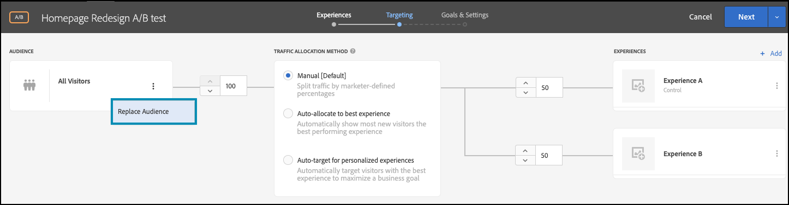

# Ejecución de pruebas A/B con indicadores de funcionalidad

## Resumen de los pasos

1. Habilitar [!UICONTROL on-device decisioning] para su organización
1. Crear una actividad [!UICONTROL A/B Test]
1. Defina su A y B
1. Añadir una audiencia
1. Establecer asignación de tráfico
1. Establecer la distribución del tráfico en variaciones
1. Configuración de informes
1. Agregar métricas para KPI de seguimiento
1. Implementar código para ejecutar pruebas A/B con indicadores de características
1. Activación de la prueba A/B con indicadores de características

>[!NOTE]
>
>Supongamos que desea determinar si el rediseño de la página principal con temas de otoño sería bien recibido por los usuarios. Usted decide probarlo ejecutando un experimento A/B en [!DNL Adobe Target]. También debe asegurarse de que el experimento se entrega con un buen rendimiento para que una experiencia de usuario negativa o lenta no distorsione los resultados.

## 1. Habilite [!UICONTROL on-device decisioning] para su organización

Al habilitar la toma de decisiones en el dispositivo, se garantiza que una actividad A/B se ejecute con una latencia cercana a cero. Para habilitar esta característica, vaya a **[!UICONTROL Administration]** > **[!UICONTROL Implementation]** > **[!UICONTROL Account details]** en [!DNL Adobe Target] y habilite la opción **[!UICONTROL On-Device Decisioning]**.

&lt;!— Insertar imagen-impar4.png —>


>[!NOTE]
>
>Debe tener el rol de administrador o aprobador [usuario](https://experienceleague.adobe.com/docs/target/using/administer/manage-users/user-management.html?lang=es) para habilitar o deshabilitar la opción de toma de decisiones en el dispositivo.

Después de habilitar la opción **[!UICONTROL On-Device Decisioning]**, [!DNL Adobe Target] comienza a generar artefactos de regla para el cliente.

## 2. Crear una actividad [!UICONTROL A/B Test]

En [!DNL Adobe Target], vaya a la página **[!UICONTROL Activities]** y, a continuación, seleccione **[!UICONTROL Create Activity]** > **[!UICONTROL A/B test]**.


En el modal **[!UICONTROL Create A/B Test Activity]**, deje seleccionada la opción predeterminada **[!UICONTROL Web]** (1), seleccione **[!UICONTROL Form]** como compositor de experiencias (2), seleccione **[!UICONTROL Default Workspace]** sin **[!UICONTROL Property Restrictions]** (3) y haga clic en **[!UICONTROL Next]** (4).


## 3. Defina su A y B

1. En el paso **[!UICONTROL Experiences]** de creación de la actividad, proporcione un nombre para su actividad (1) y agregue una segunda experiencia, Experiencia B, haciendo clic en el botón **[!UICONTROL Add Experience]** (2). Introduzca el nombre de la ubicación (3) dentro de la aplicación donde desea ejecutar la prueba A/B. En el ejemplo que se muestra a continuación, la página principal es la ubicación definida para la Experiencia A. (También es la ubicación definida para la Experiencia B.)

   La experiencia A define el control, que es el diseño actual de la página principal.

   

   La experiencia B define al aspirante, que representará una página principal rediseñada. Haga clic para cambiar el contenido predeterminado (1).

   

1. En la Experiencia B, haga clic para cambiar el contenido de **[!UICONTROL Default Content]** al contenido rediseñado seleccionando **[!UICONTROL Create JSON Offer]** como se muestra a continuación (1).

   

1. Defina el JSON con atributos que se utilizarán como indicadores para permitir que la lógica empresarial procese la página principal recién rediseñada, en lugar de la página principal actual en producción.


   >[!NOTE]
   >
   >Cuando [!DNL Adobe Target] agrupa a un usuario para que vea la Experiencia B (la página principal rediseñada), se devuelve el JSON con los atributos definidos en el ejemplo. En el código, deberá comprobar los valores de atributo para decidir si ejecutar la lógica empresarial para procesar la página principal rediseñada. Puede definir los nombres, valores y el número de atributos en esta respuesta JSON.

   

## 4. Añada una audiencia

Supongamos que desea probar primero el rediseño en sus clientes fieles, a los que puede identificar en función de si han iniciado sesión o no.

1. En el paso **[!UICONTROL Targeting]**, haga clic en para reemplazar la audiencia **[!UICONTROL All Visitors]**, como se muestra.

   

1. En el modal **[!UICONTROL Create Audience]**, defina una regla personalizada donde `logged-in = true`. Define el grupo de usuarios que han iniciado sesión. Utilice esta audiencia en su actividad.

   

## 5. Establecer la asignación del tráfico

Defina el porcentaje de usuarios que iniciaron sesión con el que desea probar el rediseño de la nueva página principal. En otras palabras, ¿a qué porcentaje de los usuarios desea desplegar esta prueba? En este ejemplo, para implementar esta prueba para todos los usuarios que iniciaron sesión, mantenga la asignación de tráfico al 100%.


## 6. Establecer la distribución del tráfico en variaciones

Defina el porcentaje de usuarios que iniciaron sesión y que verán el diseño actual de la página principal o el rediseño completamente nuevo. En este ejemplo, mantenga la distribución del tráfico como una división 50/50 entre las experiencias A y B.


## 7. Configurar informes

En el paso **[!UICONTROL Goals & Settings]**, elija **[!UICONTROL Adobe Target]** como **[!UICONTROL Reporting Source]** para ver los resultados de la actividad en la interfaz de usuario de [!DNL Adobe Target] o elija **[!UICONTROL Adobe Analytics]** para verlos en la interfaz de usuario de Adobe Analytics.


## 8. Agregar métricas para el seguimiento de KPI

Elija un **[!UICONTROL Goal Metric]** para medir la prueba A/B. En este ejemplo, una conversión correcta se basa en si el usuario llega al final de la página, lo que indica participación. Por lo tanto, **[!UICONTROL Conversion]** se determina en función de si el usuario vio la ubicación llamada final de la página.

## 9. Implemente código para ejecutar pruebas A/B con indicadores de funcionalidad en la aplicación

>[!BEGINTABS]

>[!TAB Nodo.js]

```js {line-numbers="true"}
const TargetClient = require("@adobe/target-nodejs-sdk");
const options = {
  client: "testClient",
  organizationId: "ABCDEF012345677890ABCDEF0@AdobeOrg",
  decisioningMethod: "on-device",
  events: {
    clientReady: targetClientReady
  }
};
const targetClient = TargetClient.create(options);

function targetClientReady() {
  return targetClient.getAttributes(["homepage"]).then(function(attributes) {
    const flag = attributes.getValue("homepage", "feature-flag");
    // ...
  });
}
```

>[!TAB Java]

```java {line-numbers="true"}
import com.adobe.target.edge.client.ClientConfig;
import com.adobe.target.edge.client.TargetClient;
import com.adobe.target.delivery.v1.model.ChannelType;
import com.adobe.target.delivery.v1.model.Context;
import com.adobe.target.delivery.v1.model.ExecuteRequest;
import com.adobe.target.delivery.v1.model.MboxRequest;
import com.adobe.target.edge.client.entities.TargetDeliveryRequest;
import com.adobe.target.edge.client.model.TargetDeliveryResponse;

ClientConfig config = ClientConfig.builder()
    .client("testClient")
    .organizationId("ABCDEF012345677890ABCDEF0@AdobeOrg")
    .build();
TargetClient targetClient = TargetClient.create(config);
MboxRequest mbox = new MboxRequest().name("homepage").index(0);
TargetDeliveryRequest request = TargetDeliveryRequest.builder()
    .context(new Context().channel(ChannelType.WEB))
    .execute(new ExecuteRequest().mboxes(Arrays.asList(mbox)))
    .build();
Attributes attributes = targetClient.getAttributes(request, "homepage");
String flag = attributes.getString("homepage", "feature-flag");
```

>[!ENDTABS]

## 10. Active la prueba A/B con el indicador de funcionalidad


