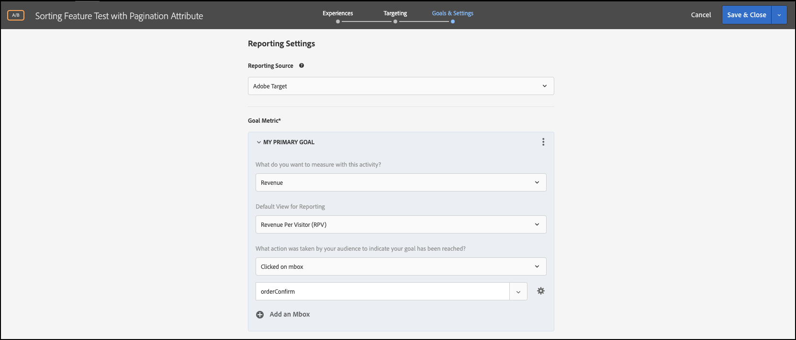

# Ejecución de pruebas de funciones con atributos

## Resumen de los pasos

1. Habilitar [!UICONTROL on-device decisioning] para su organización
1. Crear una actividad [!UICONTROL A/B Test]
1. Defina su A y B
1. Añadir una audiencia
1. Establecer asignación de tráfico
1. Establecer la distribución del tráfico en variaciones
1. Configuración de informes
1. Agregar métricas para KPI de seguimiento
1. Implementar código para ejecutar pruebas de características con atributos
1. Implementación de código para hacer un seguimiento de eventos de conversión
1. Activación de las pruebas de funciones con atributos

>[!NOTE]
>
>Supongamos que es una empresa minorista de comercio electrónico. Desea aumentar la tasa de conversión cuando los clientes examinan y clasifican su catálogo de productos. Tiene la hipótesis de que ciertos algoritmos de ordenación y estrategias de paginación arrojan mejores resultados que otros. Para probar esta teoría, decida ejecutar una prueba de características que implique el rediseño del widget de ordenación utilizando diferentes opciones de ordenación para los usuarios finales. Debe asegurarse de que esta prueba de características se ejecute con una latencia cercana a cero para que no afecte negativamente a las experiencias de los usuarios ni distorsione los resultados.

## 1. Habilite [!UICONTROL on-device decisioning] para su organización

Al habilitar la toma de decisiones en el dispositivo, se garantiza que una actividad A/B se ejecute con una latencia cercana a cero. Para habilitar esta característica, vaya a **[!UICONTROL Administration]** > **[!UICONTROL Implementation]** > **[!UICONTROL Account details]** en [!DNL Adobe Target] y habilite la opción **[!UICONTROL On-Device Decisioning]**.


>[!NOTE]
>
>Debe tener el rol de administrador o aprobador [user](https://experienceleague.adobe.com/docs/target/using/administer/manage-users/user-management.html) para habilitar o deshabilitar la opción **[!UICONTROL On-Device Decisioning]**.

Después de habilitar la opción **[!UICONTROL On-Device Decisioning]**, [!DNL Adobe Target] comienza a generar *artefactos de regla* para su cliente.

## 2. Crear una actividad [!UICONTROL A/B Test]

1. En [!DNL Adobe Target], vaya a la página **[!UICONTROL Activities]** y, a continuación, seleccione **[!UICONTROL Create Activity]** > **[!UICONTROL A/B test]**.

   

1. En el modal **[!UICONTROL Create A/B Test Activity]**, deje seleccionada la opción predeterminada **[!UICONTROL Web]** (1), seleccione **[!UICONTROL Form]** como compositor de experiencias (2), seleccione **[!UICONTROL Default Workspace]** con **[!UICONTROL No Property Restrictions]** (3) y haga clic en **[!UICONTROL Next]** (4).

   

## 3. Defina su A y B

1. En el paso **[!UICONTROL Experiences]** de creación de la actividad, proporcione un nombre para su actividad (1) y agregue una segunda experiencia, Experiencia B, haciendo clic en el botón **[!UICONTROL Add Experience]** (2). Introduzca el nombre de la ubicación (3) dentro de la aplicación en la que desea ejecutar la prueba de funciones con atributos. En el ejemplo que se muestra a continuación, `product-results-page` es la ubicación definida para la Experiencia A. (También es la ubicación definida para la Experiencia B.)

   

   **[!UICONTROL Experience A]** contendrá el JSON que indica a su lógica empresarial que debe hacer lo siguiente:

   * Iniciar la característica de algoritmo de ordenación mediante el indicador de característica `test_sorting`
   * Ejecutar el algoritmo de ordenación recomendado definido en `sorting_algorithm _**_attribute`
   * Devolver 50 productos por página según la estrategia de paginación definida en `pagination_limit`

1. En la Experiencia A, haga clic para cambiar el contenido de **[!UICONTROL Default Content]** al JSON seleccionando **[!UICONTROL Create JSON Offer]** como se muestra a continuación (1).

   

1. Defina el JSON con los indicadores y atributos `test_sorting`, `sorting_algorithm` y `pagination_limit` que se utilizarán para iniciar el algoritmo de ordenación recomendado con un límite de paginación de 50 productos.

   >[!NOTE]
   >
   >Cuando [!DNL Adobe Target] agrupa a un usuario para ver la Experiencia A, se devuelve el JSON con los atributos definidos en el ejemplo. En su código, deberá comprobar el valor del indicador de característica `test_sorting` para ver si la característica de ordenación debe estar activada. Si es así, utilizará el valor recomendado del atributo `sorting_algorithm` para mostrar los productos recomendados en la vista de lista de productos. El límite de productos que se mostrarán para la aplicación será 50, ya que ese es el valor del atributo `pagination_limit`.

   

   **[!UICONTROL Experience B]** definirá el JSON que indica a su lógica empresarial que debe hacer lo siguiente:

   * Iniciar la función de algoritmo de clasificación mediante el indicador de función test_sorting
   * Ejecutar el algoritmo de ordenación `best_sellers` definido en `sorting_algorithm _**_attribute`
   * Devolver 50 productos por página según la estrategia de paginación definida en `pagination_limit`

   >[!NOTE]
   >
   >Cuando [!DNL Adobe Target] agrupa a un usuario para ver la Experiencia B, se devuelve el JSON con los atributos definidos en el ejemplo. En su código, deberá comprobar el valor del indicador de característica `test_sorting` para ver si la característica de ordenación debe estar activada. Si es así, utilizará el valor `best_sellers` del atributo `sorting_algorithm` para mostrar los productos más vendidos en la vista de lista de productos. El límite de productos que se mostrarán para la aplicación será 50, ya que ese es el valor del atributo `pagination_limit`.

   

## 4. Añada una audiencia

En el paso **[!UICONTROL Targeting]**, mantenga la audiencia **[!UICONTROL All Visitors]**. Esto le permitirá comprender el impacto de la función de clasificación, así como qué algoritmo y número de elementos influyen mejor en los resultados.


## 5. Establecer la asignación del tráfico

Defina el porcentaje de visitantes con el que desea probar los algoritmos de ordenación y la estrategia de paginación. En otras palabras, ¿a qué porcentaje de los usuarios desea desplegar esta prueba? En este ejemplo, para implementar esta prueba para todos los usuarios que iniciaron sesión, mantenga la asignación de tráfico al 100%.


## 6. Establecer la distribución del tráfico en variaciones

Defina el porcentaje de visitantes que verán el algoritmo de clasificación recomendado frente al algoritmo de clasificación de los más vendidos, con un límite de 50 productos por página. En este ejemplo, mantenga la distribución del tráfico como una división 50/50 entre las experiencias A y B.


## 7. Configurar informes

En el paso **[!UICONTROL Goals & Settings]**, elija **[!UICONTROL Adobe Target]** como **[!UICONTROL Reporting Source]** para ver los resultados de la prueba A/B en la interfaz de usuario de [!DNL Adobe Target], o elija **[!UICONTROL Adobe Analytics]** para verlos en la interfaz de usuario de Adobe Analytics.



## 8. Agregar métricas para el seguimiento de KPI

Elija un(a) **[!UICONTROL Goal Metric]** para medir la prueba de características con atributos. En este ejemplo, el éxito se basa en si el usuario compra un producto, según el algoritmo de ordenación y la estrategia de paginación que se hayan mostrado.

## 9. Implemente pruebas de funciones con atributos en la aplicación

>[!BEGINTABS]

>[!TAB Nodo.js]

```js {line-numbers="true"}
const TargetClient = require("@adobe/target-nodejs-sdk");
const options = {
  client: "testClient",
  organizationId: "ABCDEF012345677890ABCDEF0@AdobeOrg",
  decisioningMethod: "on-device",
  events: {
    clientReady: targetClientReady
  }
};
const targetClient = TargetClient.create(options);

function targetClientReady() {
  return targetClient.getAttributes(["product-results-page"]).then(function(attributes) {
    const test_sorting = attributes.getValue("product-results-page", "test-sorting");
    const sorting_algorithm = attributes.getValue("product-results-page", "sorting_algorithm");
    const pagination_limit = attributes.getValue("product-results-page", "pagination_limit");
  });
}
```

>[!TAB Java]

```java {line-numbers="true"}
import com.adobe.target.edge.client.ClientConfig;
import com.adobe.target.edge.client.TargetClient;
import com.adobe.target.delivery.v1.model.ChannelType;
import com.adobe.target.delivery.v1.model.Context;
import com.adobe.target.delivery.v1.model.ExecuteRequest;
import com.adobe.target.delivery.v1.model.MboxRequest;
import com.adobe.target.edge.client.entities.TargetDeliveryRequest;
import com.adobe.target.edge.client.model.TargetDeliveryResponse;

ClientConfig config = ClientConfig.builder()
    .client("testClient")
    .organizationId("ABCDEF012345677890ABCDEF0@AdobeOrg")
    .build();
TargetClient targetClient = TargetClient.create(config);
MboxRequest mbox = new MboxRequest().name("product-results-page").index(0);
TargetDeliveryRequest request = TargetDeliveryRequest.builder()
    .context(new Context().channel(ChannelType.WEB))
    .execute(new ExecuteRequest().mboxes(Arrays.asList(mbox)))
    .build();
Attributes attributes = targetClient.getAttributes(request, "product-results-page");
String testSorting = attributes.getString("product-results-page", "test-sorting");
String sortingAlgorithm = attributes.getString("product-results-page", "sorting_algorithm");
String paginationLimit = attributes.getString("product-results-page", "pagination_limit");
```

>[!ENDTABS]

## 10. Implementar código para rastrear eventos de conversión

>[!BEGINTABS]

>[!TAB Nodo.js]

```js {line-numbers="true"}
//... Code removed for brevity

//When a conversion happens
TargetClient.sendNotifications({
    targetCookie,
    "request" : {
      "notifications" : [
        {
          type: "click",
          timestamp : Date.now(),
          id: "conversion",
          mbox : {
            name : "product-results-page"
          }
        }
      ]
    }
})
```

>[!TAB Java]

```java {line-numbers="true"}
ClientConfig config = ClientConfig.builder()
  .client("acmeclient")
  .organizationId("1234567890@AdobeOrg")
  .build();
TargetClient targetClient = TargetClient.create(config);

Context context = new Context().channel(ChannelType.WEB);

ExecuteRequest executeRequest = new ExecuteRequest();

NotificationDeliveryService notificationDeliveryService = new NotificationDeliveryService();

Notification notification = new Notification();
notification.setId("conversion");
notification.setImpressionId(UUID.randomUUID().toString());
notification.setType(MetricType.CLICK);
notification.setTimestamp(System.currentTimeMillis());
notification.setTokens(
    Collections.singletonList(
        "IbG2Jz2xmHaqX7Ml/YRxRGqipfsIHvVzTQxHolz2IpSCnQ9Y9OaLL2gsdrWQTvE54PwSz67rmXWmSnkXpSSS2Q=="));

TargetDeliveryRequest targetDeliveryRequest =
    TargetDeliveryRequest.builder()
        .context(context)
        .execute(executeRequest)
        .notifications(Collections.singletonList(notification))
        .build();

TargetDeliveryResponse offers = targetClient.getOffers(request);
notificationDeliveryService.sendNotification(request);

Attributes attributes = targetClient.getAttributes(request, "product-results-page");
String testSorting = attributes.getString("product-results-page", "test-sorting");
String sortingAlgorithm = attributes.getString("product-results-page", "sorting_algorithm");
String paginationLimit = attributes.getString("product-results-page", "pagination_limit");
```

>[!ENDTABS]

## 11. Active las pruebas de funciones con atributos


