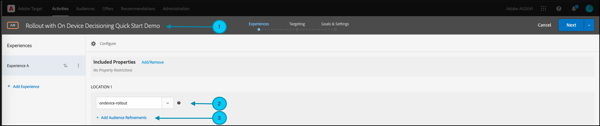
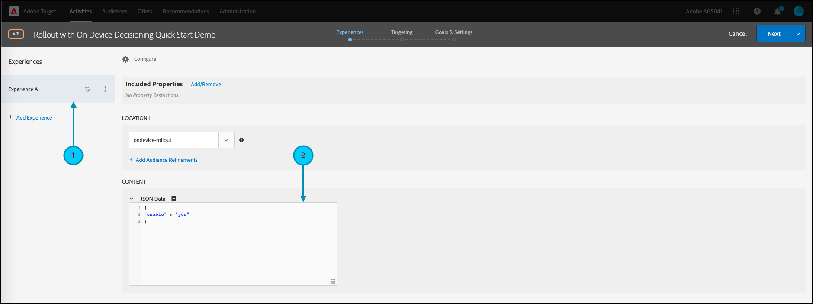
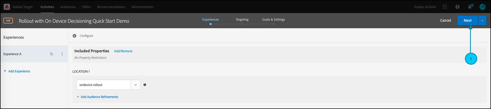

# Administración de despliegues para pruebas de funciones

## Resumen de los pasos

1. Activar [!UICONTROL toma de decisiones en el dispositivo] para su organización
1. Crear un [!UICONTROL Prueba A/B] actividad
1. Definición de la configuración de funciones y despliegue
1. Implementar y procesar la función en la aplicación
1. Implementar el seguimiento de eventos en la aplicación
1. Activación de la actividad A/B
1. Ajuste el despliegue y la asignación de tráfico según sea necesario

## 1. Habilitar [!UICONTROL toma de decisiones en el dispositivo] para su organización

Al habilitar la toma de decisiones en el dispositivo, se garantiza que una actividad A/B se ejecute con una latencia cercana a cero. Para habilitar esta función, vaya a **[!UICONTROL Administration]** > **[!UICONTROL Implementación]** > **[!UICONTROL Detalles de la cuenta]** in [!DNL Adobe Target]y habilite la opción **[!UICONTROL Toma de decisiones en el dispositivo]** alternar.


>[!NOTE]
>
>Debe tener el administrador o aprobador [función de usuario](https://experienceleague.adobe.com/docs/target/using/administer/manage-users/user-management.html) para habilitar o deshabilitar [!UICONTROL Toma de decisiones en el dispositivo] alternar.

Después de activar el [!UICONTROL Toma de decisiones en el dispositivo] alternar, [!DNL Adobe Target] comienza a generar *artefactos de regla* para su cliente.

## 2. Crear un [!UICONTROL Prueba A/B] actividad

1. Entrada [!DNL Adobe Target], vaya al **[!UICONTROL Actividades]** página, luego seleccione **[!UICONTROL Crear actividad]** > **[!UICONTROL Prueba A/B]**.

   

1. En el **[!UICONTROL Crear actividad de prueba A/B]** modal, mantenga el valor predeterminado **[!UICONTROL Web]** opción seleccionada (1), seleccionar **[!UICONTROL Form]** como compositor de experiencias (2), seleccione **[!UICONTROL Workspace predeterminado]** con **[!UICONTROL Sin restricciones de propiedad]** (3) y haga clic en **[!UICONTROL Siguiente]** (4).

   

## 3. Defina la función y la configuración de despliegue

En el **[!UICONTROL Experiencias]** paso de creación de la actividad, proporcione un nombre para la actividad (1). Introduzca el nombre de la ubicación (2) dentro de la aplicación donde desea administrar los despliegues de la función. Por ejemplo,  `ondevice-rollout` o `homepage-addtocart-rollout` son nombres de ubicación que indican los destinos para administrar los despliegues de funciones. En el ejemplo que se muestra a continuación, `ondevice-rollout` es la ubicación definida para la Experiencia A. Si lo desea, puede añadir refinamientos de audiencia (4) para restringir la calificación a la actividad.



1. En el **[!UICONTROL Contenido]** en la misma página, seleccione **[!UICONTROL Crear oferta JSON]** en la lista desplegable (1) como se muestra.

   

1. En el **[!UICONTROL Datos JSON]** En el cuadro de texto que aparece, introduzca la variable de indicador de funcionalidad de la función que desea desplegar con esta actividad en la Experiencia A (1), utilizando un objeto JSON válido (2).

   

1. Clic **[!UICONTROL Siguiente]** (1) para avanzar a la **[!UICONTROL Segmentación]** paso de creación de la actividad.

   

1. En el **[!UICONTROL Segmentación]** paso, conserve el **[!UICONTROL Todos los visitantes]** audience (1), para simplificar. Sin embargo, ajuste la asignación de tráfico (2) al 10 %. Esto restringirá la función a solo el 10 % de los visitantes del sitio. Haga clic en Siguiente (3) para avanzar a la **[!UICONTROL Objetivos y configuración]** paso.

   

1. En el **[!UICONTROL Objetivos y configuración]** paso, elija **[!UICONTROL Adobe Target]** (1) como **[!UICONTROL Fuente de informes]** para ver los resultados de la actividad en [!DNL Adobe Target] IU.

1. Elija una **[!UICONTROL Métrica de objetivo]** para medir la actividad. En este ejemplo, una conversión correcta se basa en si el usuario compra un artículo, tal como indica si el usuario llegó a la ubicación orderConfirm (2).

1. Clic **[!UICONTROL Guardar y cerrar]** (3) para guardar la actividad.

   

## 4. Implementar y procesar la función en la aplicación

>[!BEGINTABS]

>[!TAB Node.js]

```js {line-numbers="true"}
targetClient.getAttributes(["ondevice-rollout"]).then(function(attributes) {
      const featureFlags = attributes.asObject("ondevice-rollout");

      // Your flag variables are now available in the featureFlags object variable.
      //If you failed to qualify for the Activity, you will have an empty object.
      console.log(featureFlags);
    });
```

>[!TAB Java]

```java {line-numbers="true"}
    Attributes attrs = targetJavaClient.getAttributes(targetDeliveryRequest, "ondevice-rollout");
    Map<String, Object> featureFlags = attrs.toMboxMap("ondevice-rollout");
​
    // Your flag variables are now available in the featureFlags object variable.
    //If you failed to qualify for the Activity, you will have an empty object.
    System.out.println(featureFlags);
```

>[!ENDTABS]

## 5. Implemente el seguimiento de eventos en la aplicación

Después de hacer que la variable de indicador de funcionalidad esté disponible en la aplicación, puede utilizarla para habilitar cualquier función que ya forme parte de la aplicación. Si un visitante no cumple los requisitos para la actividad, significa que no se incluyó como parte del bloque del 10 % definido como audiencia.

>[!BEGINTABS]

>[!TAB Node.js]

```js {line-numbers="true"}
//... Code removed for brevity

if(featureFlags.enable == "yes") { //Fell within 10% traffic
    console.log("Render Feature");
}
else {
    console.log("Disable Feature");
}

// alternatively, the getValue method could be used on the Attributes object.

if(attributes.getValue("ondevice-rollout", "enable") === "yes") { //Fell within 10% traffic
    console.log("Render Feature");
}
else {
    console.log("Disable Feature");
}
```

>[!TAB Java]

```java {line-numbers="true"}
//... Code removed for brevity
​
if("yes".equals(String.valueOf(featureFlags.get("enable")))) { //Fell within 10% traffic
    System.out.println("Render Feature");
}
else {
    System.out.println("Disable Feature");
}
​
// alternatively, the getString method could be used on the Attributes object.
​
if("yes".equals(attrs.getString("ondevice-rollout", "enable"))) { //Fell within 10% traffic
    System.out.println("Render Feature");
}
else {
    System.out.println("Disable Feature");
}
```

>[!ENDTABS]

## 6. Active la actividad de despliegue


## 7. Ajuste el despliegue y la asignación de tráfico según sea necesario

Una vez que haya activado la actividad, edítela en cualquier momento para aumentar o disminuir la asignación de tráfico según sea necesario.

Aumento de la asignación del tráfico del 10 % al 50 % debido al éxito del despliegue inicial.


