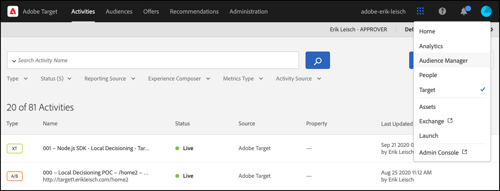

# Solución de problemas [!UICONTROL toma de decisiones en el dispositivo]

## Validando configuración

### Resumen de pasos

1. Asegúrese de que `logger` está configurado
1. Asegurar [!DNL Target] traces está habilitado
1. Compruebe el [!UICONTROL toma de decisiones en el dispositivo] *artefacto de regla* se ha recuperado y almacenado en caché según el intervalo de sondeo definido.
1. Validar la entrega de contenido mediante el artefacto de regla en caché creando una prueba [!UICONTROL toma de decisiones en el dispositivo] actividad a través del compositor de experiencias basadas en formularios.
1. Inspect envía errores de notificación

## 1. Asegúrese de que el registrador esté configurado

Al inicializar el SDK, asegúrese de habilitar el registro.

**Node.js**

Para el SDK de Node.js `logger` debe proporcionarse el objeto.

```js {line-numbers="true"}
const CONFIG = {
  client: "<your client code>",
  organizationId: "<your organization ID>",
  logger: console
};
```

**SDK de Java**

Para el SDK de Java `logRequests` en el `ClientConfig` debe estar activado.

```js {line-numbers="true"}
ClientConfig config = ClientConfig.builder()
  .client("<your client code>")
  .organizationId("<your organization ID>")
  .logRequests(true)
  .build();
```

Además, la JVM debe iniciarse con el siguiente parámetro de línea de comandos:

```bash {line-numbers="true"}
java -Dorg.slf4j.simpleLogger.defaultLogLevel=DEBUG ...
```

## 2. Garantice[!DNL Target]Traces está habilitado

Al habilitar los seguimientos, se obtendrá información adicional de [!DNL Adobe Target] en lo que respecta al artefacto de reglas.

1. Vaya a[!DNL Target]IU en [!DNL Experience Cloud].

   

1. Vaya a **[!UICONTROL Administration]** > **[!UICONTROL Implementación]** y haga clic en **[!UICONTROL Generar nuevo token de autorización]**.

   

1. Copie el token de autorización recién generado en el portapapeles y agréguelo a su[!DNL Target]solicitud:

   **Node.js**

   ```js {line-numbers="true"}
   const request = {
     trace: {
       authorizationToken: "88f1a924-6bc5-4836-8560-2f9c86aeb36b"
     },
     execute: {
       mboxes: [{
         name: "sdk-mbox"
       }]
   }};
   ```

   **Java**

   ```js {line-numbers="true"}
   Trace trace = new Trace()
     .authorizationToken("88f1a924-6bc5-4836-8560-2f9c86aeb36b");
   Context context = new Context()
     .channel(ChannelType.WEB);
   MboxRequest mbox = new MboxRequest()
     .name("sdk-mbox")
     .index(0);
   ExecuteRequest executeRequest = new ExecuteRequest()
     .mboxes(Arrays.asList(mbox));
   
   TargetDeliveryRequest request = TargetDeliveryRequest.builder()
     .trace(trace)
     .context(context)
     .execute(executeRequest)
     .build();
   ```

1. Con el registrador y el seguimiento en su lugar, inicie la aplicación y supervise el terminal del servidor. El siguiente resultado del registrador confirma que se ha recuperado el artefacto de regla:

   **SDK de Node.js**

   ```text {line-numbers="true"}
     AT: LD.ArtifactProvider fetching artifact - https://assets.adobetarget.com/your-client-code/production/v1/rules.json
     AT: LD.ArtifactProvider artifact received - status=200
   ```

## 3. Compruebe el [!UICONTROL toma de decisiones en el dispositivo] *artefacto de regla* se ha recuperado y almacenado en caché según el intervalo de sondeo definido.

1. Espere la duración del intervalo de sondeo (el valor predeterminado es 20 minutos) y asegúrese de que el SDK esté recuperando el artefacto. Se generarán los mismos registros de terminal.

   Además, la información de la[!DNL Target]El seguimiento debe enviarse al terminal con detalles sobre el artefacto de regla.

   ```text {line-numbers="true"}
   "trace": {
     "clientCode": "your-client-code",
     "artifact": {
       "artifactLocation": "https://assets.adobetarget.com/your-client-code/production/v1/rules.json",
       "pollingInterval": 300000,
       "pollingHalted": false,
       "artifactVersion": "1.0.0",
       "artifactRetrievalCount": 10,
       "artifactLastRetrieved": "2020-09-20T00:09:42.707Z",
       "clientCode": "your-client-code",
       "environment": "production",
       "generatedAt": "2020-09-22T17:17:59.783Z"
     },
   ```

## 4. Valide la entrega de contenido mediante el artefacto de regla en caché creando una prueba [!UICONTROL toma de decisiones en el dispositivo] actividad a través del compositor de experiencias basadas en formularios

1. Vaya a[!DNL Target]IU en el Experience Cloud

   

1. Cree una nueva actividad XT con el Compositor de experiencias basadas en formularios.

   

1. Introduzca el nombre de mbox utilizado en su[!DNL Target]como la ubicación de la actividad XT (tenga en cuenta que debe ser un nombre de mbox único específicamente para fines de desarrollo).

   

1. Cambie el contenido a una oferta de HTML u oferta JSON. Esto se devolverá en el[!DNL Target]a su aplicación. Deje el objetivo de la actividad como &quot;Todos los visitantes&quot; y seleccione la métrica que desee. Asigne un nombre a la actividad, guárdela y actívela para asegurarse de que el mbox o la ubicación en uso solo sean aptos para el desarrollo.

   

1. En la aplicación, agregue instrucciones de registro para el contenido recibido en la respuesta de su[!DNL Target]solicitud

   **SDK de Node.js**

   ```js {line-numbers="true"}
   try {
     const response = await targetClient.getOffers({ request });
     console.log('Response: ', response.response.execute.mboxes[0].options[0].content);
   } catch (error) {
     console.error('Something went wrong', error);
   }
   ```

   **SDK de Java**

   ```js {line-numbers="true"}
   try {
     Context context = new Context()
       .channel(ChannelType.WEB);
     MboxRequest mbox = new MboxRequest()
       .name("sdk-mbox")
       .index(0);
     ExecuteRequest executeRequest = new ExecuteRequest()
       .mboxes(Arrays.asList(mbox));
   
     TargetDeliveryRequest request = TargetDeliveryRequest.builder()
       .context(context)
       .decisioningMethod(DecisioningMethod.ON_DEVICE)
       .execute(executeRequest)
       .build();
   
       TargetDeliveryResponse response = targetClient.getOffers(request);
     logger.debug("Response: ", response.getResponse().getExecute().getMboxes().get(0).getOptions().get(0).getContent());
   } catch (Exception exception) {
     logger.error("Something went wrong", exception);
   }
   ```

1. Revise los registros de su terminal para verificar que el contenido se está enviando y que se entregó a través del artefacto de reglas en su servidor. El `LD.DeciscionProvider` El objeto de se genera cuando la calificación y la toma de decisiones de la actividad se determinaron en el dispositivo en función del artefacto de reglas. Además, debido a la tala de `content`, debería ver `<div>test</div>` o como quiera que haya decidido que sea la respuesta al crear la actividad de prueba.

   **Salida del registrador**

   ```text {line-numbers="true"}
   AT: LD.DecisionProvider {...}
   AT: Response received {...}
   Response:  <div>test</div>
   ```

## Inspect envía errores de notificación

Al utilizar la toma de decisiones en el dispositivo, las notificaciones se envían automáticamente para que getOffers ejecute solicitudes. Estas solicitudes se envían silenciosamente en segundo plano. Los errores se pueden inspeccionar suscribiéndose a un evento llamado `sendNotificationError`. Este es un ejemplo de código que muestra cómo suscribirse a los errores de notificación mediante el SDK de Node.js.

```js {line-numbers="true"}
const TargetClient = require("@adobe/target-nodejs-sdk");
let client;

function onSendNotificationError({ notification, error }) {
  console.log(
    `There was an error when sending a notification: ${error.message}`
  );
  console.log(`Notification Payload: ${JSON.stringify(notification, null, 2)}`);
}

async function targetClientReady() {
  const request = {
    context: { channel: "web" },
    execute: {
      mboxes: [{
        name: "a1-serverside-ab",
        index: 1
      }]
    }
  };
  const targetResponse = await client.getOffers({ request });
}

client = TargetClient.create({
  events: {
    clientReady: targetClientReady,
    sendNotificationError: onSendNotificationError
  }
});
```

## Escenarios comunes de resolución de problemas

Asegúrese de revisar [funciones compatibles](supported-features.md) para [!UICONTROL toma de decisiones en el dispositivo] cuando encuentre problemas.

### Las actividades de toma de decisiones en el dispositivo no se ejecutan debido a una audiencia o actividad no admitidas

Un problema común que puede ocurrir es [!UICONTROL toma de decisiones en el dispositivo] Las actividades de no se ejecutan debido a que la audiencia está en uso o el tipo de actividad no es compatible.

(1) Con el resultado del registrador, revise las entradas de la propiedad trace en el objeto response. Identifique específicamente la propiedad de campañas:

**Salida de seguimiento**

```text {line-numbers="true"}
  "execute": {
  "mboxes": [
    {
      "name": "your-mbox-name",
      "index": 0,
      "trace": {
        "clientCode": "your-client-code",
        ...
        "campaigns": [],
        ...
      }
    }
```

Observará que la actividad para la que intenta cumplir los requisitos no está en la `campaigns` ya que no se admite el tipo de audiencia o actividad. Si la actividad se enumera en la `campaigns` , el problema no se debe a una audiencia o tipo de actividad no compatible.

(2) Además, busque la variable `rules.json` al consultar el archivo `trace` > `artifact` > `artifactLocation` en la salida del registrador y observe que la actividad no aparece en el `rules` > `mboxes` propiedad:

**Salida del registrador**

```text {line-numbers="true"}
 ...
 rules: {
   mboxes: { },
   views: { }
 }
```

Finalmente, vaya a[!DNL Target]IU de y busque la actividad en cuestión: [experience.adobe.com/target](https://experience.adobe.com/target)

Revise las reglas utilizadas en la audiencia y asegúrese de utilizar solo las mencionadas que son compatibles. Además, asegúrese de que el tipo de actividad sea A/B o XT.


### Las actividades de toma de decisiones en el dispositivo no se ejecutan debido a una audiencia no cualificada

Si no se está ejecutando una actividad de toma de decisiones en el dispositivo, pero ha verificado que el archivo rules.json contiene la actividad, realice los siguientes pasos:

(1) Asegúrese de que el mbox que está ejecutando en la aplicación es el mismo que utiliza la actividad:

>[!BEGINTABS]

>[!TAB rule.json]

```text {line-numbers="true"}
 ...
 rules: {
   mboxes: {
    target-only-node-sdk-mbox: [{ // this mbox name must match the mbox in your request
      ...
    }]
   }
 ...
```

>[!TAB SDK de Node.js]

```js {line-numbers="true"}
 const request = {
   trace: {
     authorizationToken: '2dfc1dce-1e58-4e05-bbd6-a6725893d4d6'
   },
   execute: {
     mboxes: [{
       address: getAddress(req),
       name: "target-only-node-sdk-mbox-two" // this mbox name must match the mbox the activity is using
     }]
   }};
```

>[!TAB SDK de Java]

```js {line-numbers="true"}
Context context = new Context()
  .channel(ChannelType.WEB);
MboxRequest mbox = new MboxRequest()
  .name("target-only-node-sdk-mbox-two")
  .index(0);
ExecuteRequest executeRequest = new ExecuteRequest()
  .mboxes(Arrays.asList(mbox));

TargetDeliveryRequest request = TargetDeliveryRequest.builder()
  .context(context)
  .decisioningMethod(DecisioningMethod.ON_DEVICE)
  .execute(executeRequest)
  .build();

TargetDeliveryResponse response = targetClient.getOffers(request);
```

>[!ENDTABS]

(2) Asegúrese de que reúne los requisitos para la audiencia de su actividad revisando la `matchedRuleConditions` o `unmatchedRuleConditions` propiedad del resultado del seguimiento:

**Salida de seguimiento**

```text {line-numbers="true"}
...
},
"campaignId": 368564,
"campaignType": "landing",
"matchedSegmentIds": [],
"unmatchedSegmentIds": [
  6188838
      ],
      "matchedRuleConditions": [],
          "unmatchedRuleConditions": [
            {
              "in": [
                "true",
                {
                  "var": "mbox.auth_lc"
                }
              ]
            }
          ]
    ...
```

Si tiene condiciones de regla no coincidentes, no cumple los requisitos para la actividad y, por lo tanto, la actividad no se ejecutará. Revise las reglas de la audiencia para ver por qué no cumple los requisitos.

### La actividad de toma de decisiones en el dispositivo no se ejecuta, pero el motivo no es aparente

Puede que no sea evidente por qué no se está ejecutando una actividad de toma de decisiones en el dispositivo. En este caso, siga estos pasos de solución de problemas para identificar el problema:

(1) Lea el resultado de seguimiento del registrador en la consola e identifique la propiedad artifact, que tendrá un aspecto similar al siguiente:

**Salida de seguimiento**

```text {line-numbers="true"}
...
      "artifact": {
          "artifactLocation": "https://assets.adobetarget.com/your-client-code/production/v1/rules.json",
          "pollingInterval": 300000,
          "pollingHalted": false,
          "artifactVersion": "1.0.0",
          "artifactRetrievalCount": 3,
          "artifactLastRetrieved": "2020-10-16T00:56:27.596Z",
          "clientCode": "adobeinterikleisch",
          "environment": "production"
        },
...
```

Consulte la `artifactLastRetrieved` fecha del artefacto y asegúrese de que dispone de la última `rules.json` archivo descargado en la aplicación.

(2) Encuentre el `evaluatedCampaignTargets` en la salida del registrador:

**Salida del registrador**

```text {line-numbers="true"}
...
  "evaluatedCampaignTargets": [
      {
        "context": {
          "current_timestamp": 1602812599608,
          "current_time": "0143",
          "current_day": 5,
          "user": {
            "browserType": "unknown",
            "platform": "Unknown",
            "locale": "en",
            "browserVersion": -1
          },
          "page": {
            "url": "localhost:3000/",
            "path": "/",
            "query": "",
            "fragment": "",
            "subdomain": "",
            "domain": "3000",
            "topLevelDomain": "",
            "url_lc": "localhost:3000/",
            "path_lc": "/",
            "query_lc": "",
            "fragment_lc": "",
            "subdomain_lc": "",
            "domain_lc": "3000",
            "topLevelDomain_lc": ""
          },
          "referring": {
            "url": "localhost:3000/",
            "path": "/",
            "query": "",
            "fragment": "",
            "subdomain": "",
            "domain": "3000",
            "topLevelDomain": "",
            "url_lc": "localhost:3000/",
            "path_lc": "/",
            "query_lc": "",
            "fragment_lc": "",
            "subdomain_lc": "",
            "domain_lc": "3000",
            "topLevelDomain_lc": ""
          },
          "geo": {},
          "mbox": {},
          "allocation": 23.79
        },
        "campaignId": 368564,
        "campaignType": "landing",
        "matchedSegmentIds": [],
        "unmatchedSegmentIds": [
          6188838
        ],
        "matchedRuleConditions": [],
        "unmatchedRuleConditions": [
          {
            "in": [
              "true",
              {
                "var": "mbox.auth_lc"
              }
            ]
          }
        ]
...
```

(3) Revise la `context`, `page`, y `referring` para garantizar que es lo esperado, ya que esto puede afectar a la calificación de la actividad como objetivo.

(4) Revise la `campaignId` para garantizar que se evalúen la actividad o actividades que espera ejecutar. El `campaignId` coincidirá con el ID de actividad en la ficha de información general de actividad de[!DNL Target]IU:


(5) Revise la `matchedRuleConditions` y `unmatchedRuleConditions` para identificar los problemas relacionados con los requisitos para las reglas de audiencia de una actividad determinada.

(6) Revise los últimos `rules.json` para garantizar que se incluyan la actividad o actividades que desea ejecutar localmente. En el paso 1 se hace referencia a la ubicación.

(7) Asegúrese de que utiliza los mismos nombres de mbox en sus solicitudes y actividades.

(8) Asegúrese de que utiliza reglas de audiencia y tipos de actividades compatibles.

### Se realiza una llamada al servidor aunque la configuración de la actividad en un mbox indique &quot;Elegible para la toma de decisiones en el dispositivo&quot; en el[!DNL Target]interfaz de usuario

Existen varias razones por las que se realiza una llamada al servidor aunque el dispositivo sea apto para la toma de decisiones en el dispositivo:

* Cuando el mbox utilizado para una actividad &quot;Elegible para la toma de decisiones en el dispositivo&quot; se utiliza también para otras actividades que no son &quot;Elegibles para la toma de decisiones en el dispositivo&quot;, el mbox se enumera en la sección `remoteMboxes` de la sección `rules.json` artefacto. Cuando aparece un mbox en `remoteMboxes`, cualquiera `getOffer(s)` las llamadas a ese mbox dan como resultado una llamada al servidor.

* Si configura una actividad en un espacio de trabajo/propiedad y no incluye la misma al configurar el SDK, esto puede provocar lo siguiente `rules.josn` del espacio de trabajo predeterminado que se va a descargar, que puede utilizar el mbox en `remoteMboxes` sección.
