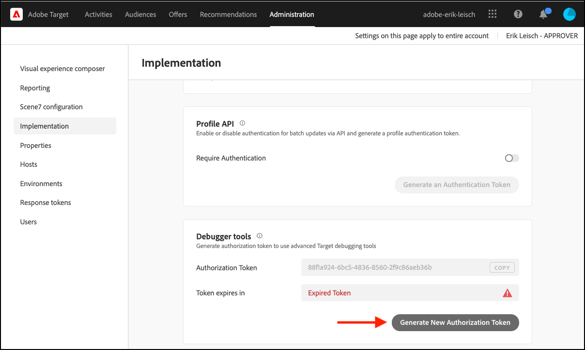
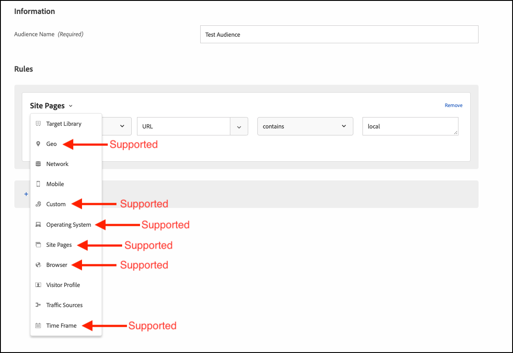
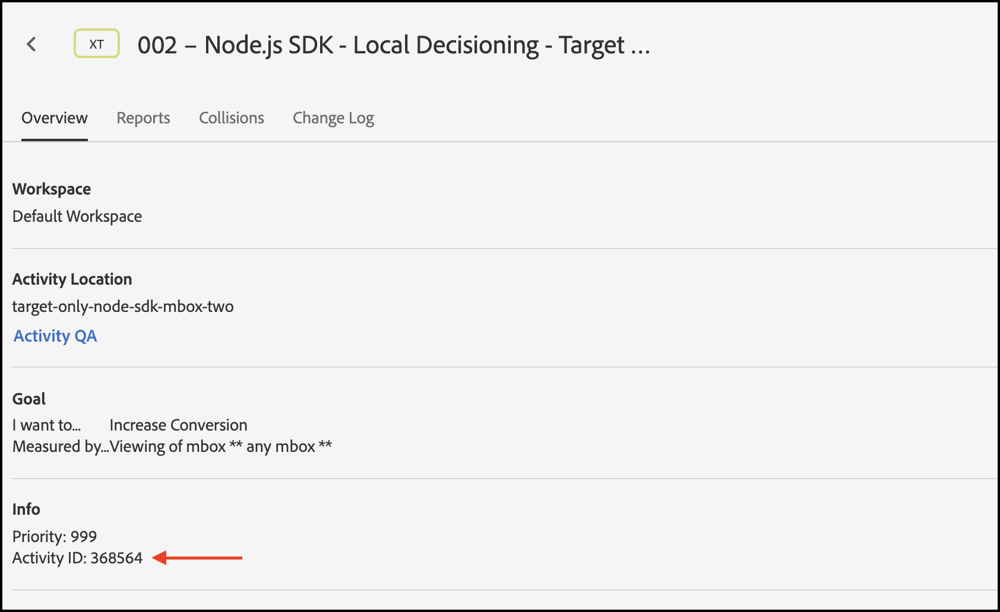

# Solucionando problemas de [!UICONTROL toma de decisiones en el dispositivo]

## Validando configuración

### Resumen de pasos

1. Asegúrese de que `logger` esté configurado
1. Asegúrese de que los seguimientos de [!DNL Target] estén habilitados
1. Compruebe que el [!UICONTROL artefacto de la regla *de toma de decisiones en el dispositivo]* se ha recuperado y almacenado en caché según el intervalo de sondeo definido.
1. Valide la entrega de contenido a través del artefacto de reglas en caché creando una actividad de prueba [!UICONTROL toma de decisiones en el dispositivo] a través del compositor de experiencias basadas en formularios.
1. Inspeccionar errores de notificación de envío

## &#x200B;1. Asegúrese de que el registrador esté configurado

Al inicializar SDK, asegúrese de habilitar el registro.

**Nodo.js**

Se debe proporcionar un objeto `logger` para Node.js SDK.

```js {line-numbers="true"}
const CONFIG = {
  client: "<your client code>",
  organizationId: "<your organization ID>",
  logger: console
};
```

**SDK de Java**

Para Java SDK `logRequests` en `ClientConfig` debe estar habilitado.

```js {line-numbers="true"}
ClientConfig config = ClientConfig.builder()
  .client("<your client code>")
  .organizationId("<your organization ID>")
  .logRequests(true)
  .build();
```

Además, la JVM debe iniciarse con el siguiente parámetro de línea de comandos:

```bash {line-numbers="true"}
java -Dorg.slf4j.simpleLogger.defaultLogLevel=DEBUG ...
```

## &#x200B;2. Asegúrese de que [!DNL Target]Traces esté habilitado

Al habilitar los seguimientos, se generará información adicional de [!DNL Adobe Target] con respecto al artefacto de reglas.

1. Vaya a la [!DNL Target]interfaz de usuario de [!DNL Experience Cloud].

   

1. Vaya a **[!UICONTROL Administración]** > **[!UICONTROL Implementación]** y haga clic en **[!UICONTROL Generar nuevo token de autorización]**.

   

1. Copie el token de autorización recién generado al portapapeles y agréguelo a su [!DNL Target]solicitud:

   **Nodo.js**

   ```js {line-numbers="true"}
   const request = {
     trace: {
       authorizationToken: "88f1a924-6bc5-4836-8560-2f9c86aeb36b"
     },
     execute: {
       mboxes: [{
         name: "sdk-mbox"
       }]
   }};
   ```

   **Java**

   ```js {line-numbers="true"}
   Trace trace = new Trace()
     .authorizationToken("88f1a924-6bc5-4836-8560-2f9c86aeb36b");
   Context context = new Context()
     .channel(ChannelType.WEB);
   MboxRequest mbox = new MboxRequest()
     .name("sdk-mbox")
     .index(0);
   ExecuteRequest executeRequest = new ExecuteRequest()
     .mboxes(Arrays.asList(mbox));
   
   TargetDeliveryRequest request = TargetDeliveryRequest.builder()
     .trace(trace)
     .context(context)
     .execute(executeRequest)
     .build();
   ```

1. Con el registrador y el seguimiento en su lugar, inicie la aplicación y supervise el terminal del servidor. El siguiente resultado del registrador confirma que se ha recuperado el artefacto de regla:

   **SDK de Node.js**

   ```text {line-numbers="true"}
     AT: LD.ArtifactProvider fetching artifact - https://assets.adobetarget.com/your-client-code/production/v1/rules.json
     AT: LD.ArtifactProvider artifact received - status=200
   ```

## &#x200B;3. Compruebe que el [!UICONTROL artefacto de la regla *de toma de decisiones en el dispositivo]* se ha recuperado y almacenado en caché según el intervalo de sondeo definido.

1. Espere el intervalo de sondeo (el valor predeterminado es 20 minutos) y asegúrese de que SDK está recuperando el artefacto. Se generarán los mismos registros de terminal.

   Además, la información del seguimiento [!DNL Target]Trace debe enviarse al terminal con detalles sobre el artefacto de regla.

   ```text {line-numbers="true"}
   "trace": {
     "clientCode": "your-client-code",
     "artifact": {
       "artifactLocation": "https://assets.adobetarget.com/your-client-code/production/v1/rules.json",
       "pollingInterval": 300000,
       "pollingHalted": false,
       "artifactVersion": "1.0.0",
       "artifactRetrievalCount": 10,
       "artifactLastRetrieved": "2020-09-20T00:09:42.707Z",
       "clientCode": "your-client-code",
       "environment": "production",
       "generatedAt": "2020-09-22T17:17:59.783Z"
     },
   ```

## &#x200B;4. Valide la entrega de contenido mediante el artefacto de reglas en caché creando una actividad de prueba [!UICONTROL toma de decisiones en el dispositivo] a través del compositor de experiencias basadas en formularios

1. Vaya a la [!DNL Target]IU de en Experience Cloud

   

1. Cree una nueva actividad XT con el Compositor de experiencias basadas en formularios.

   

1. Escriba el nombre de mbox utilizado en la solicitud [!DNL Target] como ubicación para la actividad XT (tenga en cuenta que debe ser un nombre de mbox único específicamente para fines de desarrollo).

   

1. Cambie el contenido a una oferta de HTML u oferta JSON. Esto se devolverá en la [!DNL Target]solicitud a su aplicación. Deje el objetivo de la actividad como &quot;Todos los visitantes&quot; y seleccione la métrica que desee. Asigne un nombre a la actividad, guárdela y actívela para asegurarse de que el mbox o la ubicación en uso solo sean aptos para el desarrollo.

   

1. En su aplicación, agregue instrucciones de registro para el contenido recibido en la respuesta de su [!DNL Target]solicitud

   **SDK de Node.js**

   ```js {line-numbers="true"}
   try {
     const response = await targetClient.getOffers({ request });
     console.log('Response: ', response.response.execute.mboxes[0].options[0].content);
   } catch (error) {
     console.error('Something went wrong', error);
   }
   ```

   **SDK de Java**

   ```js {line-numbers="true"}
   try {
     Context context = new Context()
       .channel(ChannelType.WEB);
     MboxRequest mbox = new MboxRequest()
       .name("sdk-mbox")
       .index(0);
     ExecuteRequest executeRequest = new ExecuteRequest()
       .mboxes(Arrays.asList(mbox));
   
     TargetDeliveryRequest request = TargetDeliveryRequest.builder()
       .context(context)
       .decisioningMethod(DecisioningMethod.ON_DEVICE)
       .execute(executeRequest)
       .build();
   
       TargetDeliveryResponse response = targetClient.getOffers(request);
     logger.debug("Response: ", response.getResponse().getExecute().getMboxes().get(0).getOptions().get(0).getContent());
   } catch (Exception exception) {
     logger.error("Something went wrong", exception);
   }
   ```

1. Revise los registros de su terminal para verificar que el contenido se está enviando y que se entregó a través del artefacto de reglas en su servidor. El objeto `LD.DeciscionProvider` se genera cuando la calificación y la toma de decisiones de la actividad se determinaron en el dispositivo en función del artefacto de reglas. Además, debido al registro de `content`, debería ver `<div>test</div>` o como sea que haya decidido que sea la respuesta al crear la actividad de prueba.

   **Salida del registrador**

   ```text {line-numbers="true"}
   AT: LD.DecisionProvider {...}
   AT: Response received {...}
   Response:  <div>test</div>
   ```

## Inspeccionar errores de notificación de envío

Al utilizar la toma de decisiones en el dispositivo, las notificaciones se envían automáticamente para que getOffers ejecute solicitudes. Estas solicitudes se envían silenciosamente en segundo plano. Cualquier error se puede inspeccionar mediante la suscripción a un evento denominado `sendNotificationError`. Este es un ejemplo de código que muestra cómo suscribirse a los errores de notificación mediante el SDK de Node.js.

```js {line-numbers="true"}
const TargetClient = require("@adobe/target-nodejs-sdk");
let client;

function onSendNotificationError({ notification, error }) {
  console.log(
    `There was an error when sending a notification: ${error.message}`
  );
  console.log(`Notification Payload: ${JSON.stringify(notification, null, 2)}`);
}

async function targetClientReady() {
  const request = {
    context: { channel: "web" },
    execute: {
      mboxes: [{
        name: "a1-serverside-ab",
        index: 1
      }]
    }
  };
  const targetResponse = await client.getOffers({ request });
}

client = TargetClient.create({
  events: {
    clientReady: targetClientReady,
    sendNotificationError: onSendNotificationError
  }
});
```

## Escenarios comunes de resolución de problemas

Asegúrese de revisar las [funciones compatibles](supported-features.md) para la [!UICONTROL toma de decisiones en el dispositivo] cuando encuentre problemas.

### Las actividades de toma de decisiones en el dispositivo no se ejecutan debido a una audiencia o actividad no admitidas

Un problema común que puede ocurrir es que las actividades de [!UICONTROL toma de decisiones en el dispositivo] no se ejecuten debido a que la audiencia en uso o el tipo de actividad no son compatibles.

(1) Con el resultado del registrador, revise las entradas de la propiedad trace en el objeto response. Identifique específicamente la propiedad de campañas:

**Salida de seguimiento**

```text {line-numbers="true"}
  "execute": {
  "mboxes": [
    {
      "name": "your-mbox-name",
      "index": 0,
      "trace": {
        "clientCode": "your-client-code",
        ...
        "campaigns": [],
        ...
      }
    }
```

Observará que la actividad para la que intenta calificar no está en la propiedad `campaigns`, ya que no se admite la audiencia o el tipo de actividad. Si la actividad aparece en la propiedad `campaigns`, el problema no se debe a una audiencia o a un tipo de actividad no compatibles.

(2) Además, busque el archivo `rules.json` mirando `trace` > `artifact` > `artifactLocation` en la salida del registrador y observe que falta su actividad en la propiedad `rules` > `mboxes`:

**Salida del registrador**

```text {line-numbers="true"}
 ...
 rules: {
   mboxes: { },
   views: { }
 }
```

Finalmente, vaya a la [!DNL Target]interfaz de usuario y busque la actividad en cuestión: [experience.adobe.com/target](https://experience.adobe.com/target)

Revise las reglas utilizadas en la audiencia y asegúrese de utilizar solo las mencionadas que son compatibles. Además, asegúrese de que el tipo de actividad sea A/B o XT.



### Las actividades de toma de decisiones en el dispositivo no se ejecutan debido a una audiencia no cualificada

Si no se está ejecutando una actividad de toma de decisiones en el dispositivo, pero ha verificado que el archivo rules.json contiene la actividad, realice los siguientes pasos:

(1) Asegúrese de que el mbox que está ejecutando en la aplicación es el mismo que utiliza la actividad:

>[!BEGINTABS]

>[!TAB rule.json]

```text {line-numbers="true"}
 ...
 rules: {
   mboxes: {
    target-only-node-sdk-mbox: [{ // this mbox name must match the mbox in your request
      ...
    }]
   }
 ...
```

>[!TAB SDK de Node.js]

```js {line-numbers="true"}
 const request = {
   trace: {
     authorizationToken: '2dfc1dce-1e58-4e05-bbd6-a6725893d4d6'
   },
   execute: {
     mboxes: [{
       address: getAddress(req),
       name: "target-only-node-sdk-mbox-two" // this mbox name must match the mbox the activity is using
     }]
   }};
```

>[!TAB SDK de Java]

```js {line-numbers="true"}
Context context = new Context()
  .channel(ChannelType.WEB);
MboxRequest mbox = new MboxRequest()
  .name("target-only-node-sdk-mbox-two")
  .index(0);
ExecuteRequest executeRequest = new ExecuteRequest()
  .mboxes(Arrays.asList(mbox));

TargetDeliveryRequest request = TargetDeliveryRequest.builder()
  .context(context)
  .decisioningMethod(DecisioningMethod.ON_DEVICE)
  .execute(executeRequest)
  .build();

TargetDeliveryResponse response = targetClient.getOffers(request);
```

>[!ENDTABS]

(2) Asegúrese de que cumple los requisitos para la audiencia de su actividad revisando la propiedad `matchedRuleConditions` o `unmatchedRuleConditions` del resultado del seguimiento:

**Salida de seguimiento**

```text {line-numbers="true"}
...
},
"campaignId": 368564,
"campaignType": "landing",
"matchedSegmentIds": [],
"unmatchedSegmentIds": [
  6188838
      ],
      "matchedRuleConditions": [],
          "unmatchedRuleConditions": [
            {
              "in": [
                "true",
                {
                  "var": "mbox.auth_lc"
                }
              ]
            }
          ]
    ...
```

Si tiene condiciones de regla no coincidentes, no cumple los requisitos para la actividad y, por lo tanto, la actividad no se ejecutará. Revise las reglas de la audiencia para ver por qué no cumple los requisitos.

### La actividad de toma de decisiones en el dispositivo no se ejecuta, pero el motivo no es aparente

Puede que no sea evidente por qué no se está ejecutando una actividad de toma de decisiones en el dispositivo. En este caso, siga estos pasos de solución de problemas para identificar el problema:

(1) Lea el resultado de seguimiento del registrador en la consola e identifique la propiedad artifact, que tendrá un aspecto similar al siguiente:

**Salida de seguimiento**

```text {line-numbers="true"}
...
      "artifact": {
          "artifactLocation": "https://assets.adobetarget.com/your-client-code/production/v1/rules.json",
          "pollingInterval": 300000,
          "pollingHalted": false,
          "artifactVersion": "1.0.0",
          "artifactRetrievalCount": 3,
          "artifactLastRetrieved": "2020-10-16T00:56:27.596Z",
          "clientCode": "adobeinterikleisch",
          "environment": "production"
        },
...
```

Observe la fecha `artifactLastRetrieved` del artefacto y asegúrese de que ha descargado el archivo más reciente de `rules.json` en su aplicación.

(2) Busque la propiedad `evaluatedCampaignTargets` en la salida del registrador:

**Salida del registrador**

```text {line-numbers="true"}
...
  "evaluatedCampaignTargets": [
      {
        "context": {
          "current_timestamp": 1602812599608,
          "current_time": "0143",
          "current_day": 5,
          "user": {
            "browserType": "unknown",
            "platform": "Unknown",
            "locale": "en",
            "browserVersion": -1
          },
          "page": {
            "url": "localhost:3000/",
            "path": "/",
            "query": "",
            "fragment": "",
            "subdomain": "",
            "domain": "3000",
            "topLevelDomain": "",
            "url_lc": "localhost:3000/",
            "path_lc": "/",
            "query_lc": "",
            "fragment_lc": "",
            "subdomain_lc": "",
            "domain_lc": "3000",
            "topLevelDomain_lc": ""
          },
          "referring": {
            "url": "localhost:3000/",
            "path": "/",
            "query": "",
            "fragment": "",
            "subdomain": "",
            "domain": "3000",
            "topLevelDomain": "",
            "url_lc": "localhost:3000/",
            "path_lc": "/",
            "query_lc": "",
            "fragment_lc": "",
            "subdomain_lc": "",
            "domain_lc": "3000",
            "topLevelDomain_lc": ""
          },
          "geo": {},
          "mbox": {},
          "allocation": 23.79
        },
        "campaignId": 368564,
        "campaignType": "landing",
        "matchedSegmentIds": [],
        "unmatchedSegmentIds": [
          6188838
        ],
        "matchedRuleConditions": [],
        "unmatchedRuleConditions": [
          {
            "in": [
              "true",
              {
                "var": "mbox.auth_lc"
              }
            ]
          }
        ]
...
```

(3) Revise los datos de `context`, `page` y `referring` para asegurarse de que son lo esperados, ya que esto puede afectar a la calificación de la actividad como objetivo.

(4) Revise `campaignId` para asegurarse de que se evalúan la actividad o actividades que espera ejecutar. `campaignId` coincidirá con el ID de actividad en la ficha de información general de actividad de la [!DNL Target]IU:



(5) Revise `matchedRuleConditions` y `unmatchedRuleConditions` para identificar los problemas con la calificación de las reglas de audiencia para una actividad determinada.

(6) Revise el archivo `rules.json` más reciente para asegurarse de que se incluyen la actividad o actividades que desea ejecutar localmente. En el paso 1 se hace referencia a la ubicación.

(7) Asegúrese de que utiliza los mismos nombres de mbox en sus solicitudes y actividades.

(8) Asegúrese de que utiliza reglas de audiencia y tipos de actividades compatibles.

### Se realiza una llamada al servidor aunque la configuración de la actividad en un mbox indique &quot;Opción de decisiones en el dispositivo elegible&quot; en la interfaz de usuario [!DNL Target]

Existen varias razones por las que se realiza una llamada al servidor aunque el dispositivo sea apto para la toma de decisiones en el dispositivo:

* Cuando el mbox utilizado para una actividad &quot;Opción de decisiones en el dispositivo elegible&quot; también se usa para otras actividades que no son &quot;Opción de decisiones en el dispositivo elegible&quot;, el mbox se enumera en la sección `remoteMboxes` del artefacto `rules.json`. Cuando un mbox aparece en `remoteMboxes`, cualquier llamada de `getOffer(s)` a ese mbox resulta en una llamada al servidor.

* Si configura una actividad en un espacio de trabajo o una propiedad y no incluye la misma al configurar SDK, esto puede hacer que se descargue el `rules.josn` del espacio de trabajo predeterminado, que puede utilizar el mbox en la sección `remoteMboxes`.
